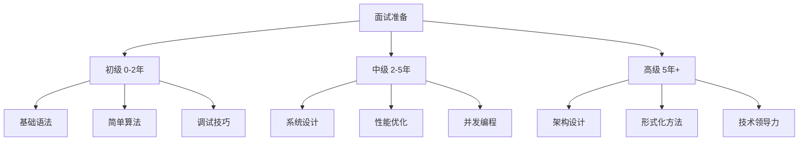
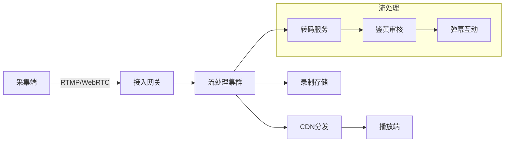

# 面试准备路径

> **目标读者**：准备C语言相关技术面试的求职者
> **覆盖范围**：从初级到高级的全方位面试准备
> **准备周期**：建议2-4周集中准备

---

## 面试级别概览



---


---

## 📑 目录

- [面试准备路径](#面试准备路径)
  - [面试级别概览](#面试级别概览)
  - [📑 目录](#-目录)
  - [初级（0-2年）](#初级0-2年)
    - [📋 知识点清单](#-知识点清单)
    - [❓ 常见面试题及解答](#-常见面试题及解答)
      - [题目1：解释C语言中的`static`关键字](#题目1解释c语言中的static关键字)
      - [题目2：指针和数组的区别](#题目2指针和数组的区别)
      - [题目3：什么是内存泄漏？如何检测？](#题目3什么是内存泄漏如何检测)
      - [题目4：解释栈溢出和堆溢出](#题目4解释栈溢出和堆溢出)
      - [题目5：手写字符串拷贝函数](#题目5手写字符串拷贝函数)
    - [💻 编码练习建议](#-编码练习建议)
      - [必会算法题](#必会算法题)
      - [编码练习平台](#编码练习平台)
  - [中级（2-5年）](#中级2-5年)
    - [📋 知识点清单](#-知识点清单-1)
    - [❓ 常见面试题及解答](#-常见面试题及解答-1)
      - [题目1：设计一个线程安全的内存池](#题目1设计一个线程安全的内存池)
      - [题目2：实现一个线程安全的LRU缓存](#题目2实现一个线程安全的lru缓存)
      - [题目3：解释epoll的原理，相比select/poll的优势](#题目3解释epoll的原理相比selectpoll的优势)
      - [题目4：如何排查内存泄漏？](#题目4如何排查内存泄漏)
      - [题目5：解释CPU缓存友好性，如何优化](#题目5解释cpu缓存友好性如何优化)
    - [🏗️ 系统设计题目](#️-系统设计题目)
      - [题目1：设计一个高性能日志系统](#题目1设计一个高性能日志系统)
      - [题目2：设计一个简单的HTTP服务器](#题目2设计一个简单的http服务器)
    - [💻 编码练习建议](#-编码练习建议-1)
      - [必会设计题](#必会设计题)
  - [高级（5年+）](#高级5年)
    - [📋 知识点清单](#-知识点清单-2)
    - [❓ 常见面试题及解答](#-常见面试题及解答-2)
      - [题目1：设计一个分布式KV存储](#题目1设计一个分布式kv存储)
      - [题目2：如何设计一个能支撑百万并发的系统](#题目2如何设计一个能支撑百万并发的系统)
      - [题目3：解释形式化验证在关键系统中的应用](#题目3解释形式化验证在关键系统中的应用)
    - [🏗️ 架构设计题目](#️-架构设计题目)
      - [题目1：设计一个实时流媒体系统](#题目1设计一个实时流媒体系统)
      - [题目2：设计一个金融交易系统](#题目2设计一个金融交易系统)
    - [💻 编码练习建议](#-编码练习建议-2)
  - [面试技巧与建议](#面试技巧与建议)
    - [📝 面试前准备](#-面试前准备)
    - [💬 面试中技巧](#-面试中技巧)
    - [❓ 反问环节准备](#-反问环节准备)
    - [📚 推荐资源](#-推荐资源)


---

## 初级（0-2年）

### 📋 知识点清单

| 类别 | 知识点 | 重要程度 | 参考文件 |
|------|--------|----------|----------|
| **基础语法** | 数据类型与修饰符 | ⭐⭐⭐⭐⭐ | `knowledge/01_Core_Language/01_Basics/` |
| | 运算符优先级 | ⭐⭐⭐⭐ | `knowledge/01_Core_Language/01_Basics/02_operators.md` |
| | 控制流语句 | ⭐⭐⭐⭐⭐ | `knowledge/01_Core_Language/01_Basics/03_control_flow.md` |
| **函数** | 函数声明与定义 | ⭐⭐⭐⭐⭐ | `knowledge/01_Core_Language/03_Functions/` |
| | 参数传递方式 | ⭐⭐⭐⭐⭐ | `knowledge/01_Core_Language/03_Functions/02_parameter_passing.md` |
| | 递归函数 | ⭐⭐⭐⭐ | `knowledge/01_Core_Language/03_Functions/04_recursion.md` |
| **指针** | 指针基础概念 | ⭐⭐⭐⭐⭐ | `knowledge/01_Core_Language/04_Memory/01_pointers_basics.md` |
| | 指针与数组 | ⭐⭐⭐⭐⭐ | `knowledge/01_Core_Language/04_Memory/03_pointers_arrays.md` |
| | 内存分配 | ⭐⭐⭐⭐⭐ | `knowledge/01_Core_Language/04_Memory/06_memory_allocation.md` |
| **数据结构** | 数组与字符串 | ⭐⭐⭐⭐⭐ | `knowledge/02_Data_Structures/00_Foundations/` |
| | 链表基础 | ⭐⭐⭐⭐ | `knowledge/02_Data_Structures/01_Linked_Lists/01_singly_linked_list.md` |
| | 栈和队列 | ⭐⭐⭐⭐ | `knowledge/02_Data_Structures/02_Stack_Queue/` |
| **调试** | GDB基础 | ⭐⭐⭐⭐ | `knowledge/05_Tools_Chain/02_Debugging/01_gdb_guide.md` |
| | Valgrind使用 | ⭐⭐⭐⭐ | `knowledge/05_Tools_Chain/02_Debugging/02_valgrind_guide.md` |

### ❓ 常见面试题及解答

#### 题目1：解释C语言中的`static`关键字

**解答要点**：

```c
// 1. 静态局部变量：生命周期延长到程序结束
void func() {
    static int count = 0;  // 只初始化一次
    count++;
    printf("%d\n", count);
}

// 2. 静态全局变量/函数：限制作用域在当前文件
static int internal_var;  // 其他文件不可见
static void internal_func() {}  // 其他文件不可调用

// 3. C++中的类静态成员（如果面试C++）
```

#### 题目2：指针和数组的区别

**解答要点**：

```c
// 关键区别：
// 1. sizeof结果不同
int arr[10];
int *p = arr;
printf("%zu %zu\n", sizeof(arr), sizeof(p));  // 40 8 (64位)

// 2. 数组名是常量指针，不能赋值
arr = NULL;  // 错误！
p = NULL;    // 正确

// 3. 数组在栈/数据段分配连续空间
//    指针只是存储地址的变量

// 4. 函数参数中，数组退化为指针
void f(int arr[10]) { /* arr实际上是指针 */ }
```

#### 题目3：什么是内存泄漏？如何检测？

**解答要点**：

```c
// 内存泄漏示例
void leak() {
    int *p = malloc(sizeof(int) * 100);
    // 忘记free
}  // p离开作用域，内存无法访问也无法释放

// 检测方法：
// 1. Valgrind: valgrind --leak-check=full ./program
// 2. AddressSanitizer: gcc -fsanitize=address
// 3. 代码审查：malloc/free配对检查
// 4. 智能指针（C++）或RAII模式
```

#### 题目4：解释栈溢出和堆溢出

**解答要点**：

```c
// 栈溢出 - 通常由于递归太深或大局部变量
void stack_overflow() {
    char big_array[1024 * 1024 * 10];  // 10MB栈分配
    stack_overflow();  // 无限递归
}

// 堆溢出 - 写入超出分配内存
void heap_overflow() {
    char *p = malloc(10);
    strcpy(p, "this is way too long");  // 越界写入
    free(p);
}

// 防御方法：
// - 限制递归深度
// - 使用安全函数（strncpy替代strcpy）
// - 启用栈保护（-fstack-protector）
```

#### 题目5：手写字符串拷贝函数

**参考答案**：

```c
// 安全版本，返回目标指针
char *my_strcpy(char *dest, const char *src) {
    assert(dest != NULL && src != NULL);
    char *d = dest;
    while ((*d++ = *src++) != '\0');
    return dest;
}

// 限制长度的安全版本
char *my_strncpy(char *dest, const char *src, size_t n) {
    assert(dest != NULL && src != NULL);
    char *d = dest;
    while (n-- > 0 && (*d++ = *src++) != '\0');
    // 如果src长度小于n，填充剩余空间
    while (n-- > 0) *d++ = '\0';
    return dest;
}

// 更好的实现（处理非终止情况）
size_t my_strlcpy(char *dest, const char *src, size_t size) {
    size_t src_len = strlen(src);
    if (size > 0) {
        size_t copy_len = (src_len >= size) ? size - 1 : src_len;
        memcpy(dest, src, copy_len);
        dest[copy_len] = '\0';
    }
    return src_len;
}
```

### 💻 编码练习建议

#### 必会算法题

| 题目 | 难度 | 考察点 | 时间要求 |
|------|------|--------|----------|
| 反转链表 | 简单 | 指针操作 | 15分钟 |
| 判断回文链表 | 中等 | 双指针、栈 | 20分钟 |
| 合并两个有序数组 | 简单 | 数组操作 | 10分钟 |
| 实现strstr | 中等 | 字符串、KMP | 20分钟 |
| 快速排序 | 中等 | 递归、分治 | 20分钟 |
| 二叉树遍历 | 中等 | 递归/栈 | 15分钟 |

#### 编码练习平台

- **LeetCode**: 重点练习Easy/Medium难度的数组、链表、字符串题目
- **牛客网**: 针对国内公司的真题练习
- **HackerRank**: C语言专项练习

---

## 中级（2-5年）

### 📋 知识点清单

| 类别 | 知识点 | 重要程度 | 参考文件 |
|------|--------|----------|----------|
| **指针高级** | 函数指针 | ⭐⭐⭐⭐⭐ | `knowledge/01_Core_Language/04_Memory/05_function_pointers.md` |
| | 多级指针 | ⭐⭐⭐⭐ | `knowledge/01_Core_Language/04_Memory/04_multilevel_pointers.md` |
| | 复杂声明解析 | ⭐⭐⭐⭐ | `knowledge/01_Core_Language/01_Basics/05_complex_declarations.md` |
| **内存管理** | 内存池设计 | ⭐⭐⭐⭐⭐ | `knowledge/01_Core_Language/04_Memory/10_memory_pool.md` |
| | 内存对齐 | ⭐⭐⭐⭐ | `knowledge/01_Core_Language/04_Memory/09_memory_alignment.md` |
| | 自定义malloc | ⭐⭐⭐⭐ | `knowledge/01_Core_Language/04_Memory/11_custom_allocator.md` |
| **数据结构** | 哈希表实现 | ⭐⭐⭐⭐⭐ | `knowledge/02_Data_Structures/04_Hash/` |
| | 二叉搜索树 | ⭐⭐⭐⭐ | `knowledge/02_Data_Structures/03_Trees/02_bst.md` |
| | LRU缓存 | ⭐⭐⭐⭐⭐ | 哈希+双向链表 |
| **系统设计** | 线程池设计 | ⭐⭐⭐⭐⭐ | `knowledge/01_Core_Language/07_Concurrency/04_thread_pool.md` |
| | 内存池设计 | ⭐⭐⭐⭐⭐ | `knowledge/01_Core_Language/04_Memory/10_memory_pool.md` |
| | 对象池设计 | ⭐⭐⭐⭐ | 游戏/嵌入式常见 |
| **并发编程** | 互斥锁与条件变量 | ⭐⭐⭐⭐⭐ | `knowledge/01_Core_Language/07_Concurrency/02_mutex_condvar.md` |
| | 死锁避免 | ⭐⭐⭐⭐⭐ | `knowledge/01_Core_Language/07_Concurrency/05_concurrency_problems.md` |
| | 原子操作 | ⭐⭐⭐⭐ | `knowledge/01_Core_Language/07_Concurrency/07_c11_atomics.md` |
| **性能优化** | 缓存优化 | ⭐⭐⭐⭐ | `knowledge/05_Tools_Chain/04_Performance/02_cache_optimization.md` |
| | 性能分析工具 | ⭐⭐⭐⭐ | perf、gprof、VTune |
| **网络编程** | Socket编程 | ⭐⭐⭐⭐ | `knowledge/04_Network_Programming/01_Socket_Basics/` |
| | IO多路复用 | ⭐⭐⭐⭐⭐ | select/poll/epoll |
| | 并发模型 | ⭐⭐⭐⭐⭐ | `knowledge/04_Network_Programming/02_Concurrent_Server/` |

### ❓ 常见面试题及解答

#### 题目1：设计一个线程安全的内存池

**解答要点**：

```c
typedef struct MemoryPool {
    // 固定大小的内存块
    size_t block_size;
    size_t block_count;

    // 空闲链表
    _Atomic(void *) free_list;

    // 大块内存（用于分配）
    void *memory;
    size_t used;
    pthread_mutex_t lock;
} MemoryPool;

// 关键设计点：
// 1. 预分配大块内存，减少系统调用
// 2. 使用原子操作实现无锁free list（或细粒度锁）
// 3. 固定大小分配，避免碎片
// 4. 对齐到缓存行，避免伪共享

void *pool_alloc(MemoryPool *pool) {
    // 尝试从无锁链表获取
    void *block = atomic_load(&pool->free_list);
    while (block != NULL) {
        void *next = *(void **)block;
        if (atomic_compare_exchange_weak(&pool->free_list,
                                          &block, next)) {
            return block;
        }
    }

    // 链表为空，从大块分配
    pthread_mutex_lock(&pool->lock);
    if (pool->used + pool->block_size <= pool->block_count * pool->block_size) {
        void *ptr = (char *)pool->memory + pool->used;
        pool->used += pool->block_size;
        pthread_mutex_unlock(&pool->lock);
        return ptr;
    }
    pthread_mutex_unlock(&pool->lock);
    return NULL;  // 内存池耗尽
}

void pool_free(MemoryPool *pool, void *ptr) {
    // 压入无锁链表
    void *old_head = atomic_load(&pool->free_list);
    do {
        *(void **)ptr = old_head;
    } while (!atomic_compare_exchange_weak(&pool->free_list,
                                            &old_head, ptr));
}
```

#### 题目2：实现一个线程安全的LRU缓存

**解答要点**：

```c
#include <pthread.h>
#include <uthash.h>

typedef struct CacheNode {
    int key;
    int value;
    struct CacheNode *prev;
    struct CacheNode *next;
    UT_hash_handle hh;
} CacheNode;

typedef struct {
    int capacity;
    int size;
    CacheNode *head;  // 最近使用
    CacheNode *tail;  // 最久未使用
    CacheNode *hash_table;  // uthash
    pthread_rwlock_t lock;
} LRUCache;

// 核心操作：
// 1. get：加读锁，查找，移动到头部
// 2. put：加写锁，插入或更新，淘汰
// 3. 使用读写锁提高并发度

int lru_get(LRUCache *cache, int key) {
    pthread_rwlock_rdlock(&cache->lock);
    CacheNode *node;
    HASH_FIND_INT(cache->hash_table, &key, node);
    if (node) {
        // 需要移动到头部，升级为写锁
        pthread_rwlock_unlock(&cache->lock);
        pthread_rwlock_wrlock(&cache->lock);
        // 重新查找（可能已被删除）
        HASH_FIND_INT(cache->hash_table, &key, node);
        if (node) {
            move_to_head(cache, node);
        }
        pthread_rwlock_unlock(&cache->lock);
        return node ? node->value : -1;
    }
    pthread_rwlock_unlock(&cache->lock);
    return -1;
}
```

#### 题目3：解释epoll的原理，相比select/poll的优势

**解答要点**：

```c
// select/poll的问题：
// 1. 每次调用都要复制fd集合到内核
// 2. 遍历所有fd检查就绪状态 - O(n)
// 3. fd数量有限（select默认1024）

// epoll的改进：
// 1. epoll_ctl注册fd，只需一次拷贝
// 2. 使用红黑树存储fd，O(log n)查找
// 3. 使用就绪链表，直接返回就绪fd
// 4. 支持水平触发(LT)和边缘触发(ET)

// 代码示例：
int epoll_fd = epoll_create1(0);
struct epoll_event ev, events[MAX_EVENTS];

// 注册fd
ev.events = EPOLLIN | EPOLLET;  // ET模式
ev.data.fd = listen_fd;
epoll_ctl(epoll_fd, EPOLL_CTL_ADD, listen_fd, &ev);

// 等待事件
int nfds = epoll_wait(epoll_fd, events, MAX_EVENTS, -1);
for (int i = 0; i < nfds; i++) {
    if (events[i].data.fd == listen_fd) {
        // 接受新连接
    } else {
        // 处理IO
    }
}

// 适用场景：
// - 大量连接，少量活跃（C10K问题）
// - 需要高性能网络服务器
```

#### 题目4：如何排查内存泄漏？

**解答要点**：

```c
// 1. 工具检测
// Valgrind: valgrind --leak-check=full --show-leak-kinds=all ./program
// AddressSanitizer: gcc -fsanitize=address -g

// 2. 自定义检测（Hook malloc/free）
#define _GNU_SOURCE
#include <dlfcn.h>

typedef struct AllocInfo {
    void *ptr;
    size_t size;
    const char *file;
    int line;
    struct AllocInfo *next;
} AllocInfo;

static AllocInfo *alloc_list = NULL;
static pthread_mutex_t alloc_lock = PTHREAD_MUTEX_INITIALIZER;

void *malloc(size_t size) {
    static void *(*real_malloc)(size_t) = NULL;
    if (!real_malloc) real_malloc = dlsym(RTLD_NEXT, "malloc");

    void *p = real_malloc(size);

    // 记录分配信息
    AllocInfo *info = real_malloc(sizeof(AllocInfo));
    info->ptr = p;
    info->size = size;
    info->next = alloc_list;

    pthread_mutex_lock(&alloc_lock);
    alloc_list = info;
    pthread_mutex_unlock(&alloc_lock);

    return p;
}

void print_leaks() {
    pthread_mutex_lock(&alloc_lock);
    AllocInfo *p = alloc_list;
    while (p) {
        printf("Leak: %p, size %zu\n", p->ptr, p->size);
        p = p->next;
    }
    pthread_mutex_unlock(&alloc_lock);
}
```

#### 题目5：解释CPU缓存友好性，如何优化

**解答要点**：

```c
// 缓存不友好的代码：
// 按列访问二维数组
int sum = 0;
for (int j = 0; j < cols; j++) {
    for (int i = 0; i < rows; i++) {
        sum += matrix[i][j];  // 跳跃访问，缓存失效
    }
}

// 缓存友好的代码：
// 按行访问，利用空间局部性
for (int i = 0; i < rows; i++) {
    for (int j = 0; j < cols; j++) {
        sum += matrix[i][j];  // 顺序访问，缓存命中
    }
}

// 其他优化技巧：
// 1. 数据对齐（64字节缓存行）
struct __attribute__((aligned(64))) CacheLine {
    int data[16];
};

// 2. 避免伪共享
struct ThreadData {
    int counter;
    char padding[60];  // 填充到64字节
};

// 3. 循环分块（Cache Blocking）
// 4. 预取指令 __builtin_prefetch
```

### 🏗️ 系统设计题目

#### 题目1：设计一个高性能日志系统

**参考答案框架**：

```c
// 需求分析：
// - 高吞吐：每秒百万级日志
// - 低延迟：微秒级写入延迟
// - 线程安全：多线程并发写入
// - 可靠：不丢日志

// 架构设计：
typedef struct {
    // 1. 内存缓冲（每线程一个，避免锁竞争）
    __thread char *thread_buffer;

    // 2. 双缓冲队列（无锁SPSC队列）
    LockFreeQueue *queue;

    // 3. 后台刷盘线程
    pthread_t flush_thread;

    // 4. 批量刷盘 + 超时机制
    int batch_size;
    int flush_interval_ms;

    // 5. 文件管理（按大小/时间轮转）
    int max_file_size;
    int max_files;
} HighPerfLogger;

// 关键优化：
// - 批量写入减少syscall
// - mmap写入（可选）
// - 预分配文件避免碎片
// - 压缩（可选）
```

#### 题目2：设计一个简单的HTTP服务器

**参考答案框架**：

```c
// 架构选择：
// 模型1：多进程（Apache prefork）
// - 优点：稳定，一个进程崩溃不影响其他
// - 缺点：内存占用高，进程切换开销

// 模型2：多线程（Apache worker）
// - 优点：资源共享，内存占用低
// - 缺点：线程安全需注意

// 模型3：事件驱动（Nginx）
// - 优点：高并发，低资源
// - 缺点：不适合CPU密集型

// 推荐实现：
typedef struct {
    // 主线程：accept连接
    int listen_fd;

    // Worker线程池
    ThreadPool *workers;

    // 事件循环（epoll）
    int epoll_fd;

    // 连接管理
    Connection *connections;
    int max_connections;
} HttpServer;

// 关键组件：
// 1. 连接管理（定时器处理超时）
// 2. 请求解析状态机
// 3. 响应缓存
// 4. 日志记录
```

### 💻 编码练习建议

#### 必会设计题

| 题目 | 难度 | 考察点 | 时间要求 |
|------|------|--------|----------|
| 线程池 | 中等 | 并发、同步 | 45分钟 |
| 内存池 | 中等 | 内存管理、对齐 | 40分钟 |
| 定时器 | 中等 | 数据结构、时间 | 30分钟 |
| 环形缓冲区 | 简单 | 无锁、原子操作 | 25分钟 |
| 生产者消费者 | 中等 | 条件变量 | 30分钟 |
| 读写锁 | 中等 | 并发控制 | 35分钟 |

---

## 高级（5年+）

### 📋 知识点清单

| 类别 | 知识点 | 重要程度 | 参考文件 |
|------|--------|----------|----------|
| **架构设计** | 微服务架构 | ⭐⭐⭐⭐ | 服务拆分、通信 |
| | 分布式系统 | ⭐⭐⭐⭐⭐ | 一致性、分区容忍 |
| | 高可用设计 | ⭐⭐⭐⭐⭐ | 容错、降级、熔断 |
| **性能极致** | 无锁编程 | ⭐⭐⭐⭐⭐ | Lock-free数据结构 |
| | 内存序 | ⭐⭐⭐⭐⭐ | C11内存模型 |
| | DPDK/SPDK | ⭐⭐⭐⭐ | 内核旁路 |
| **底层系统** | 内核原理 | ⭐⭐⭐⭐ | 调度、内存、文件系统 |
| | eBPF | ⭐⭐⭐⭐ | 内核可编程 |
| | 虚拟化 | ⭐⭐⭐ | KVM、容器 |
| **形式化方法** | 静态分析 | ⭐⭐⭐⭐ | 代码正确性验证 |
| | 模型检测 | ⭐⭐⭐ | 并发正确性 |
| **工程管理** | 技术选型 | ⭐⭐⭐⭐⭐ | 权衡与决策 |
| | 团队协作 | ⭐⭐⭐⭐ | 代码审查、指导 |
| | 项目管理 | ⭐⭐⭐⭐ | 估算、计划 |

### ❓ 常见面试题及解答

#### 题目1：设计一个分布式KV存储

**解答要点**：

```c
// 核心问题：
// 1. 数据分片（Sharding）
//    - 一致性哈希
//    - 虚拟节点
//
// 2. 复制（Replication）
//    - 主从复制 vs 多主复制
//    - 同步复制 vs 异步复制
//
// 3. 一致性协议
//    - Raft/Paxos（强一致性）
//    - 最终一致性（Gossip）
//
// 4. 故障处理
//    - 故障检测（心跳）
//    - 自动故障转移
//
// 5. 性能优化
//    - 读从节点
//    - 写缓冲区
//    - 压缩

typedef struct {
    // 节点信息
    NodeID id;
    Address addr;

    // Raft状态机
    RaftState raft;

    // 存储引擎（LSM-Tree或B+树）
    StorageEngine *storage;

    // 分片管理
    ShardManager *shards;

    // 集群成员管理
    Membership *members;
} KVServer;

// 关键设计决策：
// - CAP权衡：CP还是AP？
// - 存储引擎选择：读优化还是写优化？
// - 一致性级别：强一致还是最终一致？
```

#### 题目2：如何设计一个能支撑百万并发的系统

**解答要点**：

```c
// 系统分层优化：

// 1. 接入层（LVS/HAProxy/Nginx）
//    - 负载均衡
//    - SSL卸载
//    - DDoS防护

// 2. 网关层（API Gateway）
//    - 限流（Token Bucket/Leaky Bucket）
//    - 熔断（Circuit Breaker）
//    - 鉴权

// 3. 服务层
//    - 无状态设计
//    - 水平扩展
//    - 服务发现

// 4. 数据层
//    - 读写分离
//    - 分库分表
//    - 缓存（Redis Cluster）

// 5. 关键技术：
//    - 异步IO（io_uring/epoll）
//    - 协程（用户态调度）
//    - 连接池
//    - 本地缓存（Caffeine）

// C语言优化点：
// - 使用DPDK处理网络包
// - 共享内存IPC
// - 无锁数据结构
// - 内存池避免分配开销
```

#### 题目3：解释形式化验证在关键系统中的应用

**解答要点**：

```c
// 为什么需要形式化验证：
// - 测试无法证明无bug
// - 关键系统（航空、医疗、汽车）要求绝对正确

// 方法：
// 1. 模型检测（Model Checking）
//    - 穷举状态空间
//    - 验证安全属性

// 2. 定理证明（Theorem Proving）
//    - 使用Coq/Isabelle
//    - 证明代码符合规范

// 3. 静态分析（Static Analysis）
//    - ASTREE、Polyspace
//    - 证明无运行时错误

// 4. 符号执行（Symbolic Execution）
//    - KLEE
//    - 探索所有执行路径

// 实际应用：
// - seL4微内核：形式化验证正确性
// - CompCert编译器：验证编译正确性
// - 自动驾驶系统：ISO 26262 ASIL-D要求

// 在C语言中使用：
// - Frama-C/WP验证函数契约
// - CBMC验证边界条件
// - 编写ACS注释
```

### 🏗️ 架构设计题目

#### 题目1：设计一个实时流媒体系统

**参考架构**：



**关键考量**：

- 延迟要求：普通直播3-5秒，连麦<500ms
- 编码：H.264/H.265/AV1
- 传输：RTMP/HTTP-FLV/HLS/WebRTC
- 抗弱网：FEC、自适应码率

#### 题目2：设计一个金融交易系统

**关键要求**：

```c
// 1. 极低延迟（微秒级）
//    - 内核旁路（DPDK/Onload）
//    - 共享内存IPC
//    - CPU亲和性绑定
//    - 禁用超线程

// 2. 高可靠（不丢单）
//    - 持久化日志（WAL）
//    - 主备热切换
//    - 幂等性设计

// 3. 确定性
//    - 禁止GC
//    - 预分配内存
//    - 无锁数据结构

// 4. 风控
//    - 实时风控检查
//    - 异常熔断

typedef struct {
    // 订单簿（红黑树）
    OrderBook *order_books[MAX_SYMBOLS];

    // 撮合引擎（无锁队列）
    LockFreeQueue *order_queue;

    // 风控检查器
    RiskChecker *risk_checker;

    // 持久化（环形缓冲区 + 后台刷盘）
    WAL *wal;

    // 网络（DPDK）
    DPDKContext *network;
} TradingSystem;
```

### 💻 编码练习建议

高级面试更关注设计能力和经验，编码题通常较开放：

| 题目类型 | 示例 | 考察点 |
|----------|------|--------|
| 无锁数据结构 | Lock-free队列/栈 | 原子操作、内存序 |
| 高性能组件 | 无锁日志、内存分配器 | 性能优化、缓存 |
| 系统设计 | 分布式组件 | 架构能力 |
| 调优实战 | 给定慢程序优化 | 分析能力 |

---

## 面试技巧与建议

### 📝 面试前准备

| 时间 | 准备内容 |
|------|----------|
| 面试前1周 | 复习基础知识，手写常用算法 |
| 面试前3天 | 模拟面试，计时练习 |
| 面试前1天 | 准备问题，了解公司技术栈 |
| 面试前1小时 | 放松心情，检查设备 |

### 💬 面试中技巧

1. **理解题目**：先确认理解正确，可以举例确认
2. **先讲思路**：写代码前先说明解法思路
3. **先写框架**：先写函数签名和主要步骤
4. **边写边讲**：保持沟通，解释关键决策
5. **测试验证**：主动提出测试用例

### ❓ 反问环节准备

准备2-3个问题：

- 团队的技术栈和挑战
- 项目的架构和规模
- 个人成长空间
- 技术氛围和学习机会

### 📚 推荐资源

| 资源 | 用途 | 链接 |
|------|------|------|
| 《Cracking the Coding Interview》 | 算法面试 | 经典书籍 |
| 《System Design Interview》 | 系统设计 | 经典书籍 |
| LeetCode | 算法练习 | leetcode.com |
| System Design Primer | 系统设计 | GitHub |

---

> **返回**：[专业方向路径](./04_Specialization_Paths.md) | **回到起点**：[进阶学习路径](./02_Intermediate_Learning_Path.md)


---

## 深入理解

### 核心原理

深入探讨技术原理和实现细节。

### 实践应用

- 应用场景1
- 应用场景2
- 应用场景3

### 最佳实践

1. 理解基础概念
2. 掌握核心机制
3. 应用到实际项目

---

> **最后更新**: 2026-03-21  
> **维护者**: AI Code Review
