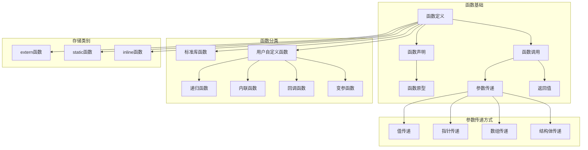
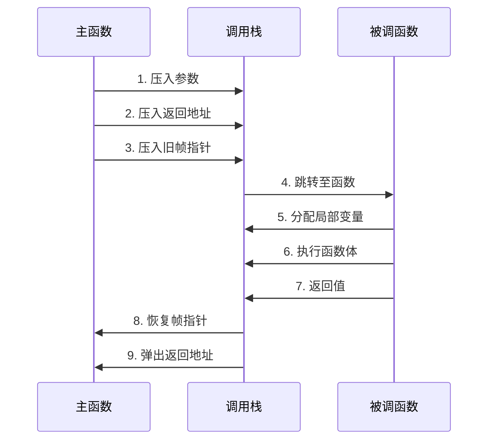
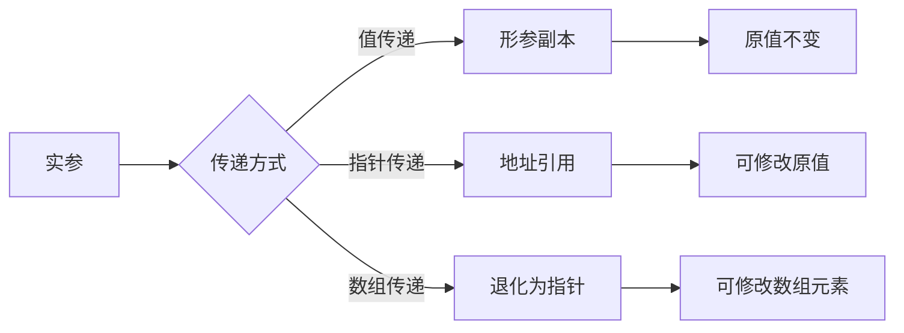
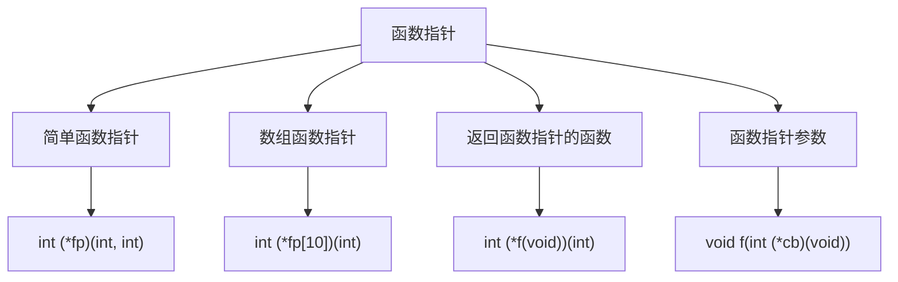
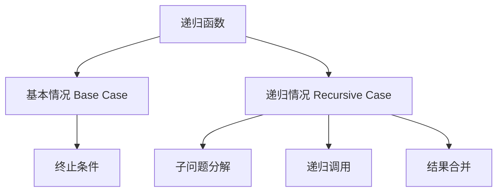

# 函数知识图谱

> 全面展示C语言函数的概念体系、分类、关系和最佳实践

---

## 一、函数概念全景图



---

## 二、函数调用机制



---

## 三、函数类型详解

| 函数类型 | 声明示例 | 特点 | 使用场景 |
|:---------|:---------|:-----|:---------|
| 标准库函数 | `int printf(const char*, ...);` | 预定义、可移植 | 通用操作 |
| 自定义函数 | `int add(int a, int b);` | 用户实现 | 业务逻辑 |
| 递归函数 | 自我调用 | 分治思想 | 树/图遍历 |
| 内联函数 | `inline int max(int a, int b);` | 展开调用 | 频繁调用小函数 |
| 回调函数 | `void qsort(void*, ..., int (*cmp)(const void*, const void*));` | 函数指针 | 事件驱动、排序 |
| 变参函数 | `int printf(const char* fmt, ...);` | 参数数量可变 | 格式化输出 |

---

## 四、参数传递详解

### 4.1 传递方式对比



### 4.2 各类型参数传递

| 参数类型 | 传递方式 | 能否修改原值 | 内存开销 | 示例 |
|:---------|:--------:|:------------:|:--------:|:-----|
| `int` | 值传递 | ❌ | 小 | `void f(int x)` |
| `int*` | 指针传递 | ✅ | 小 | `void f(int* p)` |
| `int[]` | 退化为指针 | ✅ | 小 | `void f(int arr[], int n)` |
| `struct S` | 值传递（通常） | ❌ | 大 | `void f(struct S s)` |
| `const struct S*` | 指针传递（只读） | ❌ | 小 | `void f(const struct S* s)` |
| `char*` | 指针传递 | ✅ | 小 | `void f(char* str)` |

---

## 五、函数指针

### 5.1 函数指针类型层次



### 5.2 函数指针应用

| 应用场景 | 代码示例 | 说明 |
|:---------|:---------|:-----|
| 回调函数 | `qsort(arr, n, sizeof(int), cmp);` | 排序比较 |
| 状态机 | `void (*state[])(void) = {state_init, state_run, state_stop};` | 状态切换 |
| 策略模式 | `int (*operation)(int, int);` | 算法选择 |
| 事件处理 | `void (*handlers[EVENT_MAX])(event_t*);` | 事件分发 |

---

## 六、递归函数

### 6.1 递归结构



### 6.2 经典递归示例

| 问题 | 递归关系 | 时间复杂度 | 空间复杂度 |
|:-----|:---------|:----------:|:----------:|
| 阶乘 | `n! = n * (n-1)!` | O(n) | O(n) |
| 斐波那契 | `F(n) = F(n-1) + F(n-2)` | O(2^n) | O(n) |
| 二分查找 | `T(n) = T(n/2) + O(1)` | O(log n) | O(log n) |
| 归并排序 | `T(n) = 2T(n/2) + O(n)` | O(n log n) | O(n) |
| 快排 | `T(n) = 2T(n/2) + O(n)` | O(n log n) | O(log n) |

---

## 七、函数设计原则

### 7.1 单一职责原则

```c
// ❌ 不好的设计：一个函数做太多事情
void process_data_bad(data_t* data) {
    read_file(data);
    validate(data);
    transform(data);
    save_to_db(data);
    send_notification(data);
}

// ✅ 好的设计：每个函数只做一件事
void read_data(const char* path, data_t* out);
bool validate_data(const data_t* data);
void transform_data(data_t* data);
bool save_data(const data_t* data);
void notify(const data_t* data);
```

### 7.2 函数设计检查清单

| 检查项 | 说明 | ✅ |
|:-------|:-----|:--:|
| 单一职责 | 函数只做一件事 | ☐ |
| 命名清晰 | 函数名准确描述功能 | ☐ |
| 参数合理 | 参数数量 ≤ 5 | ☐ |
| 返回值明确 | 成功/失败有明确约定 | ☐ |
| 文档完整 | 有函数注释说明 | ☐ |
| 错误处理 | 正确处理异常情况 | ☐ |
| 无副作用 | 避免意外修改全局状态 | ☐ |
| 可测试 | 便于单元测试 | ☐ |

---

## 八、相关资源

- [指针知识图谱](./02_Pointer_Knowledge_Graph.md) - 函数指针相关内容
- [内存知识图谱](./03_Memory_Knowledge_Graph.md) - 栈帧和调用约定
- [类型系统知识图谱](./04_Type_System_Knowledge_Graph.md) - 函数类型
- [并发知识图谱](./05_Concurrency_Knowledge_Graph.md) - 线程函数

---

> **最后更新**: 2026-03-16
> **关联文件**: [01_Pointer_Depth.md](../../01_Core_Knowledge_System/02_Core_Layer/01_Pointer_Depth.md)
