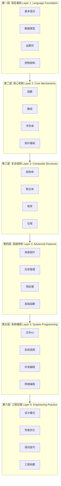
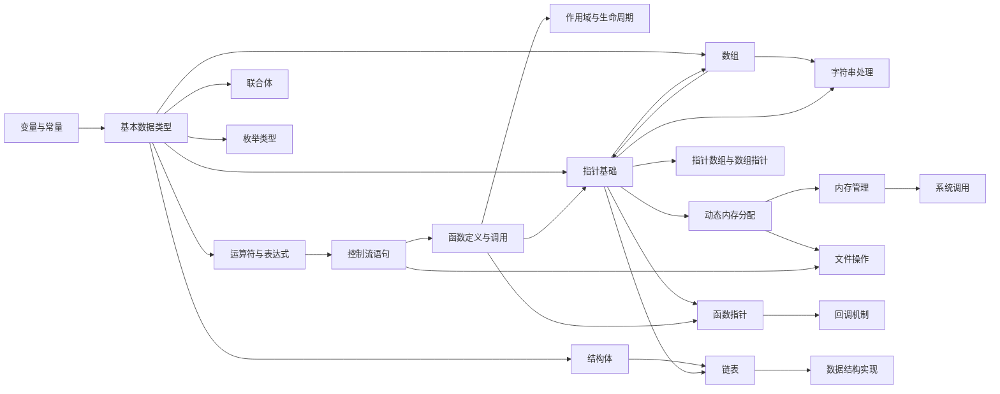
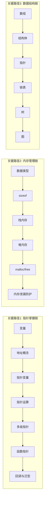
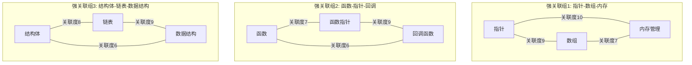
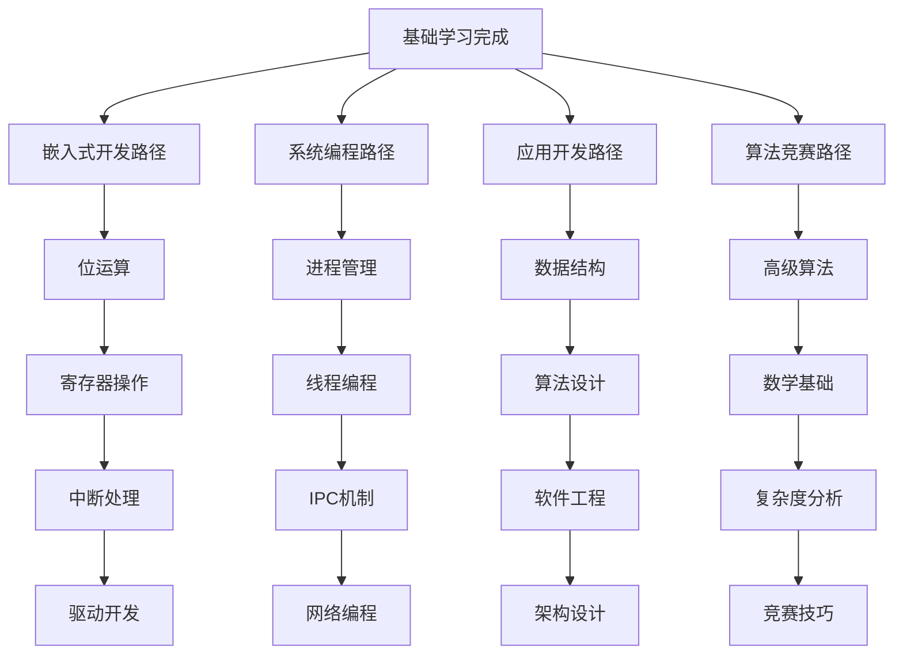
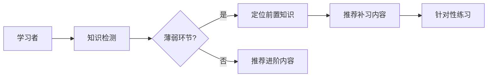

# C语言知识图谱与主题依赖关系


---

## 📑 目录

- [C语言知识图谱与主题依赖关系](#c语言知识图谱与主题依赖关系)
  - [📑 目录](#-目录)
  - [1. 知识图谱概述](#1-知识图谱概述)
    - [1.1 知识图谱的定义](#11-知识图谱的定义)
    - [1.2 C语言知识图谱的价值](#12-c语言知识图谱的价值)
  - [2. C语言六层知识架构](#2-c语言六层知识架构)
    - [2.1 六层架构全景图](#21-六层架构全景图)
    - [2.2 层级依赖关系详解](#22-层级依赖关系详解)
  - [3. 主题依赖关系图](#3-主题依赖关系图)
    - [3.1 核心主题依赖网络](#31-核心主题依赖网络)
    - [3.2 关键路径识别](#32-关键路径识别)
  - [4. 知识关联度分析](#4-知识关联度分析)
    - [4.1 概念关联度矩阵](#41-概念关联度矩阵)
    - [4.2 高关联概念组](#42-高关联概念组)
  - [5. 学习路径可视化](#5-学习路径可视化)
    - [5.1 推荐学习路径](#51-推荐学习路径)
    - [5.2 分支学习路径](#52-分支学习路径)
  - [6. 知识图谱数据结构实现](#6-知识图谱数据结构实现)
    - [6.1 图的邻接表表示](#61-图的邻接表表示)
    - [6.2 代码编译与运行](#62-代码编译与运行)
    - [6.3 运行结果示例](#63-运行结果示例)
  - [7. 知识图谱应用场景](#7-知识图谱应用场景)
    - [7.1 学习诊断](#71-学习诊断)
    - [7.2 个性化学习路径](#72-个性化学习路径)
  - [8. 总结](#8-总结)


---

## 1. 知识图谱概述

C语言知识图谱是一种结构化的知识表示方法，用于描述C语言各个概念之间的关联关系、依赖关系和学习路径。
通过构建知识图谱，学习者可以清晰地理解C语言的知识体系架构，明确学习顺序，避免知识盲区。

### 1.1 知识图谱的定义

知识图谱（Knowledge Graph）是一种用图结构表示知识的方法，其中：

- **节点（Node）**：表示知识概念、主题或技能点
- **边（Edge）**：表示概念之间的关系，如前置依赖、关联、包含等
- **权重（Weight）**：表示关系的强度或重要程度

### 1.2 C语言知识图谱的价值

```text
┌─────────────────────────────────────────────────────────────┐
│                    C语言知识图谱价值                         │
├─────────────────────────────────────────────────────────────┤
│  ┌──────────┐  ┌──────────┐  ┌──────────┐  ┌──────────┐    │
│  │ 明确学习  │  │ 发现关联  │  │ 诊断薄弱  │  │ 规划路径  │    │
│  │  顺序    │  │  知识    │  │  环节    │  │  优化    │    │
│  └──────────┘  └──────────┘  └──────────┘  └──────────┘    │
│       ↓            ↓            ↓            ↓              │
│  ┌──────────────────────────────────────────────────────┐ │
│  │           提升学习效率，构建完整知识体系               │ │
│  └──────────────────────────────────────────────────────┘ │
└─────────────────────────────────────────────────────────────┘
```

## 2. C语言六层知识架构

C语言知识体系采用六层架构模型，从底层基础到高层应用逐步递进：

### 2.1 六层架构全景图



### 2.2 层级依赖关系详解

| 层级 | 名称 | 核心内容 | 前置依赖 | 后续关联 |
|------|------|----------|----------|----------|
| L1 | 语言基础 | 语法、类型、运算符 | 无 | L2所有内容 |
| L2 | 核心机制 | 函数、数组、指针基础 | L1 | L3, L4 |
| L3 | 复合结构 | struct, union, enum | L1, L2 | L4, L5 |
| L4 | 高级特性 | 高级指针、内存管理 | L2, L3 | L5, L6 |
| L5 | 系统编程 | IO、系统调用、并发 | L1-L4 | L6 |
| L6 | 工程实践 | 设计模式、优化 | L1-L5 | 实际项目 |

## 3. 主题依赖关系图

### 3.1 核心主题依赖网络



### 3.2 关键路径识别

在C语言学习中，存在几条关键学习路径：



## 4. 知识关联度分析

### 4.1 概念关联度矩阵

以下矩阵展示核心概念之间的关联强度（0-10分制）：

| 概念 | 指针 | 数组 | 函数 | 结构体 | 内存 | 字符串 | 文件IO |
|------|------|------|------|--------|------|--------|--------|
| 指针 | 10 | 9 | 7 | 8 | 10 | 8 | 5 |
| 数组 | 9 | 10 | 5 | 6 | 7 | 9 | 4 |
| 函数 | 7 | 5 | 10 | 4 | 5 | 4 | 5 |
| 结构体 | 8 | 6 | 4 | 10 | 7 | 3 | 6 |
| 内存 | 10 | 7 | 5 | 7 | 10 | 6 | 4 |
| 字符串 | 8 | 9 | 4 | 3 | 6 | 10 | 5 |
| 文件IO | 5 | 4 | 5 | 6 | 4 | 5 | 10 |

### 4.2 高关联概念组



## 5. 学习路径可视化

### 5.1 推荐学习路径


### 5.2 分支学习路径

根据不同学习目标，可选择不同分支：



## 6. 知识图谱数据结构实现

### 6.1 图的邻接表表示

```c
/*
 * C语言知识图谱的邻接表实现
 * 使用邻接表表示有向图，支持权重
 * 标准: C17
 */

#include <stdio.h>
#include <stdlib.h>
#include <string.h>
#include <stdbool.h>

#define MAX_NODES 100
#define MAX_NAME_LEN 64

/* 边节点 - 表示概念间的关系 */
typedef struct EdgeNode {
    int dest_id;                /* 目标节点ID */
    int weight;                 /* 关联强度权重 1-10 */
    char relation_type[32];     /* 关系类型: prerequisite|related|extends */
    struct EdgeNode* next;
} EdgeNode;

/* 顶点节点 - 表示知识概念 */
typedef struct VertexNode {
    int id;                     /* 概念ID */
    char name[MAX_NAME_LEN];    /* 概念名称 */
    char category[32];          /* 所属类别 */
    int difficulty;             /* 难度等级 1-5 */
    int layer;                  /* 所属层级 1-6 */
    bool visited;               /* 遍历标记 */
    EdgeNode* first_edge;       /* 第一条边 */
} VertexNode;

/* 知识图谱结构 */
typedef struct KnowledgeGraph {
    VertexNode vertices[MAX_NODES];
    int num_vertices;
    int num_edges;
} KnowledgeGraph;

/* 初始化知识图谱 */
void init_graph(KnowledgeGraph* g) {
    g->num_vertices = 0;
    g->num_edges = 0;
    for (int i = 0; i < MAX_NODES; i++) {
        g->vertices[i].first_edge = NULL;
        g->vertices[i].visited = false;
    }
}

/* 添加知识概念节点 */
int add_vertex(KnowledgeGraph* g, const char* name, const char* category,
               int difficulty, int layer) {
    if (g->num_vertices >= MAX_NODES) {
        fprintf(stderr, "Error: Graph is full\n");
        return -1;
    }

    VertexNode* v = &g->vertices[g->num_vertices];
    v->id = g->num_vertices;
    strncpy(v->name, name, MAX_NAME_LEN - 1);
    v->name[MAX_NAME_LEN - 1] = '\0';
    strncpy(v->category, category, 31);
    v->category[31] = '\0';
    v->difficulty = difficulty;
    v->layer = layer;
    v->visited = false;
    v->first_edge = NULL;

    return g->num_vertices++;
}

/* 添加概念间关系（有向边） */
bool add_edge(KnowledgeGraph* g, int from, int to, int weight,
              const char* relation_type) {
    if (from < 0 || from >= g->num_vertices ||
        to < 0 || to >= g->num_vertices) {
        fprintf(stderr, "Error: Invalid vertex ID\n");
        return false;
    }

    EdgeNode* edge = (EdgeNode*)malloc(sizeof(EdgeNode));
    if (!edge) {
        perror("malloc failed");
        return false;
    }

    edge->dest_id = to;
    edge->weight = weight;
    strncpy(edge->relation_type, relation_type, 31);
    edge->relation_type[31] = '\0';
    edge->next = g->vertices[from].first_edge;
    g->vertices[from].first_edge = edge;

    g->num_edges++;
    return true;
}

/* 打印知识图谱 */
void print_graph(const KnowledgeGraph* g) {
    printf("\n========== C语言知识图谱 ==========\n");
    printf("概念总数: %d\n", g->num_vertices);
    printf("关系总数: %d\n\n", g->num_edges);

    for (int i = 0; i < g->num_vertices; i++) {
        const VertexNode* v = &g->vertices[i];
        printf("[%d] %s (L%d, 难度%d) [%s]\n",
               v->id, v->name, v->layer, v->difficulty, v->category);

        EdgeNode* e = v->first_edge;
        while (e) {
            printf("    └──> [%d] %s (权重:%d, %s)\n",
                   e->dest_id, g->vertices[e->dest_id].name,
                   e->weight, e->relation_type);
            e = e->next;
        }
    }
}

/* DFS深度优先遍历 - 探索学习路径 */
void dfs_explore(KnowledgeGraph* g, int start_id, int depth) {
    if (start_id < 0 || start_id >= g->num_vertices) return;

    VertexNode* v = &g->vertices[start_id];
    if (v->visited) return;

    v->visited = true;

    /* 打印缩进表示层级 */
    for (int i = 0; i < depth; i++) printf("  ");
    printf("└─ %s (L%d)\n", v->name, v->layer);

    /* 遍历所有前置依赖 */
    EdgeNode* e = v->first_edge;
    while (e) {
        if (strcmp(e->relation_type, "prerequisite") == 0) {
            dfs_explore(g, e->dest_id, depth + 1);
        }
        e = e->next;
    }
}

/* 重置访问标记 */
void reset_visited(KnowledgeGraph* g) {
    for (int i = 0; i < g->num_vertices; i++) {
        g->vertices[i].visited = false;
    }
}

/* 查找概念ID */
int find_vertex_id(const KnowledgeGraph* g, const char* name) {
    for (int i = 0; i < g->num_vertices; i++) {
        if (strcmp(g->vertices[i].name, name) == 0) {
            return i;
        }
    }
    return -1;
}

/* 获取指定层级的所有概念 */
void get_concepts_by_layer(const KnowledgeGraph* g, int layer) {
    printf("\n========== 第%d层概念 ==========\n", layer);
    int count = 0;
    for (int i = 0; i < g->num_vertices; i++) {
        if (g->vertices[i].layer == layer) {
            printf("  %s [%s]\n", g->vertices[i].name, g->vertices[i].category);
            count++;
        }
    }
    printf("总计: %d个概念\n", count);
}

/* 查找高关联概念（推荐学习） */
void find_related_concepts(const KnowledgeGraph* g, const char* name, int min_weight) {
    int id = find_vertex_id(g, name);
    if (id < 0) {
        printf("概念 '%s' 未找到\n", name);
        return;
    }

    printf("\n与 '%s' 高度相关的概念 (权重>=%d):\n", name, min_weight);

    EdgeNode* e = g->vertices[id].first_edge;
    while (e) {
        if (e->weight >= min_weight) {
            printf("  → %s (权重:%d, %s)\n",
                   g->vertices[e->dest_id].name,
                   e->weight, e->relation_type);
        }
        e = e->next;
    }
}

/* 释放图内存 */
void destroy_graph(KnowledgeGraph* g) {
    for (int i = 0; i < g->num_vertices; i++) {
        EdgeNode* e = g->vertices[i].first_edge;
        while (e) {
            EdgeNode* temp = e;
            e = e->next;
            free(temp);
        }
        g->vertices[i].first_edge = NULL;
    }
    g->num_vertices = 0;
    g->num_edges = 0;
}

/* 构建示例知识图谱 */
void build_sample_graph(KnowledgeGraph* g) {
    init_graph(g);

    /* L1: 语言基础 */
    int var = add_vertex(g, "变量与常量", "基础", 1, 1);
    int type = add_vertex(g, "数据类型", "基础", 1, 1);
    int op = add_vertex(g, "运算符", "基础", 1, 1);
    int ctrl = add_vertex(g, "控制结构", "基础", 2, 1);

    /* L2: 核心机制 */
    int func = add_vertex(g, "函数", "核心", 2, 2);
    int arr = add_vertex(g, "数组", "核心", 2, 2);
    int str = add_vertex(g, "字符串", "核心", 2, 2);
    int ptr = add_vertex(g, "指针基础", "核心", 3, 2);

    /* L3: 复合结构 */
    int st = add_vertex(g, "结构体", "复合", 2, 3);
    int uni = add_vertex(g, "联合体", "复合", 3, 3);

    /* L4: 高级特性 */
    int aptr = add_vertex(g, "高级指针", "高级", 4, 4);
    int mem = add_vertex(g, "内存管理", "高级", 4, 4);

    /* 添加依赖关系 */
    add_edge(g, func, var, 8, "prerequisite");
    add_edge(g, func, type, 7, "prerequisite");
    add_edge(g, arr, type, 9, "prerequisite");
    add_edge(g, arr, var, 6, "related");
    add_edge(g, str, arr, 9, "prerequisite");
    add_edge(g, ptr, var, 10, "prerequisite");
    add_edge(g, ptr, type, 8, "prerequisite");
    add_edge(g, st, type, 8, "prerequisite");
    add_edge(g, aptr, ptr, 10, "prerequisite");
    add_edge(g, aptr, arr, 9, "prerequisite");
    add_edge(g, mem, ptr, 10, "prerequisite");
    add_edge(g, mem, type, 7, "related");
    add_edge(g, ptr, arr, 9, "related");
    add_edge(g, arr, ptr, 8, "related");
}

/* 主函数 - 演示知识图谱操作 */
int main(void) {
    KnowledgeGraph kg;

    /* 构建示例图谱 */
    build_sample_graph(&kg);

    /* 打印完整图谱 */
    print_graph(&kg);

    /* 按层级查看概念 */
    get_concepts_by_layer(&kg, 1);
    get_concepts_by_layer(&kg, 2);

    /* 查找相关概念 */
    find_related_concepts(&kg, "指针基础", 8);

    /* DFS探索学习路径 */
    printf("\n========== 从'内存管理'反向探索学习路径 ==========\n");
    int mem_id = find_vertex_id(&kg, "内存管理");
    dfs_explore(&kg, mem_id, 0);

    /* 清理 */
    destroy_graph(&kg);

    return 0;
}
```

### 6.2 代码编译与运行

```bash
# 编译
gcc -std=c17 -Wall -Wextra -o knowledge_graph knowledge_graph.c

# 运行
./knowledge_graph
```

### 6.3 运行结果示例

```text
========== C语言知识图谱 ==========
概念总数: 10
关系总数: 13

[0] 变量与常量 (L1, 难度1) [基础]
[1] 数据类型 (L1, 难度1) [基础]
    └──> [2] 运算符 (权重:7, prerequisite)
...

========== 从'内存管理'反向探索学习路径 ==========
└─ 内存管理 (L4)
  └─ 指针基础 (L2)
    └─ 变量与常量 (L1)
```

## 7. 知识图谱应用场景

### 7.1 学习诊断



### 7.2 个性化学习路径

基于知识图谱，可以为不同背景的学习者生成个性化路径：

| 学习者类型 | 起点 | 重点路径 | 预期时长 |
|------------|------|----------|----------|
| 编程零基础 | L1 | 基础→核心→复合 | 3个月 |
| 有其他语言基础 | L2 | 指针→内存→系统 | 1.5个月 |
| 嵌入式方向 | L3 | 位运算→硬件→驱动 | 2个月 |
| 算法竞赛方向 | L2 | 数据结构→算法→优化 | 2个月 |

## 8. 总结

C语言知识图谱通过结构化的方式展现了语言的全貌，帮助学习者：

1. **建立全局视野**：理解各知识点在整个体系中的位置
2. **明确学习顺序**：遵循依赖关系，避免跳跃导致的基础不牢
3. **发现知识关联**：理解概念间的联系，形成知识网络
4. **诊断学习问题**：定位薄弱点，精准补强
5. **规划学习路径**：根据目标选择最优学习路线

通过本章的图结构实现，学习者可以深入理解知识图谱的计算机表示方法，将理论知识与实践技能相结合。


---

## 深入理解

### 核心原理

深入探讨技术原理和实现细节。

### 实践应用

- 应用场景1
- 应用场景2
- 应用场景3

### 最佳实践

1. 理解基础概念
2. 掌握核心机制
3. 应用到实际项目

---

> **最后更新**: 2026-03-21  
> **维护者**: AI Code Review
