# 指针知识图谱 (Pointer Knowledge Graph)

## 概述

本知识图谱展示 C 语言指针的完整概念体系，包括类型层次、操作、关系和常见问题。

```mermaid
graph TB
    %% 根节点
    Root(["Pointer System<br/>指针系统"])

    %% ============ 第一层：主要类别 ============
    subgraph Category["📦 主要类别"]
        TypeCat["指针类型层次"]
        OpCat["指针操作"]
        RelCat["指针关系"]
        MemCat["内存区域"]
        IssueCat["常见问题"]
    end

    Root --> TypeCat
    Root --> OpCat
    Root --> RelCat
    Root --> MemCat
    Root --> IssueCat

    %% ============ 指针类型层次 ============
    subgraph TypeHierarchy["🔷 指针类型层次"]
        VoidPtr["void*<br/>通用指针"]
        TypedPtr["Typed Pointers<br/>类型指针"]
        FuncPtr["Function Pointers<br/>函数指针"]

        IntPtr["int* / char*<br/>基本类型指针"]
        StructPtr["struct*<br/>结构体指针"]
        DblPtr["int** / void**<br/>多级指针"]

        PtrToFunc["ReturnType(*ptr)(Args)<br/>指向函数的指针"]
        PtrArr["ReturnType *ptr[]<br/>指针数组"]
        ArrPtr["ReturnType (*ptr)[]<br/>数组指针"]
    end

    TypeCat --> VoidPtr
    TypeCat --> TypedPtr
    TypeCat --> FuncPtr

    VoidPtr --> TypedPtr
    TypedPtr --> IntPtr
    TypedPtr --> StructPtr
    TypedPtr --> DblPtr

    FuncPtr --> PtrToFunc
    FuncPtr --> PtrArr
    FuncPtr --> ArrPtr

    %% ============ 指针操作 ============
    subgraph PointerOps["⚙️ 指针操作"]
        AddrOp["&amp; Operator<br/>取地址"]
        DerefOp["* Operator<br/>解引用"]
        MemberOp["-> Operator<br/>成员访问"]
        IndexOp["[] Operator<br/>索引访问"]
        ArithOp["Arithmetic<br/>算术运算"]

        AddOp["+ / -<br/>加减运算"]
        IncOp["++ / --<br/>自增自减"]
        SubOp["p1 - p2<br/>指针相减"]
        CompOp["&lt; / &gt; / ==<br/>指针比较"]
    end

    OpCat --> AddrOp
    OpCat --> DerefOp
    OpCat --> MemberOp
    OpCat --> IndexOp
    OpCat --> ArithOp

    ArithOp --> AddOp
    ArithOp --> IncOp
    ArithOp --> SubOp
    ArithOp --> CompOp

    %% ============ 指针与数组关系 ============
    subgraph PtrArrayRel["🔗 指针-数组关系"]
        ArrDecay["Array Decay<br/>数组退化为指针"]
        PtrArrEquiv["a[i] ↔ *(a+i)"]
        StrPtr["String Pointer<br/>字符串指针"]
        PtrArithmetic["Pointer Arithmetic<br/>基于元素大小"]
    end

    RelCat --> ArrDecay
    RelCat --> PtrArrEquiv
    RelCat --> StrPtr
    RelCat --> PtrArithmetic

    ArrDecay --> PtrArrEquiv
    StrPtr --> PtrArithmetic

    %% ============ 指针与内存区域 ============
    subgraph PtrMemory["💾 指针与内存"]
        StackPtr["Stack Pointer<br/>栈指针<br/>局部变量"]
        HeapPtr["Heap Pointer<br/>堆指针<br/>动态分配"]
        StaticPtr["Static Pointer<br/>静态指针<br/>全局/静态变量"]
        CodePtr["Code Pointer<br/>代码指针<br/>函数地址"]
    end

    MemCat --> StackPtr
    MemCat --> HeapPtr
    MemCat --> StaticPtr
    MemCat --> CodePtr

    %% ============ 常见问题 ============
    subgraph CommonIssues["🐛 常见问题"]
        NullPtr["NULL Pointer<br/>空指针<br/>可检查预防"]
        WildPtr["Wild Pointer<br/>野指针<br/>未初始化"]
        DanglePtr["Dangling Pointer<br/>悬挂指针<br/>指向已释放内存"]
        MemLeak["Memory Leak<br/>内存泄漏<br/>未释放堆内存"]
        BufferOver["Buffer Overflow<br/>缓冲区溢出"]
        Unaligned["Unaligned Access<br/>未对齐访问"]
    end

    IssueCat --> NullPtr
    IssueCat --> WildPtr
    IssueCat --> DanglePtr
    IssueCat --> MemLeak
    IssueCat --> BufferOver
    IssueCat --> Unaligned

    %% ============ 跨类别连接 ============
    HeapPtr -.->|"malloc returns"| VoidPtr
    VoidPtr -.->|"cast to"| TypedPtr
    DanglePtr -.->|"caused by"| HeapPtr
    MemLeak -.->|"caused by"| HeapPtr
    ArrDecay -.->|"enables"| IndexOp
    PtrArrEquiv -.->|"using"| ArithOp

    %% 样式定义
    classDef rootNode fill:#2E86AB,stroke:#1B4965,stroke-width:3px,color:#fff
    classDef category fill:#5C9EAD,stroke:#2E86AB,stroke-width:2px,color:#fff
    classDef typeNode fill:#A23B72,stroke:#7B1D46,stroke-width:2px,color:#fff
    classDef opNode fill:#F18F01,stroke:#C73E1D,stroke-width:2px,color:#fff
    classDef relNode fill:#3B1F2B,stroke:#1A0F15,stroke-width:2px,color:#fff
    classDef memNode fill:#2E8B57,stroke:#1E5B38,stroke-width:2px,color:#fff
    classDef issueNode fill:#C1121F,stroke:#780000,stroke-width:2px,color:#fff

    class Root rootNode
    class TypeCat,OpCat,RelCat,MemCat,IssueCat category
    class VoidPtr,TypedPtr,FuncPtr,IntPtr,StructPtr,DblPtr,PtrToFunc,PtrArr,ArrPtr typeNode
    class AddrOp,DerefOp,MemberOp,IndexOp,ArithOp,AddOp,IncOp,SubOp,CompOp opNode
    class ArrDecay,PtrArrEquiv,StrPtr,PtrArithmetic relNode
    class StackPtr,HeapPtr,StaticPtr,CodePtr memNode
    class NullPtr,WildPtr,DanglePtr,MemLeak,BufferOver,Unaligned issueNode
```



## 关键概念详解

### 1. 指针类型层次

| 类型 | 说明 | 示例 |
|------|------|------|
| void* | 通用指针，可指向任何数据类型 | `void *p = malloc(100);` |
| 基本类型指针 | 指向特定基本类型的指针 | `int *p; char *cp;` |
| 结构体指针 | 指向结构体类型的指针 | `struct Point *pp;` |
| 多级指针 | 指向指针的指针 | `int **pp;` |
| 函数指针 | 指向函数的指针 | `int (*fp)(int, int);` |
| 数组指针 | 指向数组的指针 | `int (*arr)[10];` |

### 2. 指针操作优先级

```text
高优先级 → 低优先级
() [] -> .  →  ++ -- (后缀)  →  ++ -- (前缀) * &  →  + - (一元)  →  * / %  →  + -
```

### 3. 指针关系公式

```c
// 数组与指针等价关系
a[i]       == *(a + i)      // 数组索引
&a[i]      == a + i         // 取数组元素地址
*(p + i)   == p[i]          // 指针索引
p++        // 移动 sizeof(*p) 字节
```

### 4. 常见问题预防

| 问题类型 | 原因 | 预防措施 |
|----------|------|----------|
| 空指针 | 指针被赋值为 NULL | 使用前检查 `if (p != NULL)` |
| 野指针 | 指针未初始化 | 声明时初始化为 NULL |
| 悬挂指针 | 释放后未置空 | free 后立即 `p = NULL` |
| 内存泄漏 | 未释放动态内存 | 确保每个 malloc 对应一个 free |

## 相关文件

- [01_Function_Knowledge_Graph.md](./01_Function_Knowledge_Graph.md) - 函数知识图谱
- [03_Memory_Knowledge_Graph.md](./03_Memory_Knowledge_Graph.md) - 内存知识图谱
- [04_Type_System_Knowledge_Graph.md](./04_Type_System_Knowledge_Graph.md) - 类型系统图谱
- [05_Concurrency_Knowledge_Graph.md](./05_Concurrency_Knowledge_Graph.md) - 并发知识图谱


---

## 深入理解

### 核心原理

深入探讨技术原理和实现细节。

### 实践应用

- 应用场景1
- 应用场景2
- 应用场景3

### 最佳实践

1. 理解基础概念
2. 掌握核心机制
3. 应用到实际项目

---

> **最后更新**: 2026-03-21
> **维护者**: AI Code Review
