# 内存知识图谱 (Memory Knowledge Graph)

## 概述

本知识图谱展示 C 语言内存管理的完整概念体系，包括存储类别、存储期、内存区域、管理函数和常见问题。

```mermaid
graph TB
    %% 根节点
    Root(["Memory System<br/>内存系统"])

    %% ============ 第一层：主要类别 ============
    subgraph Category["📦 主要类别"]
        StorageCat["Storage Classes<br/>存储类别"]
        DurationCat["Storage Duration<br/>存储期"]
        RegionCat["Memory Regions<br/>内存区域"]
        FuncCat["Management Functions<br/>管理函数"]
        IssueCat["Memory Issues<br/>内存问题"]
    end

    Root --> StorageCat
    Root --> DurationCat
    Root --> RegionCat
    Root --> FuncCat
    Root --> IssueCat

    %% ============ 存储类别 ============
    subgraph StorageClasses["🔷 存储类别 (Storage Classes)"]
        Auto["auto<br/>自动变量<br/>默认，局部作用域"]
        Static["static<br/>静态变量<br/>持久存储，限制可见性"]
        Extern["extern<br/>外部变量<br/>声明在其他文件定义"]
        Register["register<br/>寄存器变量<br/>建议存储在寄存器"]
        ThreadLocal["_Thread_local<br/>线程局部存储<br/>C11"]
    end

    StorageCat --> Auto
    StorageCat --> Static
    StorageCat --> Extern
    StorageCat --> Register
    StorageCat --> ThreadLocal

    %% ============ 存储期 ============
    subgraph StorageDuration["⏱️ 存储期 (Storage Duration)"]
        AutoDur["Automatic<br/>自动存储期<br/>函数执行期间"]
        StaticDur["Static<br/>静态存储期<br/>程序整个生命周期"]
        ThreadDur["Thread<br/>线程存储期<br/>线程整个生命周期<br/>C11"]
        AllocDur["Allocated<br/>分配存储期<br/>手动管理<br/>malloc/free"]
    end

    DurationCat --> AutoDur
    DurationCat --> StaticDur
    DurationCat --> ThreadDur
    DurationCat --> AllocDur

    %% 存储类别与存储期关系
    Auto -.->|"has"| AutoDur
    Register -.->|"has"| AutoDur
    Static -.->|"has"| StaticDur
    Extern -.->|"has"| StaticDur
    ThreadLocal -.->|"has"| ThreadDur

    %% ============ 内存区域 ============
    subgraph MemoryRegions["💾 内存区域布局"]
        TextSeg["Text Segment<br/>代码段<br/>只读，可共享<br/>程序指令"]
        DataSeg["Data Segment<br/>数据段<br/>已初始化全局/静态变量<br/>读写"]
        BSS["BSS Segment<br/>未初始化数据段<br/>零初始化全局/静态变量"]
        Heap["Heap<br/>堆<br/>动态分配，向上增长<br/>手动管理"]
        Stack["Stack<br/>栈<br/>局部变量，向下增长<br/>自动管理"]
    end

    RegionCat --> TextSeg
    RegionCat --> DataSeg
    RegionCat --> BSS
    RegionCat --> Heap
    RegionCat --> Stack

    %% 存储期与内存区域关系
    AutoDur -.->|"stored in"| Stack
    StaticDur -.->|"stored in"| DataSeg
    StaticDur -.->|"stored in"| BSS
    AllocDur -.->|"stored in"| Heap
    ThreadDur -.->|"stored in"| DataSeg

    %% 内存布局顺序
    TextSeg --> DataSeg --> BSS --> Heap
    Stack -.->|"grows toward"| Heap

    %% ============ 内存管理函数 ============
    subgraph MemFunctions["⚙️ 内存管理函数"]
        Malloc["malloc(size)<br/>分配未初始化内存"]
        Calloc["calloc(n, size)<br/>分配并清零内存"]
        Realloc["realloc(ptr, size)<br/>重新分配内存"]
        AlignedAlloc["aligned_alloc(a, size)<br/>对齐分配<br/>C11"]
        Free["free(ptr)<br/>释放内存"]
    end

    FuncCat --> Malloc
    FuncCat --> Calloc
    FuncCat --> Realloc
    FuncCat --> AlignedAlloc
    FuncCat --> Free

    %% 函数关系
    Malloc -.->|"+ zero init"| Calloc
    Malloc -.->|"resize"| Realloc
    Calloc -.->|"resize"| Realloc
    Malloc -.->|"+ alignment"| AlignedAlloc
    Malloc -.->|"must pair with"| Free
    Calloc -.->|"must pair with"| Free
    Realloc -.->|"must pair with"| Free
    AlignedAlloc -.->|"must pair with"| Free

    %% ============ 内存问题 ============
    subgraph MemoryIssues["🐛 内存问题"]
        Leak["Memory Leak<br/>内存泄漏<br/>未释放已分配内存"]
        OutOfBounds["Buffer Overflow/Underflow<br/>缓冲区越界<br/>访问超出分配范围"]
        UseAfterFree["Use After Free<br/>使用已释放内存<br/>悬挂指针访问"]
        DoubleFree["Double Free<br/>双重释放<br/>同一块内存释放两次"]
        UninitRead["Uninitialized Read<br/>读取未初始化内存"]
        NullDeref["NULL Dereference<br/>空指针解引用"]
    end

    IssueCat --> Leak
    IssueCat --> OutOfBounds
    IssueCat --> UseAfterFree
    IssueCat --> DoubleFree
    IssueCat --> UninitRead
    IssueCat --> NullDeref

    %% 问题与函数关系
    Leak -.->|"caused by missing"| Free
    UseAfterFree -.->|"after"| Free
    DoubleFree -.->|"duplicate"| Free
    NullDeref -.->|"when"| Malloc
    NullDeref -.->|"returns NULL"| Malloc

    %% ============ 内存对齐 ============
    subgraph Alignment["📐 内存对齐"]
        NaturalAlign["Natural Alignment<br/>自然对齐<br/>按类型大小对齐"]
        Padding["Padding<br/>填充字节<br/>结构体对齐"]
        PackAttr["__attribute__((packed))<br/>紧凑布局"]
        Alignas["alignas<br/>指定对齐<br/>C11"]
    end

    RegionCat -.-> Alignment
    NaturalAlign --> Padding
    Padding -.->|"disable with"| PackAttr
    Alignas -.->|"override"| NaturalAlign

    %% 样式定义
    classDef rootNode fill:#2E86AB,stroke:#1B4965,stroke-width:3px,color:#fff
    classDef category fill:#5C9EAD,stroke:#2E86AB,stroke-width:2px,color:#fff
    classDef storage fill:#9D4EDD,stroke:#5A189A,stroke-width:2px,color:#fff
    classDef duration fill:#C77DFF,stroke:#9D4EDD,stroke-width:2px,color:#fff
    classDef region fill:#2E8B57,stroke:#1E5B38,stroke-width:2px,color:#fff
    classDef function fill:#F18F01,stroke:#C73E1D,stroke-width:2px,color:#fff
    classDef issue fill:#C1121F,stroke:#780000,stroke-width:2px,color:#fff
    classDef align fill:#0077B6,stroke:#023E8A,stroke-width:2px,color:#fff

    class Root rootNode
    class StorageCat,DurationCat,RegionCat,FuncCat,IssueCat category
    class Auto,Static,Extern,Register,ThreadLocal storage
    class AutoDur,StaticDur,ThreadDur,AllocDur duration
    class TextSeg,DataSeg,BSS,Heap,Stack region
    class Malloc,Calloc,Realloc,AlignedAlloc,Free function
    class Leak,OutOfBounds,UseAfterFree,DoubleFree,UninitRead,NullDeref issue
    class NaturalAlign,Padding,PackAttr,Alignas align
```



## 关键概念详解

### 1. 存储类别对比

| 关键字 | 作用域 | 链接属性 | 存储期 | 默认初始值 |
|--------|--------|----------|--------|------------|
| `auto` | 块作用域 | 无 | 自动 | 未初始化（垃圾值） |
| `static` | 文件/块 | 内部链接 | 静态 | 0 |
| `extern` | 文件 | 外部链接 | 静态 | 0 |
| `register` | 块 | 无 | 自动 | 未初始化 |
| `_Thread_local` | 文件/块 | - | 线程 | 0 |

### 2. 内存区域布局（典型）

```
高地址 ┌─────────────┐
       │    栈区     │  ← 向下增长 (local variables)
       │   (Stack)   │
       ├─────────────┤
       │             │
       │    堆区     │  ← 向上增长 (malloc/free)
       │   (Heap)    │
       ├─────────────┤
       │    BSS段    │  ← 未初始化全局/静态变量
       ├─────────────┤
       │   数据段    │  ← 已初始化全局/静态变量
       │  (Data)     │
       ├─────────────┤
       │   代码段    │  ← 程序指令 (只读)
       │  (Text)     │
低地址 └─────────────┘
```

### 3. 内存管理函数对比

```c
// malloc - 分配指定字节数的未初始化内存
void *p1 = malloc(100);           // 100 bytes, 未初始化

// calloc - 分配 n * size 字节并清零
void *p2 = calloc(10, sizeof(int)); // 10个int, 全部置0

// realloc - 重新调整已分配内存大小
void *p3 = realloc(p1, 200);       // 扩展到200字节

// aligned_alloc - 按指定对齐方式分配
void *p4 = aligned_alloc(64, 256); // 64字节对齐, 256字节

// free - 释放内存
free(p2);
free(p3);
free(p4);
```

### 4. 内存问题检测

| 问题 | 检测方法 | 工具 |
|------|----------|------|
| 内存泄漏 | 统计 malloc/free 配对 | Valgrind, AddressSanitizer |
| 越界访问 | 边界检查 | AddressSanitizer |
| 使用已释放内存 | 悬挂指针检测 | Valgrind |
| 双重释放 | 释放记录跟踪 | AddressSanitizer |

### 5. C11 线程局部存储

```c
_Thread_local int thread_local_var;  // 每个线程有独立副本

// 或使用宏 (threads.h)
thread_local int tls_var;
```

## 相关文件

- [01_Function_Knowledge_Graph.md](./01_Function_Knowledge_Graph.md) - 函数知识图谱
- [02_Pointer_Knowledge_Graph.md](./02_Pointer_Knowledge_Graph.md) - 指针知识图谱
- [04_Type_System_Knowledge_Graph.md](./04_Type_System_Knowledge_Graph.md) - 类型系统图谱
- [05_Concurrency_Knowledge_Graph.md](./05_Concurrency_Knowledge_Graph.md) - 并发知识图谱


---

## 深入理解

### 核心原理

深入探讨技术原理和实现细节。

### 实践应用

- 应用场景1
- 应用场景2
- 应用场景3

### 最佳实践

1. 理解基础概念
2. 掌握核心机制
3. 应用到实际项目

---

> **最后更新**: 2026-03-21  
> **维护者**: AI Code Review
