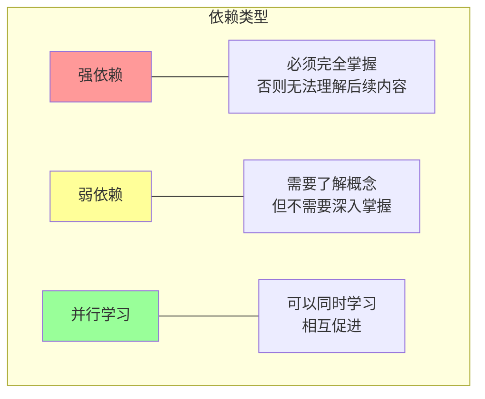
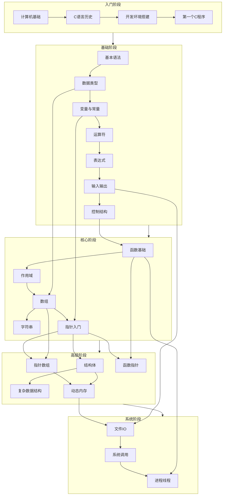
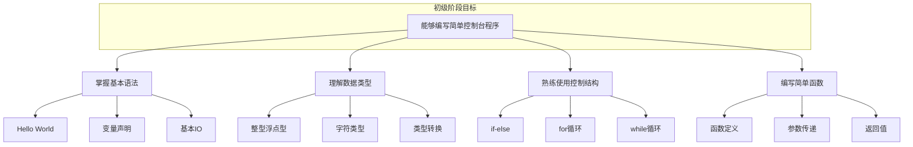
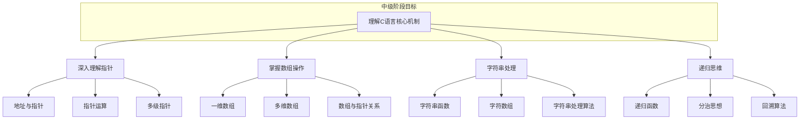
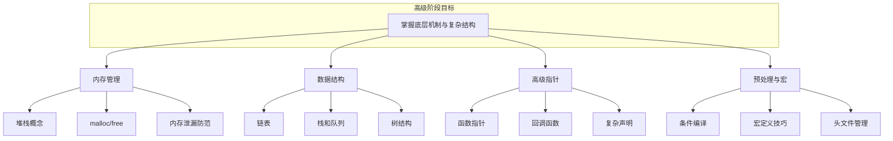
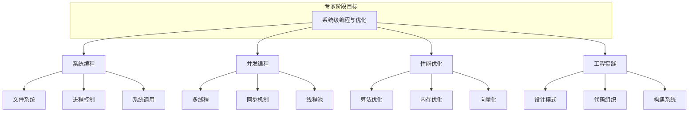
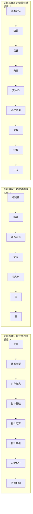
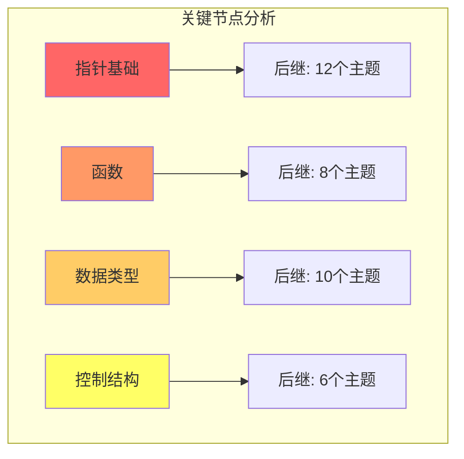
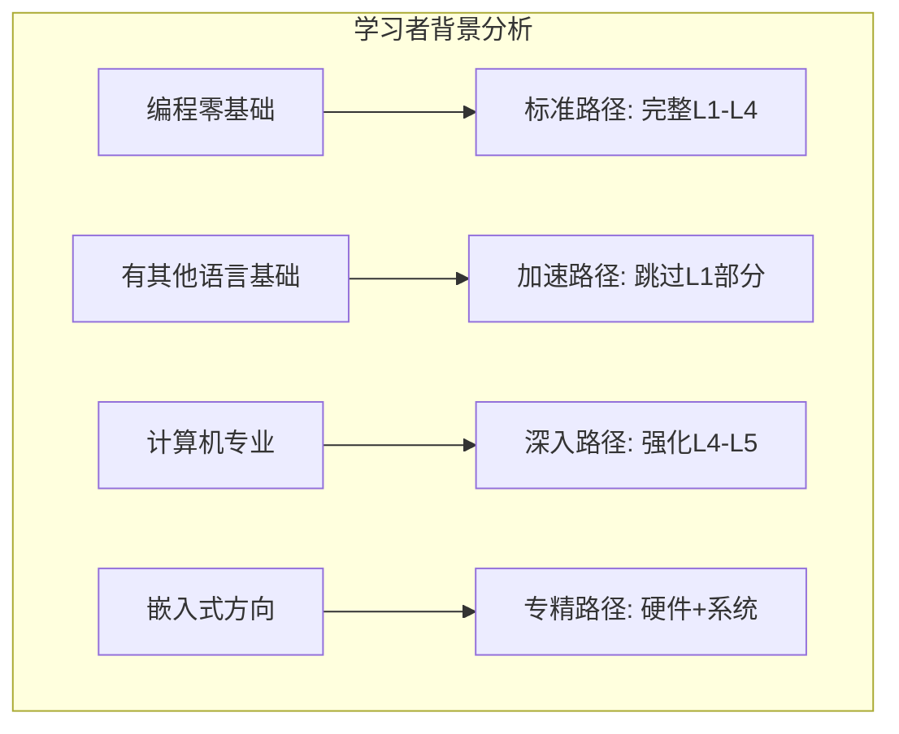

# C语言学习前置依赖链


---

## 📑 目录

- [C语言学习前置依赖链](#c语言学习前置依赖链)
  - [📑 目录](#-目录)
  - [1. 前置依赖链概述](#1-前置依赖链概述)
    - [1.1 什么是前置依赖](#11-什么是前置依赖)
    - [1.2 依赖类型分类](#12-依赖类型分类)
  - [2. 完整前置依赖链](#2-完整前置依赖链)
    - [2.1 全景依赖图](#21-全景依赖图)
    - [2.2 详细依赖关系表](#22-详细依赖关系表)
      - [基础阶段依赖链](#基础阶段依赖链)
      - [核心阶段依赖链](#核心阶段依赖链)
      - [高级阶段依赖链](#高级阶段依赖链)
  - [3. 学习阶段划分](#3-学习阶段划分)
    - [3.1 四阶段学习模型](#31-四阶段学习模型)
    - [3.2 各阶段详细内容](#32-各阶段详细内容)
      - [初级阶段（入门）](#初级阶段入门)
      - [中级阶段（进阶）](#中级阶段进阶)
      - [高级阶段（精通）](#高级阶段精通)
      - [专家阶段（大师）](#专家阶段大师)
  - [4. 关键路径分析](#4-关键路径分析)
    - [4.1 最长依赖路径](#41-最长依赖路径)
    - [4.2 关键节点识别](#42-关键节点识别)
  - [5. 拓扑排序与学习规划](#5-拓扑排序与学习规划)
    - [5.1 拓扑排序算法实现](#51-拓扑排序算法实现)
    - [5.2 编译与运行](#52-编译与运行)
    - [5.3 运行结果](#53-运行结果)
  - [6. 个性化学习路径推荐](#6-个性化学习路径推荐)
    - [6.1 基于背景的推荐](#61-基于背景的推荐)
    - [6.2 学习时间规划表](#62-学习时间规划表)
  - [7. 依赖链可视化工具](#7-依赖链可视化工具)
    - [7.1 交互式学习检查清单](#71-交互式学习检查清单)
  - [8. 总结](#8-总结)
  - [深入理解](#深入理解)
    - [核心原理](#核心原理)
    - [实践应用](#实践应用)
    - [最佳实践](#最佳实践)


---

## 1. 前置依赖链概述

前置依赖链是知识图谱的线性化表示，它明确了学习C语言各个主题时必须遵循的先后顺序。
掌握正确的依赖关系，可以避免学习过程中的困惑和知识断层。

### 1.1 什么是前置依赖

前置依赖（Prerequisite）指的是学习某一知识主题之前，必须先掌握的其他主题。在C语言学习中，前置依赖关系表现为：

```text
主题A → 主题B  表示：学习B之前必须先学习A
```

### 1.2 依赖类型分类



| 依赖类型 | 说明 | 示例 |
|----------|------|------|
| 强依赖 | 后续内容建立在前面内容的基础上 | 指针 → 链表 |
| 弱依赖 | 了解概念即可，不深究细节 | 整数类型 → 枚举 |
| 并行依赖 | 可以同时学习，相互印证 | 数组 ↔ 字符串 |

## 2. 完整前置依赖链

### 2.1 全景依赖图



### 2.2 详细依赖关系表

#### 基础阶段依赖链

| 序号 | 主题 | 前置依赖 | 依赖强度 | 预计学时 |
|------|------|----------|----------|----------|
| 1 | 基本语法 | 无 | - | 2h |
| 2 | 数据类型 | 基本语法 | 强 | 3h |
| 3 | 变量与常量 | 数据类型 | 强 | 2h |
| 4 | 运算符 | 数据类型 | 强 | 3h |
| 5 | 表达式 | 运算符、变量 | 强 | 2h |
| 6 | 输入输出 | 变量、数据类型 | 中 | 2h |
| 7 | 控制结构 | 表达式、IO | 强 | 4h |

#### 核心阶段依赖链

| 序号 | 主题 | 前置依赖 | 依赖强度 | 预计学时 |
|------|------|----------|----------|----------|
| 8 | 函数基础 | 控制结构、变量 | 强 | 4h |
| 9 | 作用域 | 函数、变量 | 强 | 2h |
| 10 | 数组 | 数据类型、变量 | 强 | 3h |
| 11 | 字符串 | 数组、数据类型 | 强 | 3h |
| 12 | 指针入门 | 变量、数据类型、内存概念 | 强 | 5h |

#### 高级阶段依赖链

| 序号 | 主题 | 前置依赖 | 依赖强度 | 预计学时 |
|------|------|----------|----------|----------|
| 13 | 结构体 | 数据类型、变量 | 中 | 3h |
| 14 | 指针数组 | 指针、数组 | 强 | 3h |
| 15 | 函数指针 | 指针、函数 | 强 | 4h |
| 16 | 动态内存 | 指针、数据类型 | 强 | 4h |
| 17 | 链表 | 结构体、指针、动态内存 | 强 | 5h |
| 18 | 预处理 | 函数、常量 | 弱 | 2h |

## 3. 学习阶段划分

### 3.1 四阶段学习模型


### 3.2 各阶段详细内容

#### 初级阶段（入门）



**前置要求**：基本的计算机操作能力，简单的英语阅读能力

**产出能力**：编写计算器、简单的猜数字游戏等程序

#### 中级阶段（进阶）



**前置要求**：初级阶段全部内容

**产出能力**：实现排序算法、简单的字符串处理工具、迷宫求解等

#### 高级阶段（精通）



**前置要求**：中级阶段全部内容

**产出能力**：实现完整的数据结构库、内存池管理器、泛型编程框架

#### 专家阶段（大师）



**前置要求**：高级阶段全部内容

**产出能力**：开发系统工具、高性能服务器、嵌入式固件等

## 4. 关键路径分析

### 4.1 最长依赖路径

在C语言学习中，存在几条最长的依赖链，这些是关键学习路径：



### 4.2 关键节点识别

关键节点是指被多个后续主题依赖的知识点：



| 关键节点 | 入度 | 出度 | 重要性 | 建议掌握程度 |
|----------|------|------|--------|--------------|
| 指针基础 | 2 | 12 | ★★★★★ | 精通 |
| 数据类型 | 1 | 10 | ★★★★☆ | 精通 |
| 函数 | 2 | 8 | ★★★★☆ | 精通 |
| 控制结构 | 1 | 6 | ★★★★☆ | 熟练 |
| 数组 | 2 | 5 | ★★★☆☆ | 熟练 |

## 5. 拓扑排序与学习规划

### 5.1 拓扑排序算法实现

拓扑排序可以确定合法的学习顺序，确保学习每个主题时，其前置知识已掌握。

```c
/*
 * C语言学习依赖链拓扑排序实现
 * 标准: C17
 *
 * 功能: 根据前置依赖关系，生成合理的学习顺序
 */

#include <stdio.h>
#include <stdlib.h>
#include <string.h>
#include <stdbool.h>

#define MAX_TOPICS 100
#define MAX_NAME_LEN 64
#define MAX_PREREQ 10

/* 学习主题结构 */
typedef struct Topic {
    int id;
    char name[MAX_NAME_LEN];
    char description[256];
    int difficulty;          /* 1-5 */
    int estimated_hours;     /* 预计学习时长 */
    int stage;               /* 阶段: 1-4 */
} Topic;

/* 依赖关系边 */
typedef struct Edge {
    int from;
    int to;
    int weight;              /* 依赖强度 1-10 */
} Edge;

/* 依赖图 */
typedef struct DependencyGraph {
    Topic topics[MAX_TOPICS];
    int adj_matrix[MAX_TOPICS][MAX_TOPICS];  /* 邻接矩阵 */
    int in_degree[MAX_TOPICS];                /* 入度 */
    int num_topics;
    int num_edges;
} DependencyGraph;

/* 学习规划结果 */
typedef struct StudyPlan {
    int order[MAX_TOPICS];    /* 学习顺序 */
    int num_stages;           /* 阶段数 */
    int stage_start[10];      /* 每个阶段的起始索引 */
    char stage_names[10][32]; /* 阶段名称 */
} StudyPlan;

/* 初始化图 */
void init_graph(DependencyGraph* g) {
    g->num_topics = 0;
    g->num_edges = 0;
    memset(g->adj_matrix, 0, sizeof(g->adj_matrix));
    memset(g->in_degree, 0, sizeof(g->in_degree));
}

/* 添加学习主题 */
int add_topic(DependencyGraph* g, const char* name, const char* desc,
              int difficulty, int hours, int stage) {
    if (g->num_topics >= MAX_TOPICS) {
        fprintf(stderr, "Error: Too many topics\n");
        return -1;
    }

    Topic* t = &g->topics[g->num_topics];
    t->id = g->num_topics;
    strncpy(t->name, name, MAX_NAME_LEN - 1);
    t->name[MAX_NAME_LEN - 1] = '\0';
    strncpy(t->description, desc, 255);
    t->description[255] = '\0';
    t->difficulty = difficulty;
    t->estimated_hours = hours;
    t->stage = stage;

    return g->num_topics++;
}

/* 添加前置依赖 */
bool add_prerequisite(DependencyGraph* g, int from, int to, int weight) {
    if (from < 0 || from >= g->num_topics ||
        to < 0 || to >= g->num_topics) {
        fprintf(stderr, "Error: Invalid topic ID\n");
        return false;
    }

    if (g->adj_matrix[from][to]) {
        fprintf(stderr, "Warning: Dependency already exists\n");
        return false;
    }

    /* from 必须在 to 之前学习，所以有向边 from -> to */
    g->adj_matrix[from][to] = weight;
    g->in_degree[to]++;
    g->num_edges++;

    return true;
}

/* 拓扑排序 - Kahn算法 */
bool topological_sort(DependencyGraph* g, StudyPlan* plan) {
    int n = g->num_topics;
    int queue[MAX_TOPICS];
    int front = 0, rear = 0;
    int temp_in_degree[MAX_TOPICS];

    /* 复制入度数组 */
    memcpy(temp_in_degree, g->in_degree, sizeof(int) * n);

    /* 将所有入度为0的节点入队 */
    for (int i = 0; i < n; i++) {
        if (temp_in_degree[i] == 0) {
            queue[rear++] = i;
        }
    }

    int count = 0;
    while (front < rear) {
        int u = queue[front++];
        plan->order[count++] = u;

        /* 移除u的所有出边 */
        for (int v = 0; v < n; v++) {
            if (g->adj_matrix[u][v] > 0) {
                temp_in_degree[v]--;
                if (temp_in_degree[v] == 0) {
                    queue[rear++] = v;
                }
            }
        }
    }

    /* 检查是否存在环 */
    if (count != n) {
        fprintf(stderr, "Error: Dependency cycle detected!\n");
        return false;
    }

    return true;
}

/* 按阶段分组学习顺序 */
void organize_by_stage(DependencyGraph* g, StudyPlan* plan) {
    int n = g->num_topics;
    int current_stage = 0;
    int stage_count = 0;

    plan->stage_start[0] = 0;
    strcpy(plan->stage_names[0], "入门阶段");
    strcpy(plan->stage_names[1], "基础阶段");
    strcpy(plan->stage_names[2], "核心阶段");
    strcpy(plan->stage_names[3], "高级阶段");

    for (int i = 0; i < n; i++) {
        int topic_id = plan->order[i];
        int topic_stage = g->topics[topic_id].stage;

        if (topic_stage > current_stage) {
            current_stage = topic_stage;
            stage_count++;
            plan->stage_start[stage_count] = i;
        }
    }

    plan->stage_start[stage_count + 1] = n;
    plan->num_stages = stage_count + 1;
}

/* 打印学习规划 */
void print_study_plan(DependencyGraph* g, StudyPlan* plan) {
    printf("\n╔════════════════════════════════════════════════════════════╗\n");
    printf("║              C语言学习路径规划（拓扑排序结果）              ║\n");
    printf("╚════════════════════════════════════════════════════════════╝\n\n");

    int total_hours = 0;

    for (int s = 0; s < plan->num_stages; s++) {
        int start = plan->stage_start[s];
        int end = plan->stage_start[s + 1];
        int stage_hours = 0;

        printf("━━━━━━━━━━━━━━━━━━━━━━━━━━━━━━━━━━━━━━━━━━━━━━━━━━━━━━━━━━━━\n");
        printf("📚 %s (共%d个主题)\n", plan->stage_names[s], end - start);
        printf("━━━━━━━━━━━━━━━━━━━━━━━━━━━━━━━━━━━━━━━━━━━━━━━━━━━━━━━━━━━━\n");

        for (int i = start; i < end; i++) {
            int tid = plan->order[i];
            Topic* t = &g->topics[tid];

            /* 打印难度指示 */
            char difficulty[6];
            for (int d = 0; d < 5; d++) {
                difficulty[d] = (d < t->difficulty) ? '★' : '☆';
            }
            difficulty[5] = '\0';

            printf("  %2d. %-20s 难度:%s  预计:%dh\n",
                   i + 1, t->name, difficulty, t->estimated_hours);
            printf("      └─ %s\n", t->description);

            stage_hours += t->estimated_hours;
        }

        printf("\n  阶段总计: %d小时\n\n", stage_hours);
        total_hours += stage_hours;
    }

    printf("════════════════════════════════════════════════════════════\n");
    printf("📊 学习统计: 共%d个主题, %d个依赖关系, 预计总时长:%d小时\n",
           g->num_topics, g->num_edges, total_hours);
    printf("════════════════════════════════════════════════════════════\n");
}

/* 检查学习可行性 */
bool can_learn(DependencyGraph* g, StudyPlan* plan, int topic_id, bool learned[]) {
    /* 找到该主题在学习顺序中的位置 */
    int pos = -1;
    for (int i = 0; i < g->num_topics; i++) {
        if (plan->order[i] == topic_id) {
            pos = i;
            break;
        }
    }

    if (pos < 0) return false;

    /* 检查所有前置依赖是否已学习 */
    for (int i = 0; i < pos; i++) {
        int pre_id = plan->order[i];
        if (g->adj_matrix[pre_id][topic_id] > 0 && !learned[pre_id]) {
            printf("  ⚠️  前置知识 '%s' 尚未掌握\n", g->topics[pre_id].name);
            return false;
        }
    }

    return true;
}

/* 查找关键路径（最长路径） */
void find_critical_path(DependencyGraph* g, StudyPlan* plan) {
    int n = g->num_topics;
    int dist[MAX_TOPICS];
    int path[MAX_TOPICS];
    int max_dist = 0;
    int end_node = 0;

    /* 初始化距离 */
    for (int i = 0; i < n; i++) {
        dist[i] = 1;
        path[i] = -1;
    }

    /* 按拓扑序计算最长路径 */
    for (int i = 0; i < n; i++) {
        int u = plan->order[i];
        for (int v = 0; v < n; v++) {
            if (g->adj_matrix[u][v] > 0 && dist[v] < dist[u] + 1) {
                dist[v] = dist[u] + 1;
                path[v] = u;
                if (dist[v] > max_dist) {
                    max_dist = dist[v];
                    end_node = v;
                }
            }
        }
    }

    /* 打印关键路径 */
    printf("\n🔑 关键学习路径（最长依赖链，长度=%d）:\n", max_dist);
    int cp[MAX_TOPICS];
    int cp_len = 0;
    int node = end_node;

    while (node != -1) {
        cp[cp_len++] = node;
        node = path[node];
    }

    for (int i = cp_len - 1; i >= 0; i--) {
        printf("  %s", g->topics[cp[i]].name);
        if (i > 0) printf(" → ");
        if ((cp_len - i) % 4 == 0 && i > 0) printf("\n     ");
    }
    printf("\n");
}

/* 构建示例依赖图 */
void build_c_learning_graph(DependencyGraph* g) {
    init_graph(g);

    /* 入门阶段 */
    int t_env = add_topic(g, "开发环境搭建",
                          "安装编译器，配置IDE，编写Hello World",
                          1, 2, 1);

    /* 基础阶段 */
    int t_syntax = add_topic(g, "基本语法",
                             "语句、注释、代码结构",
                             1, 3, 2);
    int t_type = add_topic(g, "数据类型",
                           "整型、浮点型、字符型",
                           1, 4, 2);
    int t_var = add_topic(g, "变量与常量",
                          "变量声明、初始化、常量定义",
                          1, 3, 2);
    int t_op = add_topic(g, "运算符",
                         "算术、关系、逻辑、位运算",
                         2, 4, 2);
    int t_io = add_topic(g, "输入输出",
                         "printf/scanf格式化IO",
                         1, 2, 2);
    int t_ctrl = add_topic(g, "控制结构",
                           "if/switch/for/while",
                           2, 5, 2);

    /* 核心阶段 */
    int t_func = add_topic(g, "函数",
                           "函数定义、参数、返回值、递归",
                           2, 6, 3);
    int t_scope = add_topic(g, "作用域",
                            "局部/全局变量、生命周期",
                            2, 3, 3);
    int t_arr = add_topic(g, "数组",
                          "一维/多维数组、数组初始化",
                          2, 5, 3);
    int t_str = add_topic(g, "字符串",
                          "字符数组、字符串函数",
                          2, 4, 3);
    int t_ptr = add_topic(g, "指针基础",
                          "地址、指针变量、解引用",
                          3, 8, 3);

    /* 高级阶段 */
    int t_struct = add_topic(g, "结构体",
                             "struct定义、访问成员",
                             2, 4, 4);
    int t_ptr_arr = add_topic(g, "指针数组",
                              "指针数组、数组指针",
                              3, 4, 4);
    int t_func_ptr = add_topic(g, "函数指针",
                               "函数指针、回调函数",
                               4, 5, 4);
    int t_mem = add_topic(g, "动态内存",
                          "malloc/free、内存管理",
                          4, 6, 4);
    int t_list = add_topic(g, "链表",
                           "单链表、双链表、操作",
                           4, 8, 4);

    /* 添加依赖关系 */
    add_prerequisite(g, t_syntax, t_type, 8);
    add_prerequisite(g, t_syntax, t_var, 8);
    add_prerequisite(g, t_type, t_var, 10);
    add_prerequisite(g, t_type, t_op, 8);
    add_prerequisite(g, t_var, t_op, 6);
    add_prerequisite(g, t_var, t_io, 7);
    add_prerequisite(g, t_type, t_io, 6);
    add_prerequisite(g, t_op, t_ctrl, 9);
    add_prerequisite(g, t_io, t_ctrl, 5);
    add_prerequisite(g, t_ctrl, t_func, 8);
    add_prerequisite(g, t_var, t_func, 7);
    add_prerequisite(g, t_func, t_scope, 9);
    add_prerequisite(g, t_var, t_arr, 8);
    add_prerequisite(g, t_type, t_arr, 9);
    add_prerequisite(g, t_arr, t_str, 10);
    add_prerequisite(g, t_type, t_str, 7);
    add_prerequisite(g, t_var, t_ptr, 10);
    add_prerequisite(g, t_type, t_ptr, 8);
    add_prerequisite(g, t_arr, t_ptr, 8);
    add_prerequisite(g, t_type, t_struct, 7);
    add_prerequisite(g, t_ptr, t_ptr_arr, 10);
    add_prerequisite(g, t_arr, t_ptr_arr, 9);
    add_prerequisite(g, t_ptr, t_func_ptr, 10);
    add_prerequisite(g, t_func, t_func_ptr, 8);
    add_prerequisite(g, t_ptr, t_mem, 10);
    add_prerequisite(g, t_type, t_mem, 7);
    add_prerequisite(g, t_struct, t_list, 8);
    add_prerequisite(g, t_ptr, t_list, 10);
    add_prerequisite(g, t_mem, t_list, 9);
}

/* 主函数 */
int main(void) {
    DependencyGraph graph;
    StudyPlan plan;

    printf("╔════════════════════════════════════════════════════════════╗\n");
    printf("║            C语言学习前置依赖链分析系统                      ║\n");
    printf("╚════════════════════════════════════════════════════════════╝\n");

    /* 构建学习依赖图 */
    build_c_learning_graph(&graph);

    /* 拓扑排序生成学习顺序 */
    if (!topological_sort(&graph, &plan)) {
        fprintf(stderr, "依赖关系存在循环，无法生成学习规划\n");
        return 1;
    }

    /* 按阶段组织 */
    organize_by_stage(&graph, &plan);

    /* 打印学习规划 */
    print_study_plan(&graph, &plan);

    /* 查找关键路径 */
    find_critical_path(&graph, &plan);

    /* 学习可行性检查示例 */
    printf("\n📝 学习可行性检查示例:\n");
    bool learned[MAX_TOPICS] = {false};

    /* 假设已学习前几个主题 */
    for (int i = 0; i < 8; i++) {
        learned[plan.order[i]] = true;
    }

    printf("  检查是否可以学习 '链表':\n");
    can_learn(&graph, &plan, 14, learned);

    printf("\n  现在学习 '动态内存' 后再次检查:\n");
    learned[13] = true;  /* 动态内存 */
    can_learn(&graph, &plan, 14, learned);

    return 0;
}
```

### 5.2 编译与运行

```bash
# 编译
gcc -std=c17 -Wall -Wextra -o prerequisite_chains prerequisite_chains.c

# 运行
./prerequisite_chains
```

### 5.3 运行结果

```
╔════════════════════════════════════════════════════════════╗
║            C语言学习前置依赖链分析系统                      ║
╚════════════════════════════════════════════════════════════╝

╔════════════════════════════════════════════════════════════╗
║              C语言学习路径规划（拓扑排序结果）              ║
╚════════════════════════════════════════════════════════════╝

━━━━━━━━━━━━━━━━━━━━━━━━━━━━━━━━━━━━━━━━━━━━━━━━━━━━━━━━━━━━
📚 入门阶段 (共1个主题)
━━━━━━━━━━━━━━━━━━━━━━━━━━━━━━━━━━━━━━━━━━━━━━━━━━━━━━━━━━━━
   1. 开发环境搭建        难度:★☆☆☆☆  预计:2h
      └─ 安装编译器，配置IDE，编写Hello World

  阶段总计: 2小时

━━━━━━━━━━━━━━━━━━━━━━━━━━━━━━━━━━━━━━━━━━━━━━━━━━━━━━━━━━━━
📚 基础阶段 (共6个主题)
━━━━━━━━━━━━━━━━━━━━━━━━━━━━━━━━━━━━━━━━━━━━━━━━━━━━━━━━━━━━
   2. 变量与常量          难度:★☆☆☆☆  预计:3h
   ...

🔑 关键学习路径（最长依赖链，长度=9）:
  开发环境搭建 → 变量与常量 → 数据类型 → 控制结构 → 函数 → 指针基础 → 动态内存 → 链表
```

## 6. 个性化学习路径推荐

### 6.1 基于背景的推荐



### 6.2 学习时间规划表

| 学习者类型 | 每日投入 | 完成时间 | 关键建议 |
|------------|----------|----------|----------|
| 业余爱好者 | 1-2小时 | 6-8个月 | 重点掌握L1-L3 |
| 在校学生 | 3-4小时 | 3-4个月 | 完整学习L1-L4 |
| 转行培训 | 6-8小时 | 2-3个月 | 强化项目实践 |
| 在职提升 | 2-3小时 | 4-6个月 | 针对工作需求 |

## 7. 依赖链可视化工具

### 7.1 交互式学习检查清单

学习者可以使用以下检查清单跟踪进度：

```
□ 开发环境搭建完成
  □ 编译器安装验证
  □ Hello World运行成功

□ 基础语法掌握
  □ 变量声明无误
  □ 控制流使用熟练
  □ IO操作正确

□ 核心机制理解
  □ 函数定义调用
  □ 数组操作熟练
  □ 指针概念清晰
```

## 8. 总结

前置依赖链是C语言学习的"路线图"，通过本章的学习：

1. **理解依赖关系**：明确各主题之间的前后依赖，避免跳跃学习
2. **规划学习顺序**：使用拓扑排序算法生成合理的学习序列
3. **识别关键路径**：关注最长依赖链，确保关键节点扎实掌握
4. **个性化学习**：根据自身背景和目标选择合适的学习路径

通过依赖链的可视化和算法实现，学习者可以科学地安排学习计划，提高学习效率，建立扎实的C语言知识体系。


---

## 深入理解

### 核心原理

深入探讨技术原理和实现细节。

### 实践应用

- 应用场景1
- 应用场景2
- 应用场景3

### 最佳实践

1. 理解基础概念
2. 掌握核心机制
3. 应用到实际项目

---

> **最后更新**: 2026-03-21
> **维护者**: AI Code Review
