# 类型系统知识图谱 (Type System Knowledge Graph)


---

## 📑 目录

- [类型系统知识图谱 (Type System Knowledge Graph)](#类型系统知识图谱-type-system-knowledge-graph)
  - [📑 目录](#-目录)
  - [概述](#概述)
  - [关键概念详解](#关键概念详解)
    - [1. 基本类型大小（典型64位系统）](#1-基本类型大小典型64位系统)
    - [2. 派生类型声明（右左法则）](#2-派生类型声明右左法则)
    - [3. 类型限定符用法](#3-类型限定符用法)
    - [4. 类型转换规则](#4-类型转换规则)
      - [隐式转换层级（低到高）](#隐式转换层级低到高)
      - [通常算术转换示例](#通常算术转换示例)
      - [显式转换](#显式转换)
    - [5. \_Generic 关键字（C11）](#5-_generic-关键字c11)
  - [相关文件](#相关文件)
  - [深入理解](#深入理解)
    - [核心原理](#核心原理)
    - [实践应用](#实践应用)
    - [最佳实践](#最佳实践)


---

## 概述

本知识图谱展示 C 语言类型系统的完整概念体系，包括基本类型、派生类型、修饰符、限定符和类型转换规则。

```mermaid
graph TB
    %% 根节点
    Root(["Type System<br/>类型系统"])

    %% ============ 第一层：主要类别 ============
    subgraph Category["📦 主要类别"]
        BasicCat["Basic Types<br/>基本类型"]
        DerivedCat["Derived Types<br/>派生类型"]
        ModifierCat["Type Modifiers<br/>类型修饰符"]
        QualifierCat["Type Qualifiers<br/>类型限定符"]
        ConvCat["Type Conversion<br/>类型转换"]
    end

    Root --> BasicCat
    Root --> DerivedCat
    Root --> ModifierCat
    Root --> QualifierCat
    Root --> ConvCat

    %% ============ 基本类型 ============
    subgraph BasicTypes["🔷 基本类型 (Basic Types)"]
        Integer["Integer Types<br/>整数类型"]
        Floating["Floating Types<br/>浮点类型"]
        Character["Character Types<br/>字符类型"]
        Boolean["Boolean Type<br/>布尔类型<br/>C99 _Bool / C23 bool"]
        Void["void Type<br/>空类型"]

        IntTypes["int / short / long / long long"]
        FloatTypes["float / double / long double"]
        CharTypes["char / signed char / unsigned char"]
    end

    BasicCat --> Integer
    BasicCat --> Floating
    BasicCat --> Character
    BasicCat --> Boolean
    BasicCat --> Void

    Integer --> IntTypes
    Floating --> FloatTypes
    Character --> CharTypes

    %% ============ 派生类型 ============
    subgraph DerivedTypes["🔶 派生类型 (Derived Types)"]
        Array["Array<br/>数组类型<br/>T[N]"]
        Pointer["Pointer<br/>指针类型<br/>T*"]
        Function["Function<br/>函数类型<br/>T(Args)"]
        Struct["Structure<br/>结构体类型<br/>struct"]
        Union["Union<br/>联合体类型<br/>union"]
        Enum["Enumeration<br/>枚举类型<br/>enum"]

        BitField["Bit Field<br/>位域<br/>struct { int : 4; }"]
        Complex["Complex<br/>复数类型<br/>float _Complex<br/>C99"]
    end

    DerivedCat --> Array
    DerivedCat --> Pointer
    DerivedCat --> Function
    DerivedCat --> Struct
    DerivedCat --> Union
    DerivedCat --> Enum
    DerivedCat --> BitField
    DerivedCat --> Complex

    %% 类型声明复杂度
    DeclComplexity["Declarator Complexity<br/>声明复杂度"]
    Array -.->|"element of"| DeclComplexity
    Pointer -.->|"point to"| DeclComplexity
    Function -.->|"return"| DeclComplexity

    %% ============ 类型修饰符 ============
    subgraph TypeModifiers["⚙️ 类型修饰符 (Modifiers)"]
        Signedness["Signedness<br/>符号性"]
        Length["Length<br/>长度修饰"]

        Signed["signed<br/>有符号"]
        Unsigned["unsigned<br/>无符号"]
        Short["short<br/>短型<br/>≤ int"]
        Long["long<br/>长型<br/>≥ int"]
        LongLong["long long<br/>更长型<br/>≥ long<br/>C99"]
    end

    ModifierCat --> Signedness
    ModifierCat --> Length

    Signedness --> Signed
    Signedness --> Unsigned
    Length --> Short
    Length --> Long
    Length --> LongLong

    %% 修饰符组合
    Signed -.->|"combine with"| IntTypes
    Unsigned -.->|"combine with"| IntTypes
    Short -.->|"only with"| IntTypes
    Long -.->|"with int/float/double"| IntTypes
    Long -.->|"with int/float/double"| FloatTypes
    LongLong -.->|"only with"| IntTypes

    %% ============ 类型限定符 ============
    subgraph TypeQualifiers["🛡️ 类型限定符 (Qualifiers)"]
        Const["const<br/>常量限定符<br/>只读"]
        Volatile["volatile<br/>易变限定符<br/>禁止优化"]
        Restrict["restrict<br/>限制限定符<br/>独占访问<br/>C99"]
        Atomic["_Atomic<br/>原子限定符<br/>线程安全<br/>C11"]
    end

    QualifierCat --> Const
    QualifierCat --> Volatile
    QualifierCat --> Restrict
    QualifierCat --> Atomic

    %% 限定符应用
    Const -.->|"pointer to const"| Pointer
    Const -.->|"const pointer"| Pointer
    Volatile -.->|"volatile variable"| BasicTypes
    Restrict -.->|"restricted pointer"| Pointer
    Atomic -.->|"atomic variable"| BasicTypes

    %% ============ 类型转换 ============
    subgraph TypeConversion["🔄 类型转换 (Conversion)"]
        Implicit["Implicit Conversion<br/>隐式转换<br/>自动进行"]
        Explicit["Explicit Conversion<br/>显式转换<br/>强制类型转换"]

        IntegerPromo["Integer Promotion<br/>整数提升<br/>char/short → int"]
        UsualArith["Usual Arithmetic<br/>通常算术转换<br/>操作数对齐"]
        StandardConv["Standard Conversion<br/>标准转换<br/>赋值/传参"]

        CastOp["Cast Operator<br/>(type)expr"]
    end

    ConvCat --> Implicit
    ConvCat --> Explicit

    Implicit --> IntegerPromo
    Implicit --> UsualArith
    Implicit --> StandardConv
    Explicit --> CastOp

    %% 转换规则
    IntegerPromo -.->|"before"| UsualArith
    UsualArith -.->|"common type"| StandardConv
    CastOp -.->|"override"| Implicit

    %% ============ 类型兼容性 ============
    subgraph TypeCompatibility["🔗 类型兼容性"]
        Compatible["Compatible Types<br/>兼容类型"]
        Composite["Composite Type<br/>复合类型"]
        Incomplete["Incomplete Type<br/>不完整类型<br/>struct X; void"]
    end

    Root -.-> TypeCompatibility
    Compatible --> Composite
    Compatible -.->|"can be"| Incomplete

    %% ============ 类型大小 ============
    subgraph TypeSizes["📏 类型大小"]
        Sizeof["sizeof Operator<br/>获取类型大小"]
        Alignof["alignof Operator<br/>获取对齐要求<br/>C11"]
        Limits["Limits Macros<br/>INT_MAX, FLT_MAX<br/>&lt;limits.h&gt;, &lt;float.h&gt;"]
    end

    Root -.-> TypeSizes
    Sizeof -.->|"for all"| BasicTypes
    Sizeof -.->|"for all"| DerivedTypes
    Alignof -.->|"alignment of"| BasicTypes

    %% 样式定义
    classDef rootNode fill:#2E86AB,stroke:#1B4965,stroke-width:3px,color:#fff
    classDef category fill:#5C9EAD,stroke:#2E86AB,stroke-width:2px,color:#fff
    classDef basic fill:#E63946,stroke:#9D0208,stroke-width:2px,color:#fff
    classDef derived fill:#F18F01,stroke:#C73E1D,stroke-width:2px,color:#fff
    classDef modifier fill:#8338EC,stroke:#3A0CA3,stroke-width:2px,color:#fff
    classDef qualifier fill:#06A77D,stroke:#005F73,stroke-width:2px,color:#fff
    classDef conversion fill:#0077B6,stroke:#023E8A,stroke-width:2px,color:#fff
    classDef utility fill:#6C757D,stroke:#495057,stroke-width:2px,color:#fff

    class Root rootNode
    class BasicCat,DerivedCat,ModifierCat,QualifierCat,ConvCat category
    class Integer,Floating,Character,Boolean,Void,IntTypes,FloatTypes,CharTypes basic
    class Array,Pointer,Function,Struct,Union,Enum,BitField,Complex derived
    class Signedness,Length,Signed,Unsigned,Short,Long,LongLong modifier
    class Const,Volatile,Restrict,Atomic qualifier
    class Implicit,Explicit,IntegerPromo,UsualArith,StandardConv,CastOp conversion
    class TypeCompatibility,Compatible,Composite,Incomplete,TypeSizes,sizeof,Alignof,Limits utility
```



## 关键概念详解

### 1. 基本类型大小（典型64位系统）

| 类型 | 大小 (bytes) | 范围/精度 |
|------|--------------|-----------|
| `char` | 1 | -128 ~ 127 或 0 ~ 255 |
| `short` | 2 | -32768 ~ 32767 |
| `int` | 4 | -2147483648 ~ 2147483647 |
| `long` | 4/8 | 平台相关 |
| `long long` | 8 | -2^63 ~ 2^63-1 |
| `float` | 4 | ~7位有效数字 |
| `double` | 8 | ~15位有效数字 |
| `long double` | 8/16 | 平台相关 |
| `_Bool` | 1 | 0 或 1 |
| `void*` | 8 | 地址大小 |

### 2. 派生类型声明（右左法则）

```c
int *p;                    // p 是指向 int 的指针
int arr[10];               // arr 是包含 10 个 int 的数组
int *arr[10];              // arr 是包含 10 个 int* 的数组
int (*p)[10];              // p 是指向包含 10 个 int 的数组的指针
int *func();               // func 是返回 int* 的函数
int (*func)();             // func 是指向返回 int 的函数的指针
int (*arr[5])();           // arr 是包含 5 个函数指针的数组
int *(*(*func)[10])();     // 更复杂的声明...
```

### 3. 类型限定符用法

```c
const int ci = 10;              // ci 是常量，不可修改
int const ic = 10;              // 等价写法

const int *pci;                 // pci 指向常量 int（值不可改）
int * const cpi = &x;           // cpi 是常量指针（指向不可改）
const int * const cpci = &y;    // 两者都不可改

volatile int vi;                // vi 可能被外部修改，禁止优化

void func(int *restrict p, int *restrict q) {
    // p 和 q 指向不同内存，可优化访问
}

_Atomic int ai;                 // ai 是原子类型，线程安全
```

### 4. 类型转换规则

#### 隐式转换层级（低到高）

```
char/short → int → unsigned int → long → unsigned long →
float → double → long double
```

#### 通常算术转换示例

```c
char c = 'A';
int i = 100;
float f = 3.14f;

// c 先提升为 int，然后与 i 相加，结果提升为 float
float result = c + i + f;   // char → int → float

// 不同类型运算
long l = 1000L;
unsigned int ui = 500U;
// 如果 sizeof(long) == sizeof(int)，两者都转为 unsigned long
auto r = l + ui;  // 结果类型取决于平台
```

#### 显式转换

```c
double d = 3.14;
int i = (int)d;           // C 风格

// C11 泛型选择（类型安全的"转换"）
#define ABS(x) _Generic((x), \
    int: abs, \
    long: labs, \
    long long: llabs, \
    double: fabs \
)(x)
```

### 5. _Generic 关键字（C11）

```c
#define TYPE_NAME(x) _Generic((x), \
    int: "int", \
    double: "double", \
    char*: "string", \
    default: "unknown" \
)

printf("Type: %s\n", TYPE_NAME(42));        // "int"
printf("Type: %s\n", TYPE_NAME(3.14));      // "double"
printf("Type: %s\n", TYPE_NAME("hello"));   // "string"
```

## 相关文件

- [01_Function_Knowledge_Graph.md](./01_Function_Knowledge_Graph.md) - 函数知识图谱
- [02_Pointer_Knowledge_Graph.md](./02_Pointer_Knowledge_Graph.md) - 指针知识图谱
- [03_Memory_Knowledge_Graph.md](./03_Memory_Knowledge_Graph.md) - 内存知识图谱
- [05_Concurrency_Knowledge_Graph.md](./05_Concurrency_Knowledge_Graph.md) - 并发知识图谱


---

## 深入理解

### 核心原理

深入探讨技术原理和实现细节。

### 实践应用

- 应用场景1
- 应用场景2
- 应用场景3

### 最佳实践

1. 理解基础概念
2. 掌握核心机制
3. 应用到实际项目

---

> **最后更新**: 2026-03-21
> **维护者**: AI Code Review
