# 并发知识图谱 (Concurrency Knowledge Graph)


---

## 📑 目录

- [并发知识图谱 (Concurrency Knowledge Graph)](#并发知识图谱-concurrency-knowledge-graph)
  - [📑 目录](#-目录)
  - [概述](#概述)
  - [关键概念详解](#关键概念详解)
    - [1. C11 线程管理函数](#1-c11-线程管理函数)
    - [2. 内存序详解](#2-内存序详解)
    - [3. 原子操作使用](#3-原子操作使用)
    - [4. 同步机制对比](#4-同步机制对比)
    - [5. 条件变量正确使用模式](#5-条件变量正确使用模式)
    - [6. 并发问题示例与预防](#6-并发问题示例与预防)
  - [相关文件](#相关文件)


---

## 概述

本知识图谱展示 C11 标准并发编程的完整概念体系，包括线程管理、原子操作、内存序、同步机制和并发问题。

```mermaid
graph TB
    %% 根节点
    Root(["Concurrency System<br/>并发系统<br/>C11 &lt;threads.h&gt;"])

    %% ============ 第一层：主要类别 ============
    subgraph Category["📦 主要类别"]
        ThreadCat["Thread Management<br/>线程管理"]
        AtomicCat["Atomic Operations<br/>原子操作"]
        MemOrderCat["Memory Order<br/>内存序"]
        SyncCat["Synchronization<br/>线程同步"]
        IssueCat["Concurrency Issues<br/>并发问题"]
    end

    Root --> ThreadCat
    Root --> AtomicCat
    Root --> MemOrderCat
    Root --> SyncCat
    Root --> IssueCat

    %% ============ 线程管理 ============
    subgraph ThreadManagement["🔷 C11 线程管理"]
        Create["thrd_create<br/>创建线程"]
        Exit["thrd_exit<br/>线程退出"]
        Join["thrd_join<br/>等待线程结束"]
        Detach["thrd_detach<br/>分离线程"]
        Yield["thrd_yield<br/>主动让出CPU"]
        Sleep["thrd_sleep<br/>线程睡眠"]
        Equal["thrd_equal<br/>比较线程ID"]
        Current["thrd_current<br/>获取当前线程ID"]
    end

    ThreadCat --> Create
    ThreadCat --> Exit
    ThreadCat --> Join
    ThreadCat --> Detach
    ThreadCat --> Yield
    ThreadCat --> Sleep
    ThreadCat --> Equal
    ThreadCat --> Current

    %% 线程生命周期
    Create -->|"spawns"| Exit
    Create -->|"returns thrd_t"| Join
    Create -->|"returns thrd_t"| Detach
    Join -.->|"after"| Exit
    Detach -.->|"independent"| Exit

    %% 线程状态
    subgraph ThreadStates["线程状态"]
        New["新建 (New)"]
        Runnable["就绪 (Runnable)"]
        Running["运行 (Running)"]
        Blocked["阻塞 (Blocked)"]
        Terminated["终止 (Terminated)"]
    end

    ThreadCat -.-> ThreadStates
    New --> Runnable --> Running
    Running -->|"yield/sleep"| Runnable
    Running -->|"wait lock/cond"| Blocked
    Blocked -->|"acquired/woken"| Runnable
    Running -->|"exit/return"| Terminated

    %% ============ 原子操作 ============
    subgraph AtomicOperations["⚛️ 原子操作 (stdatomic.h)"]
        Load["atomic_load<br/>原子读取"]
        Store["atomic_store<br/>原子写入"]
        Exchange["atomic_exchange<br/>原子交换"]
        FetchAdd["atomic_fetch_add<br/>原子加"]
        FetchSub["atomic_fetch_sub<br/>原子减"]
        FetchOr["atomic_fetch_or<br/>原子或"]
        FetchAnd["atomic_fetch_and<br/>原子与"]
        FetchXor["atomic_fetch_xor<br/>原子异或"]
        CAS["atomic_compare_exchange<br/>比较并交换<br/>CAS"]
        Flag["atomic_flag<br/>原子标志<br/>test_and_set/clear"]
        Fence["atomic_thread_fence<br/>内存屏障"]
    end

    AtomicCat --> Load
    AtomicCat --> Store
    AtomicCat --> Exchange
    AtomicCat --> FetchAdd
    AtomicCat --> FetchSub
    AtomicCat --> FetchOr
    AtomicCat --> FetchAnd
    AtomicCat --> FetchXor
    AtomicCat --> CAS
    AtomicCat --> Flag
    AtomicCat --> Fence

    %% 原子操作关系
    Load -.->|"read"| Store
    Exchange -.->|"combines"| Load
    Exchange -.->|"combines"| Store
    CAS -.->|"conditional"| Exchange
    FetchAdd -.->|"using"| CAS
    Fence -.->|"affects"| Load
    Fence -.->|"affects"| Store

    %% ============ 内存序 ============
    subgraph MemoryOrder["📊 内存序 (Memory Order)"]
        Relaxed["memory_order_relaxed<br/>宽松序<br/>无同步保证"]
        Consume["memory_order_consume<br/>消费序<br/>依赖同步"]
        Acquire["memory_order_acquire<br/>获取序<br/>读同步"]
        Release["memory_order_release<br/>释放序<br/>写同步"]
        AcqRel["memory_order_acq_rel<br/>获取释放序<br/>读写同步"]
        SeqCst["memory_order_seq_cst<br/>顺序一致<br/>最强保证"]
    end

    MemOrderCat --> Relaxed
    MemOrderCat --> Consume
    MemOrderCat --> Acquire
    MemOrderCat --> Release
    MemOrderCat --> AcqRel
    MemOrderCat --> SeqCst

    %% 内存序关系
    Relaxed -.->|"weaker"| Consume
    Consume -.->|"weaker"| Acquire
    Release -.->|"pair with"| Acquire
    Release -.->|"pair with"| Consume
    AcqRel -.->|"combine"| Acquire
    AcqRel -.->|"combine"| Release
    SeqCst -.->|"strongest"| AcqRel

    %% 内存序与操作
    Load -.->|"can use"| Relaxed
    Load -.->|"can use"| Acquire
    Store -.->|"can use"| Relaxed
    Store -.->|"can use"| Release
    CAS -.->|"can use"| AcqRel

    %% ============ 线程同步 ============
    subgraph Synchronization["🔄 线程同步机制"]
        Mutex["Mutex<br/>互斥锁"]
        CondVar["Condition Variable<br/>条件变量"]
        Barrier["Barrier<br/>屏障"]
        TLS["Thread Local Storage<br/>线程局部存储"]

        subgraph MutexOps["互斥锁操作"]
            mtxInit["mtx_init<br/>初始化"]
            mtxLock["mtx_lock<br/>加锁"]
            mtxTryLock["mtx_trylock<br/>尝试加锁"]
            mtxTimedLock["mtx_timedlock<br/>限时加锁"]
            mtxUnlock["mtx_unlock<br/>解锁"]
            mtxDestroy["mtx_destroy<br/>销毁"]
        end

        subgraph CondVarOps["条件变量操作"]
            cndInit["cnd_init<br/>初始化"]
            cndWait["cnd_wait<br/>等待"]
            cndTimedWait["cnd_timedwait<br/>限时等待"]
            cndSignal["cnd_signal<br/>唤醒一个"]
            cndBroadcast["cnd_broadcast<br/>唤醒全部"]
            cndDestroy["cnd_destroy<br/>销毁"]
        end

        subgraph BarrierOps["屏障操作"]
            BarrierInit["barrier_init<br/>初始化"]
            BarrierWait["barrier_wait<br/>等待到达"]
            BarrierDestroy["barrier_destroy<br/>销毁"]
        end
    end

    SyncCat --> Mutex
    SyncCat --> CondVar
    SyncCat --> Barrier
    SyncCat --> TLS

    Mutex --> MutexOps
    CondVar --> CondVarOps
    Barrier --> BarrierOps

    %% 同步关系
    mtxLock -.->|"unlock before"| mtxUnlock
    cndWait -.->|"must hold"| mtxLock
    cndWait -.->|"atomically release"| mtxUnlock
    cndWait -.->|"re-acquire after"| mtxLock
    cndSignal -.->|"wakes"| cndWait
    BarrierWait -.->|"all threads arrive"| BarrierWait

    %% ============ 并发问题 ============
    subgraph ConcurrencyIssues["🐛 并发问题"]
        DataRace["Data Race<br/>数据竞争<br/>非同步读写同一内存"]
        Deadlock["Deadlock<br/>死锁<br/>循环等待资源"]
        Livelock["Livelock<br/>活锁<br/>持续改变状态无法推进"]
        Starvation["Starvation<br/>饥饿<br/>长期无法获取资源"]
        ABA["ABA Problem<br/>ABA问题<br/>值变回原但已不同"]
        PriorityInv["Priority Inversion<br/>优先级反转"]
        FalseSharing["False Sharing<br/>伪共享<br/>缓存行争用"]
    end

    IssueCat --> DataRace
    IssueCat --> Deadlock
    IssueCat --> Livelock
    IssueCat --> Starvation
    IssueCat --> ABA
    IssueCat --> PriorityInv
    IssueCat --> FalseSharing

    %% 问题与解决方案
    DataRace -.->|"prevent with"| Mutex
    DataRace -.->|"prevent with"| AtomicCat
    Deadlock -.->|"prevent with"| LockOrdering
    ABA -.->|"prevent with"| CAS
    FalseSharing -.->|"prevent with"| Padding

    %% ============ 锁排序策略 ============
    subgraph LockStrategies["🔐 锁策略"]
        LockOrdering["Lock Ordering<br/>锁排序<br/>按固定顺序获取"]
        TryLock["Try Lock Strategy<br/>尝试锁<br/>失败释放已持有"]
        Hierarchical["Hierarchical Locking<br/>层级锁"]
    end

    SyncCat -.-> LockStrategies
    LockOrdering -.->|"prevents"| Deadlock
    TryLock -.->|"prevents"| Deadlock

    %% ============ 原子类型 ============
    subgraph AtomicTypes["⚛️ 原子类型"]
        AtomicInt["atomic_int<br/>原子整型"]
        AtomicLong["atomic_long<br/>原子长整型"]
        AtomicPtr["atomic_ptr<br/>原子指针"]
        AtomicBool["atomic_bool<br/>原子布尔"]
        AtomicSizeT["atomic_size_t<br/>原子size_t"]
    end

    AtomicCat -.-> AtomicTypes
    AtomicInt -.->|"supports"| FetchAdd
    AtomicInt -.->|"supports"| CAS

    %% 样式定义
    classDef rootNode fill:#2E86AB,stroke:#1B4965,stroke-width:3px,color:#fff
    classDef category fill:#5C9EAD,stroke:#2E86AB,stroke-width:2px,color:#fff
    classDef thread fill:#9D4EDD,stroke:#5A189A,stroke-width:2px,color:#fff
    classDef atomic fill:#06A77D,stroke:#005F73,stroke-width:2px,color:#fff
    classDef memory fill:#F18F01,stroke:#C73E1D,stroke-width:2px,color:#fff
    classDef sync fill:#0077B6,stroke:#023E8A,stroke-width:2px,color:#fff
    classDef issue fill:#C1121F,stroke:#780000,stroke-width:2px,color:#fff
    classDef strategy fill:#6C757D,stroke:#495057,stroke-width:2px,color:#fff

    class Root rootNode
    class ThreadCat,AtomicCat,MemOrderCat,SyncCat,IssueCat category
    class Create,Exit,Join,Detach,Yield,Sleep,Equal,Current,New,Runnable,Running,Blocked,Terminated thread
    class Load,Store,Exchange,FetchAdd,FetchSub,FetchOr,FetchAnd,FetchXor,CAS,Flag,Fence,AtomicInt,AtomicLong,AtomicPtr,AtomicBool,AtomicSizeT atomic
    class Relaxed,Consume,Acquire,Release,AcqRel,SeqCst memory
    class Mutex,CondVar,Barrier,TLS,MutexOps,CondVarOps,BarrierOps,LockOrdering,TryLock,Hierarchical sync
    class DataRace,Deadlock,Livelock,Starvation,ABA,PriorityInv,FalseSharing issue
    class LockStrategies strategy
```



## 关键概念详解

### 1. C11 线程管理函数

```c
#include <threads.h>

// 创建线程
thrd_t thread;
int result = thrd_create(&thread, thread_func, arg);

// 线程函数签名
int thread_func(void* arg) {
    // 线程工作...
    return 0;  // 返回值可通过 thrd_join 获取
}

// 等待线程结束
int res;
thrd_join(thread, &res);

// 分离线程（自动回收资源）
thrd_detach(thread);

// 线程睡眠
struct timespec ts = {.tv_sec = 1, .tv_nsec = 0};
thrd_sleep(&ts, NULL);
```

### 2. 内存序详解

| 内存序 | 用途 | 性能 | 保证 |
|--------|------|------|------|
| `relaxed` | 计数器、统计 | 最高 | 无顺序保证，仅原子性 |
| `consume` | 数据依赖场景 | 高 | 依赖读同步（很少使用） |
| `acquire` | 获取锁、读共享数据 | 中高 | 后续读不会重排到前面 |
| `release` | 释放锁、写共享数据 | 中高 | 前面写不会重排到后面 |
| `acq_rel` | 读-修改-写操作 | 中等 | 同时具备 acquire + release |
| `seq_cst` | 默认、通用场景 | 最低 | 全局顺序一致性 |

```c
// Acquire-Release 配对（生产者-消费者）
_Atomic(int) flag = 0;
int data = 0;

// 生产者线程
void producer() {
    data = 42;
    atomic_store_explicit(&flag, 1, memory_order_release);
}

// 消费者线程
void consumer() {
    while (atomic_load_explicit(&flag, memory_order_acquire) == 0);
    // 保证看到 data = 42
    assert(data == 42);
}
```

### 3. 原子操作使用

```c
#include <stdatomic.h>

_Atomic(int) counter = 0;
atomic_int atomic_counter = 0;  // 等价写法

// 基本操作
atomic_store(&counter, 10);
int val = atomic_load(&counter);
int old = atomic_exchange(&counter, 20);

// 算术操作
atomic_fetch_add(&counter, 5);  // 返回旧值
atomic_fetch_sub(&counter, 3);

// 比较并交换（CAS）
int expected = 10;
_Bool success = atomic_compare_exchange_strong(
    &counter, &expected, 20
);
// 如果 counter == expected，设置为 20，返回 true
// 否则将当前值写入 expected，返回 false

// 原子标志（最轻量）
atomic_flag lock = ATOMIC_FLAG_INIT;
atomic_flag_test_and_set(&lock);  // 获取锁
atomic_flag_clear(&lock);          // 释放锁
```

### 4. 同步机制对比

| 机制 | 适用场景 | 特点 |
|------|----------|------|
| **Mutex** | 临界区保护 | 互斥访问，阻塞等待 |
| **Condition Variable** | 等待条件 | 与 mutex 配合，高效等待 |
| **Barrier** | 阶段同步 | 所有线程到达后才继续 |
| **Atomic** | 简单计数/标志 | 无锁，最高性能 |
| **RW Lock** | 读多写少 | 读者并行，写者独占 |

### 5. 条件变量正确使用模式

```c
mtx_t mutex;
cnd_t cond;
_Atomic(int) ready = 0;

// 等待线程
void waiter() {
    mtx_lock(&mutex);
    while (atomic_load(&ready) == 0) {  // 必须用 while 防止虚假唤醒
        cnd_wait(&cond, &mutex);  // 自动释放 mutex，等待 signal
    }
    // 条件满足，继续执行
    mtx_unlock(&mutex);
}

// 通知线程
void notifier() {
    atomic_store(&ready, 1);
    mtx_lock(&mutex);
    cnd_signal(&cond);  // 唤醒等待线程
    mtx_unlock(&mutex);
}
```

### 6. 并发问题示例与预防

| 问题 | 示例 | 解决方案 |
|------|------|----------|
| **数据竞争** | 两线程同时读写同一变量 | 使用 mutex 或原子操作 |
| **死锁** | A 持锁1等锁2，B 持锁2等锁1 | 固定加锁顺序，或使用 try_lock |
| **ABA 问题** | 指针被释放并重新分配相同地址 | 使用带标签的指针（Tagged Pointer） |
| **伪共享** | 两线程修改同一缓存行的不同变量 | 变量按缓存行对齐填充 |

## 相关文件

- [01_Function_Knowledge_Graph.md](./01_Function_Knowledge_Graph.md) - 函数知识图谱
- [02_Pointer_Knowledge_Graph.md](./02_Pointer_Knowledge_Graph.md) - 指针知识图谱
- [03_Memory_Knowledge_Graph.md](./03_Memory_Knowledge_Graph.md) - 内存知识图谱
- [04_Type_System_Knowledge_Graph.md](./04_Type_System_Knowledge_Graph.md) - 类型系统图谱


---

## 深入理解

### 核心原理

深入探讨技术原理和实现细节。

### 实践应用

- 应用场景1
- 应用场景2
- 应用场景3

### 最佳实践

1. 理解基础概念
2. 掌握核心机制
3. 应用到实际项目

---

> **最后更新**: 2026-03-21  
> **维护者**: AI Code Review
