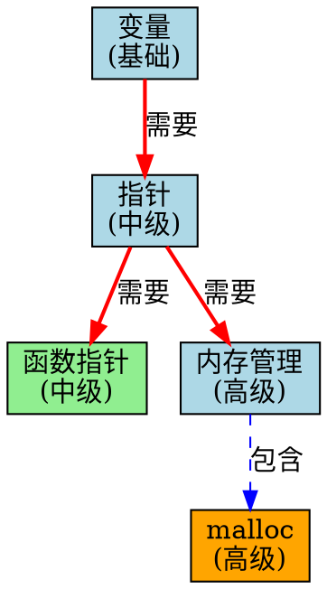

# 知识图谱


---

## 📑 目录

- [知识图谱](#知识图谱)
  - [📑 目录](#-目录)
  - [概述](#概述)
  - [1. C语言概念图谱](#1-c语言概念图谱)
    - [1.1 核心概念实体](#11-核心概念实体)
    - [1.2 概念图谱C语言定义](#12-概念图谱c语言定义)
    - [1.3 C语言核心概念实体定义](#13-c语言核心概念实体定义)
  - [2. 概念关系](#2-概念关系)
    - [2.1 核心关系图谱](#21-核心关系图谱)
    - [2.2 概念关系矩阵](#22-概念关系矩阵)
    - [2.3 关系查询实现](#23-关系查询实现)
  - [3. 学习路径推荐](#3-学习路径推荐)
    - [3.1 推荐算法](#31-推荐算法)
    - [3.2 推荐示例](#32-推荐示例)
  - [4. 图谱可视化](#4-图谱可视化)
    - [4.1 DOT格式导出](#41-dot格式导出)
    - [4.2 可视化效果示例](#42-可视化效果示例)
  - [5. 应用场景](#5-应用场景)
    - [5.1 学习诊断](#51-学习诊断)
    - [5.2 课程设计](#52-课程设计)
  - [6. 工具推荐](#6-工具推荐)
  - [总结](#总结)


---

## 概述

知识图谱是一种用图结构表示知识的语义网络，通过实体、关系和属性的三元组形式组织和关联信息。
在C语言学习体系中，知识图谱能够清晰地展示概念之间的依赖关系、关联路径和学习脉络，帮助学习者构建系统化的知识结构。

---

## 1. C语言概念图谱

### 1.1 核心概念实体

```text
┌─────────────────────────────────────────────────────────────────────────┐
│                        C语言知识图谱核心结构                              │
├─────────────────────────────────────────────────────────────────────────┤
│                                                                         │
│   实体类型:                                                              │
│   ┌──────────┐  ┌──────────┐  ┌──────────┐  ┌──────────┐                │
│   │  概念     │  │  技术    │  │  工具    │  │  标准    │                │
│   │ Concept  │  │ Technique│  │  Tool    │  │ Standard │                │
│   └──────────┘  └──────────┘  └──────────┘  └──────────┘                │
│                                                                         │
│   关系类型:                                                              │
│   ┌──────────┐  ┌──────────┐  ┌──────────┐  ┌──────────┐                │
│   │ 前置需要  │  │  相关    │  │  包含     │  │  应用    │                │
│   │requires  │  │related_to│  │contains  │  │ applies_to│               │
│   └──────────┘  └──────────┘  └──────────┘  └──────────┘                │
│                                                                         │
└─────────────────────────────────────────────────────────────────────────┘
```

### 1.2 概念图谱C语言定义

```c
/* knowledge_graph.h - 知识图谱核心数据结构 */
#ifndef KNOWLEDGE_GRAPH_H
#define KNOWLEDGE_GRAPH_H

#include <stdint.h>
#include <stdbool.h>

/* 实体类型 */
typedef enum {
    ENTITY_CONCEPT = 0,         /* 概念 */
    ENTITY_TECHNIQUE,           /* 技术/方法 */
    ENTITY_TOOL,                /* 工具 */
    ENTITY_STANDARD,            /* 标准/规范 */
    ENTITY_DOMAIN,              /* 应用领域 */
    ENTITY_PROBLEM,             /* 问题/难点 */
    ENTITY_PRACTICE,            /* 实践/项目 */
    ENTITY_RESOURCE             /* 学习资源 */
} entity_type_t;

/* 关系类型 */
typedef enum {
    REL_PREREQUISITE = 0,       /* 前置依赖 */
    REL_RELATED,                /* 相关 */
    REL_CONTAINS,               /* 包含 */
    REL_APPLIES_TO,             /* 应用于 */
    REL_IMPLEMENTS,             /* 实现 */
    REL_CONTRASTS_WITH,         /* 对比 */
    REL_EVOLVED_FROM,           /* 演进自 */
    REL_ALTERNATIVE_TO,         /* 替代方案 */
    REL_RECOMMENDED_BY          /* 推荐 */
} relation_type_t;

/* 难度等级 */
typedef enum {
    LEVEL_FUNDAMENTAL = 1,      /* 基础 */
    LEVEL_INTERMEDIATE = 2,     /* 中级 */
    LEVEL_ADVANCED = 3,         /* 高级 */
    LEVEL_EXPERT = 4            /* 专家 */
} difficulty_level_t;

/* 实体节点 */
typedef struct entity {
    uint32_t id;
    const char *name;
    const char *description;
    entity_type_t type;
    difficulty_level_t difficulty;

    /* 学习属性 */
    uint32_t estimated_hours;   /* 预计学习时长 */
    uint32_t importance;        /* 重要性 1-10 */

    /* 图结构 */
    struct relation **outgoing; /* 出边 */
    uint32_t out_degree;
    struct relation **incoming; /* 入边 */
    uint32_t in_degree;

    /* 属性 */
    struct attribute **attrs;
    uint32_t attr_count;
} entity_t;

/* 关系边 */
typedef struct relation {
    uint32_t id;
    relation_type_t type;
    entity_t *from;
    entity_t *to;
    float weight;               /* 关系权重 0-1 */
    const char *description;
} relation_t;

/* 属性 */
typedef struct attribute {
    const char *key;
    const char *value;
} attribute_t;

/* 知识图谱 */
typedef struct {
    const char *name;
    entity_t **entities;
    uint32_t entity_count;
    uint32_t entity_capacity;

    relation_t **relations;
    uint32_t relation_count;
    uint32_t relation_capacity;

    /* 索引 */
    struct hash_table *name_index;
} knowledge_graph_t;

/* API */
knowledge_graph_t *kg_create(const char *name);
void kg_destroy(knowledge_graph_t *kg);

entity_t *kg_add_entity(knowledge_graph_t *kg,
                         const char *name,
                         entity_type_t type,
                         difficulty_level_t difficulty);

relation_t *kg_add_relation(knowledge_graph_t *kg,
                             entity_t *from,
                             entity_t *to,
                             relation_type_t type,
                             float weight);

entity_t *kg_find_entity(knowledge_graph_t *kg, const char *name);

/* 查询 */
entity_t **kg_find_prerequisites(knowledge_graph_t *kg,
                                  entity_t *target,
                                  uint32_t *count);
entity_t **kg_find_related(knowledge_graph_t *kg,
                            entity_t *entity,
                            relation_type_t rel_type,
                            uint32_t *count);

/* 路径查找 */
entity_t **kg_find_learning_path(knowledge_graph_t *kg,
                                  entity_t *from,
                                  entity_t *to,
                                  uint32_t *path_length);

/* 导出 */
int kg_export_dot(knowledge_graph_t *kg, const char *filename);
int kg_export_json(knowledge_graph_t *kg, const char *filename);

#endif /* KNOWLEDGE_GRAPH_H */
```

### 1.3 C语言核心概念实体定义

```c
/* c_concepts.c - C语言核心概念实体 */
#include "knowledge_graph.h"

/* 基础概念 */
void create_basic_concepts(knowledge_graph_t *kg) {
    /* 变量与类型 */
    entity_t *variables = kg_add_entity(kg, "变量",
        ENTITY_CONCEPT, LEVEL_FUNDAMENTAL);
    kg_add_attr(variables, "定义", "命名的内存存储区域");
    kg_add_attr(variables, "关键字", "auto, static, extern, register");

    entity_t *data_types = kg_add_entity(kg, "数据类型",
        ENTITY_CONCEPT, LEVEL_FUNDAMENTAL);

    entity_t *integers = kg_add_entity(kg, "整数类型",
        ENTITY_CONCEPT, LEVEL_FUNDAMENTAL);
    entity_t *floats = kg_add_entity(kg, "浮点类型",
        ENTITY_CONCEPT, LEVEL_FUNDAMENTAL);
    entity_t *pointers = kg_add_entity(kg, "指针",
        ENTITY_CONCEPT, LEVEL_INTERMEDIATE);
    pointers->importance = 10;
    pointers->estimated_hours = 40;

    /* 建立关系 */
    kg_add_relation(kg, data_types, integers, REL_CONTAINS, 1.0);
    kg_add_relation(kg, data_types, floats, REL_CONTAINS, 1.0);
    kg_add_relation(kg, pointers, data_types, REL_RELATED, 0.8);

    /* 控制流 */
    entity_t *control_flow = kg_add_entity(kg, "控制流",
        ENTITY_CONCEPT, LEVEL_FUNDAMENTAL);

    entity_t *conditionals = kg_add_entity(kg, "条件语句",
        ENTITY_CONCEPT, LEVEL_FUNDAMENTAL);
    entity_t *loops = kg_add_entity(kg, "循环语句",
        ENTITY_CONCEPT, LEVEL_FUNDAMENTAL);
    entity_t *switches = kg_add_entity(kg, "switch语句",
        ENTITY_CONCEPT, LEVEL_FUNDAMENTAL);
    entity_t *gotos = kg_add_entity(kg, "goto语句",
        ENTITY_TECHNIQUE, LEVEL_INTERMEDIATE);

    kg_add_relation(kg, control_flow, conditionals, REL_CONTAINS, 1.0);
    kg_add_relation(kg, control_flow, loops, REL_CONTAINS, 1.0);
    kg_add_relation(kg, control_flow, switches, REL_CONTAINS, 1.0);
    kg_add_relation(kg, control_flow, gotos, REL_CONTAINS, 0.5);

    /* 函数 */
    entity_t *functions = kg_add_entity(kg, "函数",
        ENTITY_CONCEPT, LEVEL_FUNDAMENTAL);
    entity_t *recursion = kg_add_entity(kg, "递归",
        ENTITY_TECHNIQUE, LEVEL_INTERMEDIATE);
    entity_t *callbacks = kg_add_entity(kg, "回调函数",
        ENTITY_TECHNIQUE, LEVEL_INTERMEDIATE);
    entity_t *variadic = kg_add_entity(kg, "可变参数",
        ENTITY_TECHNIQUE, LEVEL_ADVANCED);

    kg_add_relation(kg, functions, recursion, REL_CONTAINS, 1.0);
    kg_add_relation(kg, functions, callbacks, REL_CONTAINS, 1.0);
    kg_add_relation(kg, functions, variadic, REL_CONTAINS, 0.8);
    kg_add_relation(kg, pointers, callbacks, REL_PREREQUISITE, 1.0);
}
```

---

## 2. 概念关系

### 2.1 核心关系图谱

```text
┌─────────────────────────────────────────────────────────────────────────┐
│                         C语言核心概念关系图                              │
├─────────────────────────────────────────────────────────────────────────┤
│                                                                         │
│  ┌─────────┐     requires     ┌─────────┐     requires     ┌─────────┐ │
│  │ 变量    │◄─────────────────│ 指针    │◄─────────────────│ 函数指针 │ │
│  └────┬────┘                  └────┬────┘                  └────┬────┘ │
│       │                            │                            │      │
│       │ contains                   │ prerequisite               │      │
│       ▼                            ▼                            ▼      │
│  ┌─────────┐                  ┌─────────┐                  ┌─────────┐ │
│  │数据类型 │                  │ 内存管理 │                  │ 回调机制 │ │
│  └─────────┘                  └────┬────┘                  └─────────┘ │
│                                    │                                   │
│                    requires        │        implements                 │
│                               ┌────┴────┐                               │
│                               │ malloc  │                               │
│                               └─────────┘                               │
│                                                                         │
│  ┌─────────┐     requires     ┌─────────┐     applies_to     ┌─────────┐│
│  │ 预处理  │─────────────────▶│ 宏编程  │───────────────────▶│ 泛型   ││
│  └─────────┘                  └─────────┘                  └─────────┘│
│                                                                         │
└─────────────────────────────────────────────────────────────────────────┘
```

### 2.2 概念关系矩阵

| 概念A | 关系 | 概念B | 权重 | 说明 |
|-------|------|-------|------|------|
| 指针 | requires | 变量 | 1.0 | 必须先理解变量 |
| 指针 | requires | 数据类型 | 0.9 | 需要理解类型系统 |
| 数组 | related_to | 指针 | 0.9 | 数组与指针密切相关 |
| 函数指针 | requires | 指针 | 1.0 | 函数指针是普通指针的扩展 |
| malloc | requires | 指针 | 1.0 | 动态分配返回指针 |
| 结构体 | contains | 变量 | 1.0 | 结构体包含多个变量 |
| 结构体 | related_to | 指针 | 0.7 | 结构体指针常见 |
| 链表 | implements | 指针 | 1.0 | 链表是经典指针应用 |
| 内存泄漏 | problem_of | malloc | 0.8 | 动态分配的常见问题 |
| 调试器 | applies_to | 指针 | 0.9 | 调试指针问题 |

### 2.3 关系查询实现

```c
/* graph_query.c - 知识图谱查询实现 */
#include "knowledge_graph.h"
#include <stdlib.h>
#include <string.h>

/* 查找所有前置依赖 (递归) */
void find_all_prerequisites_recursive(entity_t *target,
                                       bool *visited,
                                       entity_t **result,
                                       uint32_t *count,
                                       uint32_t max_count) {
    for (uint32_t i = 0; i < target->in_degree && *count < max_count; i++) {
        relation_t *rel = target->incoming[i];
        if (rel->type == REL_PREREQUISITE || rel->type == REL_CONTAINS) {
            entity_t *prereq = rel->from;
            if (!visited[prereq->id]) {
                visited[prereq->id] = true;
                result[(*count)++] = prereq;
                find_all_prerequisites_recursive(prereq, visited, result,
                                                  count, max_count);
            }
        }
    }
}

entity_t **kg_find_prerequisites(knowledge_graph_t *kg,
                                  entity_t *target,
                                  uint32_t *count) {
    entity_t **result = calloc(kg->entity_count, sizeof(entity_t *));
    bool *visited = calloc(kg->entity_capacity, sizeof(bool));
    *count = 0;

    find_all_prerequisites_recursive(target, visited, result, count,
                                      kg->entity_count);

    free(visited);
    return result;
}

/* 查找最短学习路径 (BFS) */
entity_t **kg_find_learning_path(knowledge_graph_t *kg,
                                  entity_t *from,
                                  entity_t *to,
                                  uint32_t *path_length) {
    /* BFS实现 */
    entity_t **queue = calloc(kg->entity_count, sizeof(entity_t *));
    entity_t **parent = calloc(kg->entity_count, sizeof(entity_t *));
    bool *visited = calloc(kg->entity_capacity, sizeof(bool));

    uint32_t front = 0, rear = 0;
    queue[rear++] = from;
    visited[from->id] = true;

    bool found = false;
    while (front < rear && !found) {
        entity_t *current = queue[front++];

        for (uint32_t i = 0; i < current->out_degree; i++) {
            relation_t *rel = current->outgoing[i];
            if (rel->type == REL_PREREQUISITE || rel->type == REL_RELATED) {
                entity_t *next = rel->to;
                if (!visited[next->id]) {
                    visited[next->id] = true;
                    parent[next->id] = current;
                    queue[rear++] = next;

                    if (next == to) {
                        found = true;
                        break;
                    }
                }
            }
        }
    }

    /* 重建路径 */
    entity_t **path = calloc(kg->entity_count, sizeof(entity_t *));
    *path_length = 0;

    if (found) {
        entity_t *current = to;
        while (current != NULL) {
            path[(*path_length)++] = current;
            current = parent[current->id];
        }
        /* 反转路径 */
        for (uint32_t i = 0; i < *path_length / 2; i++) {
            entity_t *tmp = path[i];
            path[i] = path[*path_length - 1 - i];
            path[*path_length - 1 - i] = tmp;
        }
    }

    free(queue);
    free(parent);
    free(visited);

    return path;
}
```

---

## 3. 学习路径推荐

### 3.1 推荐算法

```c
/* learning_recommendation.h */
#ifndef LEARNING_RECOMMENDATION_H
#define LEARNING_RECOMMENDATION_H

#include "knowledge_graph.h"

/* 学习者画像 */
typedef struct {
    uint32_t *mastered_concepts;    /* 已掌握概念ID */
    uint32_t mastered_count;

    uint32_t *learning_concepts;    /* 正在学习的概念 */
    uint32_t learning_count;

    float difficulty_preference;    /* 难度偏好 0-1 */
    uint32_t available_hours;       /* 可用学习时间 */

    const char *goal;               /* 学习目标 */
} learner_profile_t;

/* 推荐项 */
typedef struct {
    entity_t *concept;
    float relevance_score;          /* 相关性分数 */
    float difficulty_match;         /* 难度匹配度 */
    float priority_score;           /* 综合优先级 */
    const char *reason;             /* 推荐理由 */
} recommendation_t;

/* 推荐算法 */
recommendation_t *recommend_next_concepts(knowledge_graph_t *kg,
                                           learner_profile_t *profile,
                                           uint32_t *count);

/* 个性化学习路径 */
entity_t **generate_personalized_path(knowledge_graph_t *kg,
                                       learner_profile_t *profile,
                                       entity_t *goal_concept,
                                       uint32_t *path_length);

/* 基于协同过滤的推荐 */
recommendation_t *recommend_by_similar_learners(knowledge_graph_t *kg,
                                                 learner_profile_t *profile,
                                                 learner_profile_t **other_profiles,
                                                 uint32_t profile_count,
                                                 uint32_t *count);

#endif /* LEARNING_RECOMMENDATION_H */
```

### 3.2 推荐示例

```text
学习者画像:
- 已掌握: 变量, 数据类型, 控制流, 函数基础
- 目标: 系统编程
- 可用时间: 每周10小时

推荐学习路径:

优先级  概念              预计时间    理由
─────────────────────────────────────────────────
1      指针              40小时      系统编程的核心基础
2      数组与字符串       15小时      指针的重要应用
3      内存管理          30小时      系统编程必备
4      结构体            20小时      复杂数据组织
5      文件I/O           25小时      系统调用入门
6      进程管理          35小时      系统编程核心
7      线程与并发        40小时      现代系统必备
```

---

## 4. 图谱可视化

### 4.1 DOT格式导出

```c
/* graph_export.c - 导出为Graphviz格式 */
#include "knowledge_graph.h"
#include <stdio.h>
#include <string.h>

static const char *entity_type_color(entity_type_t type) {
    switch (type) {
        case ENTITY_CONCEPT: return "lightblue";
        case ENTITY_TECHNIQUE: return "lightgreen";
        case ENTITY_TOOL: return "orange";
        case ENTITY_STANDARD: return "yellow";
        case ENTITY_PROBLEM: return "red";
        default: return "white";
    }
}

static const char *relation_style(relation_type_t type) {
    switch (type) {
        case REL_PREREQUISITE: return "[color=red,penwidth=2]";
        case REL_CONTAINS: return "[color=blue,style=dashed]";
        case REL_RELATED: return "[color=gray]";
        case REL_APPLIES_TO: return "[color=green]";
        default: return "";
    }
}

int kg_export_dot(knowledge_graph_t *kg, const char *filename) {
    FILE *fp = fopen(filename, "w");
    if (!fp) return -1;

    fprintf(fp, "digraph C_Knowledge_Graph {\n");
    fprintf(fp, "  rankdir=TB;\n");
    fprintf(fp, "  node [shape=box,style=filled];\n\n");

    /* 输出节点 */
    for (uint32_t i = 0; i < kg->entity_count; i++) {
        entity_t *e = kg->entities[i];
        fprintf(fp, "  \"%s\" [fillcolor=%s,label=\"%s\\n(%s)\"];\n",
                e->name,
                entity_type_color(e->type),
                e->name,
                e->difficulty == 1 ? "基础" :
                e->difficulty == 2 ? "中级" :
                e->difficulty == 3 ? "高级" : "专家");
    }

    fprintf(fp, "\n");

    /* 输出边 */
    for (uint32_t i = 0; i < kg->relation_count; i++) {
        relation_t *r = kg->relations[i];
        fprintf(fp, "  \"%s\" -> \"%s\" %s [label=\"%s\"];\n",
                r->from->name,
                r->to->name,
                relation_style(r->type),
                r->type == REL_PREREQUISITE ? "需要" :
                r->type == REL_CONTAINS ? "包含" :
                r->type == REL_RELATED ? "相关" : "");
    }

    fprintf(fp, "}\n");
    fclose(fp);
    return 0;
}
```

### 4.2 可视化效果示例



---

## 5. 应用场景

### 5.1 学习诊断

```text
输入: 学习者当前掌握的知识点和目标

知识图谱分析:
1. 识别知识缺口
2. 计算前置依赖
3. 评估学习难度
4. 生成个性化路径

输出:
- 推荐学习顺序
- 预计学习时间
- 难度预警
- 相关资源推荐
```

### 5.2 课程设计

```text
基于图谱的课程设计:

模块1: C基础 (4周)
  ├── 变量与类型
  ├── 运算符
  ├── 控制流
  └── 函数基础

模块2: 指针与内存 (6周)
  ├── 指针基础
  ├── 指针运算
  ├── 动态内存分配
  └── 常见错误防范

模块3: 高级特性 (4周)
  ├── 结构体与联合体
  ├── 位操作
  └── 预处理与宏

模块4: 系统编程 (8周)
  ├── 文件I/O
  ├── 进程管理
  ├── 线程与同步
  └── 网络编程
```

---

## 6. 工具推荐

| 工具 | 用途 | 链接 |
|------|------|------|
| Graphviz | 图谱可视化 | graphviz.org |
| Neo4j | 图数据库 | neo4j.com |
| D3.js | 交互式可视化 | d3js.org |
| Cytoscape | 网络分析 | cytoscape.org |

---

## 总结

知识图谱为C语言学习提供了结构化的知识表示和智能的学习支持。通过概念关系分析、路径规划和个性化推荐，学习者可以更高效地构建完整的知识体系。结合可视化工具，知识图谱也能成为教学设计和课程规划的有力工具。


---

## 深入理解

### 核心原理

深入探讨技术原理和实现细节。

### 实践应用

- 应用场景1
- 应用场景2
- 应用场景3

### 最佳实践

1. 理解基础概念
2. 掌握核心机制
3. 应用到实际项目

---

> **最后更新**: 2026-03-21  
> **维护者**: AI Code Review
