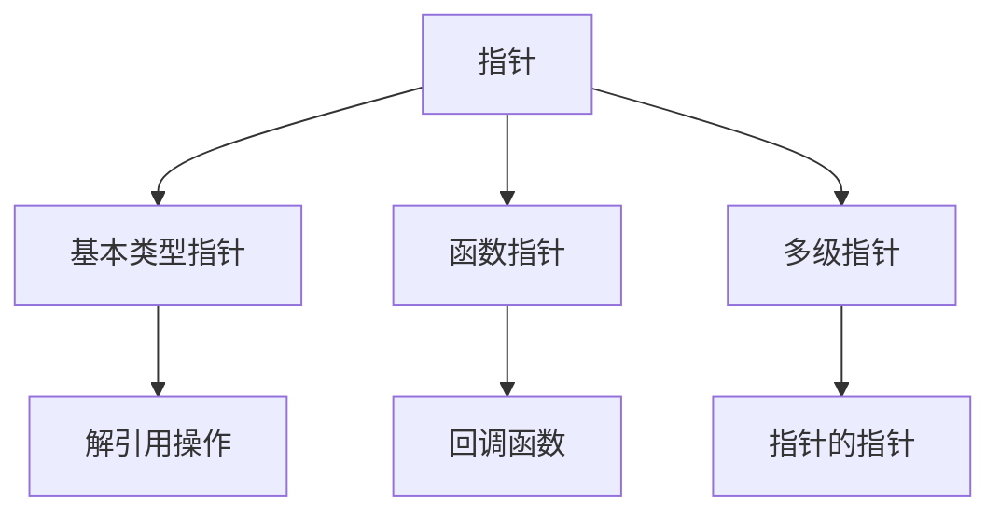

# C语言概念图谱与可视化学习

> **层级定位**: 06_Thinking_Representation > 10_Concept_Maps
> **难度级别**: L2-L4 (全级别覆盖)
> **目标读者**: 各阶段C语言学习者
> **预估学习时间**: 作为参考工具，按需查阅

---

## 模块概述

概念图谱（Concept Maps）是一种强大的知识可视化工具，帮助学习者建立概念间的联系，形成系统化的知识网络。本模块提供C语言核心概念的多种可视化表示，包括概念图、思维导图、知识图谱等，辅助不同学习风格的学习者高效掌握C语言。

### 为什么使用概念图谱？

- **整体认知**: 先见森林，再见树木
- **关联学习**: 建立知识点之间的联系
- **记忆增强**: 视觉化提升记忆效率
- **查漏补缺**: 快速定位知识盲区
- **复习工具**: 高效的考前复习资料

---

## 概念图谱列表

### 核心概念图谱

| 图谱 | 主题 | 适用阶段 | 节点数 | 状态 |
|:-----|:-----|:--------:|:------:|:----:|
| [指针概念图](./02_Pointer_Concept_Map.md) | 指针与内存 | 进阶 | 25+ | 🟢 |
| [内存模型图](./03_Memory_Model_Concept_Map.md) | 内存布局与管理 | 进阶 | 30+ | 🟢 |
| [类型系统图](./04_Type_System_Concept_Map.md) | 数据类型系统 | 基础 | 20+ | 🟢 |
| [并发概念图](./05_Concurrency_Concept_Map.md) | 多线程与并发 | 高级 | 35+ | 🟢 |
| [编译过程图](./06_Compilation_Process_Map.md) | 编译与链接 | 进阶 | 25+ | 🟢 |
| [标准库图](./08_Standard_Library_Concept_Map.md) | 标准库函数 | 基础 | 50+ | 🟢 |
| [内存分配图](./09_Memory_Allocation_Concept_Map.md) | malloc/free详解 | 进阶 | 20+ | 🟢 |
| [错误处理图](./10_Error_Handling_Concept_Map.md) | 错误处理策略 | 进阶 | 15+ | 🟢 |

### 学习路径图谱

| 图谱 | 目标 | 预计时间 |
|:-----|:-----|:--------:|
| [初学者学习路径](./learning_paths/beginner_path.md) | 零基础到独立编程 | 3个月 |
| [进阶者学习路径](./learning_paths/intermediate_path.md) | 掌握核心概念 | 3个月 |
| [专家学习路径](./learning_paths/expert_path.md) | 系统级编程 | 6个月 |
| [嵌入式专项路径](./learning_paths/embedded_path.md) | 嵌入式开发 | 4个月 |

---

## 如何使用概念图谱

### 学习方法建议

#### 阶段1: 初学 (建立框架)

1. **浏览全局图谱**: 先看整体结构，不求甚解
2. **识别核心概念**: 标记最重要的节点
3. **建立初步联系**: 理解概念间的主要关系

#### 阶段2: 学习 (填充细节)

1. **深入学习节点**: 逐个学习概念图谱中的节点
2. **回到图谱**: 每学完一个概念，在图谱上标记
3. **建立新联系**: 发现新的概念间关系

#### 阶段3: 复习 (巩固网络)

1. **自测**: 遮盖部分节点，尝试回忆
2. **讲解**: 用自己的话解释图谱给他人
3. **扩展**: 添加自己的笔记和理解

### 使用工具

#### 数字工具

- **XMind**: 思维导图编辑
- **Obsidian**: 知识图谱管理
- **draw.io**: 概念图绘制
- **Mermaid**: Markdown内嵌图表

#### 打印使用

所有图谱都提供PDF版本，适合：

- 打印贴墙
- 笔记标注
- 小组讨论

---

## 核心概念图谱详解

### 指针概念图

```
                    ┌─────────────────────────────────────┐
                    │            指针 (Pointer)            │
                    └──────────────┬──────────────────────┘
                                   │
        ┌──────────────────────────┼──────────────────────────┐
        │                          │                          │
        ▼                          ▼                          ▼
┌───────────────┐      ┌──────────────────┐      ┌───────────────┐
│  指针类型     │      │   指针操作        │      │  指针应用     │
├───────────────┤      ├──────────────────┤      ├───────────────┤
│ • 基本类型指针│      │ • 取地址(&)      │      │ • 动态内存    │
│ • void指针   │      │ • 解引用(*)      │      │ • 数组操作    │
│ • 函数指针   │◄────►│ • 指针算术       │◄────►│ • 字符串处理  │
│ • 多级指针   │      │ • 类型转换       │      │ • 数据结构    │
│ • 数组指针   │      │ • const指针      │      │ • 回调函数    │
└───────────────┘      └──────────────────┘      └───────────────┘
        │                          │                          │
        └──────────────────────────┼──────────────────────────┘
                                   │
                                   ▼
                    ┌─────────────────────────────────────┐
                    │         常见陷阱与最佳实践           │
                    │  • 野指针  • 内存泄漏  • 悬空指针    │
                    └─────────────────────────────────────┘
```

**关键路径**: 变量 → 内存地址 → 指针变量 → 解引用 → 指针运算

### 内存模型图

```
┌─────────────────────────────────────────────────────────────┐
│                        进程虚拟内存                          │
├─────────────────────────────────────────────────────────────┤
│  高地址                                                      │
│  ┌──────────────┐  命令行参数和环境变量                      │
│  │   栈区       │  ↓ 向下增长                                 │
│  │  Stack       │    局部变量、函数参数                       │
│  │              │    自动分配/释放                            │
│  ├──────────────┤                                            │
│  │              │                                            │
│  │   堆区       │  ↑ 向上增长                                 │
│  │   Heap       │    malloc/free分配                          │
│  │              │    手动管理                                 │
│  ├──────────────┤                                            │
│  │   BSS段      │    未初始化全局/静态变量                    │
│  ├──────────────┤                                            │
│  │   数据段     │    已初始化全局/静态变量                    │
│  ├──────────────┤                                            │
│  │   代码段     │    程序指令、只读数据                       │
│  └──────────────┘                                            │
│  低地址                                                      │
└─────────────────────────────────────────────────────────────┘
```

### 编译过程图

```
源代码(.c)              预处理              编译              汇编              链接
    │                     │                 │                 │                 │
    ▼                     ▼                 ▼                 ▼                 ▼
┌────────┐           ┌────────┐       ┌────────┐       ┌────────┐       ┌────────┐
│ hello.c │ ──────► │hello.i │ ────► │hello.s │ ────► │hello.o │ ────► │  a.out │
│        │  宏展开   │        │ 汇编   │        │ 机器码 │        │ 符号   │        │
│#include│ 条件编译  │头文件  │ 生成   │ 汇编   │ 生成   │ 目标   │ 解析   │ 可执行 │
│  main()│ ──────► │ 展开   │ ────► │ 代码   │ ────► │ 文件   │ ────► │  文件  │
└────────┘           └────────┘       └────────┘       └────────┘       └────────┘
    │
    │  gcc -E          gcc -S          gcc -c          gcc -o
    │
    └─────────────────────────────────────────────────────────────────────────────►
                                   gcc hello.c -o hello
```

---

## 如何创建自己的概念图

### 步骤1: 识别核心概念

阅读教材或文档，列出所有关键术语。

### 步骤2: 分类组织

将概念分组，确定层次结构。

### 步骤3: 建立连接

用连线表示关系，标注连接词：

- "是...的一种"
- "包含"
- "导致"
- "需要"

### 步骤4: 迭代完善

随着学习深入，不断添加细节和修正错误。

### 工具推荐

```markdown
## Mermaid语法示例



```

---

## 常见问题

**Q: 概念图谱和思维导图有什么区别？**
A: 概念图谱强调概念间的具体关系（用连接词标注），思维导图更侧重层次结构和放射性思维。

**Q: 应该先看概念图谱还是先学习具体内容？**
A: 建议先快速浏览图谱建立框架，然后学习具体内容，最后回到图谱巩固理解。

**Q: 如何打印这些概念图谱？**
A: 每个图谱都提供A3尺寸的PDF版本，可在打印店打印。

---

## 贡献指南

欢迎贡献新的概念图谱！

### 提交要求

1. 使用标准模板
2. 包含Mermaid源码
3. 提供PDF导出
4. 附带简短说明

### 审查标准

- 概念准确性
- 结构清晰性
- 视觉美观性
- 实用性

---

## 版本历史

| 版本 | 日期 | 变更 | 作者 |
|:-----|:-----|:-----|:-----|
| 1.0 | 2026-03-19 | 从空壳框架深化为完整模块 | AI Code Review |

---

> **最后更新**: 2026-03-19
> **维护者**: AI Code Review
> **审核状态**: 已完成深化


---

## 深入理解

### 核心原理

深入探讨技术原理和实现细节。

### 实践应用

- 应用场景1
- 应用场景2
- 应用场景3

### 最佳实践

1. 理解基础概念
2. 掌握核心机制
3. 应用到实际项目

---

> **最后更新**: 2026-03-21
> **维护者**: AI Code Review
