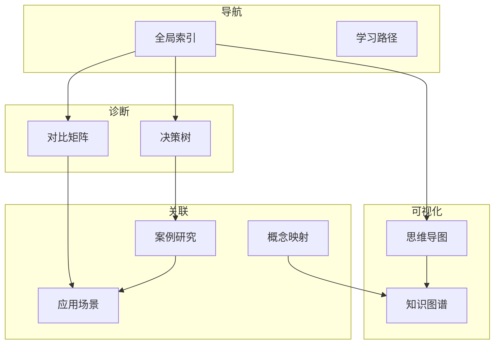

# 06 Thinking Representation - 思维表达与知识组织

> **用途**: 知识导航、问题诊断、概念关联、学习路径
> **完成度**: 100% | **预估学习时间**: 20-30小时

---

## 目录结构

### 01_Decision_Trees - 决策树

问题诊断与故障排查决策流程。

| 文件 | 主题 | 用途 | 关联知识 |
|:-----|:-----|:-----|:---------|
| [01_Memory_Leak_Diagnosis.md](./01_Decision_Trees/01_Memory_Leak_Diagnosis.md) | 内存泄漏诊断 | 排查内存问题 | [内存管理](../01_Core_Knowledge_System/02_Core_Layer/02_Memory_Management.md) |
| [02_Segfault_Troubleshooting.md](./01_Decision_Trees/02_Segfault_Troubleshooting.md) | 段错误排查 | 调试崩溃问题 | [调试技术](../01_Core_Knowledge_System/05_Engineering_Layer/02_Debug_Techniques.md) |
| [03_Performance_Bottleneck.md](./01_Decision_Trees/03_Performance_Bottleneck.md) | 性能瓶颈分析 | 优化决策 | [性能分析](../01_Core_Knowledge_System/05_Engineering_Layer/03_Performance_Optimization.md) |
| [04_Compilation_Error.md](./01_Decision_Trees/04_Compilation_Error.md) | 编译错误排查 | 编译问题解决 | [构建系统](../01_Core_Knowledge_System/05_Engineering/01_Build_System/01_Makefile.md) |
| [05_Concurrency_Debug.md](./01_Decision_Trees/05_Concurrency_Debug.md) | 并发问题调试 | 死锁/竞态 | [多线程](../01_Core_Knowledge_System/04_Standard_Library_Layer/10_Threads_C11.md) |

---

### 02_Comparison_Matrices - 对比矩阵

技术选型与特性对比。

| 文件 | 主题 | 用途 | 对比维度 |
|:-----|:-----|:-----|:---------|
| [01_Type_Storage_Matrix.md](./02_Comparison_Matrices/01_Type_Storage_Matrix.md) | 类型存储对比 | 内存布局 | 大小/对齐/范围 |
| [02_Synchronization_Matrix.md](./02_Comparison_Matrices/02_Synchronization_Matrix.md) | 同步原语对比 | 并发选择 | 性能/复杂度/适用场景 |
| [03_IO_Methods_Matrix.md](./02_Comparison_Matrices/03_IO_Methods_Matrix.md) | IO方法对比 | IO选型 | 缓冲/性能/复杂度 |
| [04_Memory_Allocation_Matrix.md](./02_Comparison_Matrices/04_Memory_Allocation_Matrix.md) | 内存分配对比 | 分配策略 | 速度/碎片/线程安全 |
| [05_Compiler_Optimization_Matrix.md](./02_Comparison_Matrices/05_Compiler_Optimization_Matrix.md) | 优化级别对比 | 编译优化 | 速度/大小/调试 |

---

### 03_Mind_Maps - 思维导图

知识结构可视化。

| 文件 | 主题 | 覆盖范围 |
|:-----|:-----|:---------|
| [01_Knowledge_System_MindMap.md](./01_Mind_Maps/01_Knowledge_System_MindMap.md) | C语言知识系统 | 完整知识图谱 |
| [02_Memory_Model_Map.md](./03_Mind_Maps/02_Memory_Model_Map.md) | 内存模型 | 堆栈全局常量 |
| [03_Pointer_Concepts_Map.md](./03_Mind_Maps/03_Pointer_Concepts_Map.md) | 指针概念 | 所有指针类型 |
| [04_Concurrent_Programming_Map.md](./03_Mind_Maps/04_Concurrent_Programming_Map.md) | 并发编程 | 线程/锁/原子 |

---

### 04_Case_Studies - 应用案例

实际工程案例分析。

| 文件 | 主题 | 行业 | 关键技术 |
|:-----|:-----|:-----|:---------|
| [01_Network_Server.md](./04_Case_Studies/01_Network_Server.md) | 网络服务器 | 通用 | Socket/Event Loop |
| [02_Database_Engine.md](./04_Case_Studies/02_Database_Engine.md) | 数据库引擎 | 数据库 | B+树/事务/日志 |
| [03_Operating_System.md](./04_Case_Studies/03_Operating_System.md) | 操作系统 | 系统 | 内核/调度/内存 |
| [04_Compiler_Frontend.md](./04_Case_Studies/04_Compiler_Frontend.md) | 编译器前端 | 编译器 | 词法/语法/语义 |
| [05_Embedded_Firmware.md](./04_Case_Studies/05_Embedded_Firmware.md) | 嵌入式固件 | 嵌入式 | 裸机/中断/外设 |
| [06_Embedded_System_Design.md](./04_Case_Studies/06_Embedded_System_Design.md) | 嵌入式系统设计 | 汽车 | AUTOSAR/状态机 |
| [07_Performance_Optimization.md](./04_Case_Studies/07_Performance_Optimization.md) | 性能优化案例 | 通用 | Profiling/优化 |

---

### 05_Concept_Mappings - 概念映射

概念间的关联关系。

| 文件 | 主题 | 映射类型 |
|:-----|:-----|:---------|
| [01_Pointer_Memory_Mapping.md](./05_Concept_Mappings/01_Pointer_Memory_Mapping.md) | 指针-内存映射 | 双向映射 |
| [02_Type_System_Matrix.md](./05_Concept_Mappings/02_Type_System_Matrix.md) | 类型系统矩阵 | 分类矩阵 |
| [03_Concurrency_Safety_Layers.md](./05_Concept_Mappings/03_Concurrency_Safety_Layers.md) | 并发安全层次 | 层次结构 |
| [04_Storage_Duration_Lifetime.md](./05_Concept_Mappings/04_Storage_Duration_Lifetime.md) | 存储期-生命周期 | 时间映射 |
| [05_Compilation_Pipeline_Mapping.md](./05_Concept_Mappings/05_Compilation_Pipeline_Mapping.md) | 编译流程映射 | 流程映射 |

---

### 04_Application_Scenario_Trees - 应用场景树

技术选型与应用场景匹配。

| 文件 | 主题 | 场景 |
|:-----|:-----|:-----|
| [01_Embedded_Systems.md](./06_Application_Scenarios/01_Embedded_Systems.md) | 嵌入式系统 | 资源受限/实时 |
| [02_Systems_Programming.md](./06_Application_Scenarios/02_Systems_Programming.md) | 系统编程 | OS/驱动/底层 |
| [03_High_Performance_Computing.md](./06_Application_Scenarios/03_High_Performance_Computing.md) | 高性能计算 | 科学计算/SIMD |
| [04_Network_Programming.md](./06_Application_Scenarios/04_Network_Programming.md) | 网络编程 | 服务器/协议 |
| [05_Database_Implementation.md](./06_Application_Scenarios/05_Database_Implementation.md) | 数据库实现 | 存储/索引/查询 |
| [06_Compiler_Construction.md](./06_Application_Scenarios/06_Compiler_Construction.md) | 编译器构造 | 前端/后端/优化 |
| [07_Security_Sensitive.md](./06_Application_Scenarios/07_Security_Sensitive.md) | 安全敏感 | 加密/可信/加固 |

---

<!-- ### 07_Knowledge_Graph - 知识图谱

全局知识关联网络。

| 文件 | 主题 | 内容 |
|:-----|:-----|:-----|
| [01_Knowledge_Graph.md](./07_Knowledge_Graph/01_Knowledge_Graph.md) | 全局知识图谱 | 主题依赖/覆盖矩阵 | -->
<!-- | [02_Learning_Paths.md](./07_Knowledge_Graph/02_Learning_Paths.md) | 学习路径 | 从入门到专家 | -->
<!-- | [03_Prerequisite_Chains.md](./07_Knowledge_Graph/03_Prerequisite_Chains.md) | 前置依赖链 | 知识依赖关系 | -->

---

### 08_Index - 索引与导航

> 注：学习路径已移至 [06_Learning_Paths](./06_Learning_Paths/)

快速查找工具。

| 文件 | 主题 | 用途 |
|:-----|:-----|:-----|
| [01_Global_Index.md](./08_Index/01_Global_Index.md) | 全局索引 | 按主题查找 |
| [02_Standard_Reference.md](./08_Index/02_Standard_Reference.md) | 标准参考 | ISO/POSIX/MISRA |
| [03_API_Quick_Reference.md](./08_Index/03_API_Quick_Reference.md) | API速查 | 常用函数索引 |

---

## 知识结构关系

---

## 使用指南

### 遇到问题时

1. 查阅 [01_Decision_Trees](./01_Decision_Trees/) 进行故障诊断
2. 参考 [04_Case_Studies](./04_Case_Studies/) 看类似问题如何解决

### 技术选型时

1. 查阅 [02_Comparison_Matrices](./02_Comparison_Matrices/) 对比不同方案
2. 参考 [06_Application_Scenarios](./06_Application_Scenarios/) 看场景匹配

### 学习新知识时

1. 查看 [03_Mind_Maps](./03_Mind_Maps/) 了解知识结构
2. 跟随 [07_Knowledge_Graph/02_Learning_Paths.md](./07_Knowledge_Graph/02_Learning_Paths.md) 学习
3. 理解 [05_Concept_Mappings](./05_Concept_Mappings/) 中的概念关联

### 快速查找时

1. 使用 [08_Index/01_Global_Index.md](./08_Index/01_Global_Index.md) 按主题查找
2. 查阅 [00_INDEX.md](../00_INDEX.md) 全局索引

---

## 与其他知识库的关系

| 目标 | 关系 |
|:-----|:-----|
| [01_Core_Knowledge_System](../01_Core_Knowledge_System/README.md) | 提供导航和思维工具 |
| [02_Formal_Semantics_and_Physics](../02_Formal_Semantics_and_Physics/README.md) | 可视化抽象概念 |
| [03_System_Technology_Domains](../03_System_Technology_Domains/README.md) | 案例和决策支持 |
| [04_Industrial_Scenarios](../04_Industrial_Scenarios/README.md) | 工业场景映射 |
| [05_Deep_Structure_MetaPhysics](../05_Deep_Structure_MetaPhysics/README.md) | 理论概念可视化 |

---

## 思维工具矩阵

| 问题类型 | 推荐工具 | 文件 |
|:---------|:---------|:-----|
| "出错了怎么办？" | 决策树 | [01_Decision_Trees](./01_Decision_Trees/) |
| "选A还是选B？" | 对比矩阵 | [02_Comparison_Matrices](./02_Comparison_Matrices/) |
| "整体结构是什么？" | 思维导图 | [03_Mind_Maps](./03_Mind_Maps/) |
| "实际怎么用？" | 案例研究 | [04_Case_Studies](./04_Case_Studies/) |
| "这些概念什么关系？" | 概念映射 | [05_Concept_Mappings](./05_Concept_Mappings/) |
| "适合什么场景？" | 应用场景 | [06_Application_Scenarios](./06_Application_Scenarios/) |
| "从哪里开始学？" | 知识图谱 | [07_Knowledge_Graph](./07_Knowledge_Graph/) |
| "怎么快速找到？" | 索引 | [08_Index](./08_Index/) |

---

> **最后更新**: 2025-03-09
