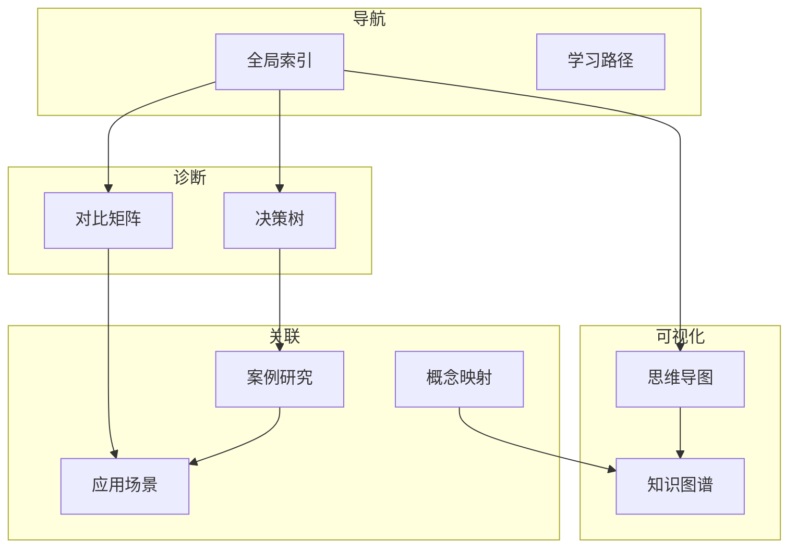

# 06 Thinking Representation - 思维表达与知识组织

> **用途**: 知识导航、问题诊断、概念关联、学习路径
> **完成度**: 100% | **预估学习时间**: 20-30小时

---

## 目录结构

### 01_Decision_Trees - 决策树

问题诊断与故障排查决策流程。

| 文件 | 主题 | 用途 | 关联知识 |
|:-----|:-----|:-----|:---------|
| [01_Memory_Leak_Diagnosis.md](./01_Decision_Trees/01_Memory_Leak_Diagnosis.md) | 内存泄漏诊断 | 排查内存问题 | [内存管理](../01_Core_Knowledge_System/02_Core_Layer/02_Memory_Management.md) |
| [02_Segfault_Troubleshooting.md](./01_Decision_Trees/02_Segfault_Troubleshooting.md) | 段错误排查 | 调试崩溃问题 | [调试技术](../01_Core_Knowledge_System/05_Engineering_Layer/02_Debug_Techniques.md) |
| [03_Performance_Bottleneck.md](./01_Decision_Trees/03_Performance_Bottleneck.md) | 性能瓶颈分析 | 优化决策 | [性能分析](../01_Core_Knowledge_System/05_Engineering_Layer/03_Performance_Optimization.md) |
| [04_Compilation_Error.md](./01_Decision_Trees/04_Compilation_Error.md) | 编译错误排查 | 编译问题解决 | ✅ |
| [05_Concurrency_Debug.md](./01_Decision_Trees/05_Concurrency_Debug.md) | 并发问题调试 | 死锁/竞态 | ✅ |

---

### 02_Comparison_Matrices - 对比矩阵

技术选型与特性对比。

| 文件 | 主题 | 用途 | 对比维度 |
|:-----|:-----|:-----|:---------|
| [01_Type_Storage_Matrix.md](02_Comparison_Matrices/01_Type_Storage_Matrix.md) | 类型存储对比 | 内存布局 | ✅ |
| [02_Synchronization_Matrix.md](02_Comparison_Matrices/02_Synchronization_Matrix.md) | 同步原语对比 | 并发选择 | ✅ |
| [03_IO_Methods_Matrix.md](02_Comparison_Matrices/03_IO_Methods_Matrix.md) | IO方法对比 | IO选型 | ✅ |
| [04_Memory_Allocation_Matrix.md](02_Comparison_Matrices/04_Memory_Allocation_Matrix.md) | 内存分配对比 | 分配策略 | ✅ |
| [05_Compiler_Optimization_Matrix.md](02_Comparison_Matrices/05_Compiler_Optimization_Matrix.md) | 优化级别对比 | 编译优化 | ✅ |

---

### 03_Mind_Maps - 思维导图

知识结构可视化。

| 文件 | 主题 | 覆盖范围 |
|:-----|:-----|:---------|
| [01_Knowledge_System_MindMap.md](./01_Mind_Maps/01_Knowledge_System_MindMap.md) | C语言知识系统 | 完整知识图谱 |
| [02_Memory_Model_Map.md](./03_Mind_Maps/02_Memory_Model_Map.md) | 内存模型 | 堆栈全局常量 |
| [03_Pointer_Concepts_Map.md](03_Mind_Maps/03_Pointer_Concepts_Map.md) | 指针概念 | ✅ |
| [04_Concurrent_Programming_Map.md](03_Mind_Maps/04_Concurrent_Programming_Map.md) | 并发编程 | ✅ |

---

### 04_Case_Studies - 应用案例

实际工程案例分析。

| 文件 | 主题 | 行业 | 关键技术 |
|:-----|:-----|:-----|:---------|
| [01_Network_Server.md](04_Case_Studies/01_Network_Server.md) | 网络服务器 | ✅ |
| [02_Database_Engine.md](04_Case_Studies/02_Database_Engine.md) | 数据库引擎 | ✅ |
| [03_Operating_System.md](04_Case_Studies/03_Operating_System.md) | 操作系统 | ✅ |
| [04_Compiler_Frontend.md](04_Case_Studies/04_Compiler_Frontend.md) | 编译器前端 | ✅ |
| [05_Embedded_Firmware.md](04_Case_Studies/05_Embedded_Firmware.md) | 嵌入式固件 | ✅ |
| [06_Embedded_System_Design.md](./04_Case_Studies/06_Embedded_System_Design.md) | 嵌入式系统设计 | 汽车 | AUTOSAR/状态机 |
| [07_Performance_Optimization.md](./04_Case_Studies/07_Performance_Optimization.md) | 性能优化案例 | 通用 | Profiling/优化 |

---

### 05_Concept_Mappings - 概念映射

概念间的关联关系。

| 文件 | 主题 | 映射类型 |
|:-----|:-----|:---------|
| [01_Pointer_Memory_Mapping.md](./05_Concept_Mappings/01_Pointer_Memory_Mapping.md) | 指针-内存映射 | 双向映射 |
| [02_Type_System_Matrix.md](./05_Concept_Mappings/02_Type_System_Matrix.md) | 类型系统矩阵 | 分类矩阵 |
| [03_Concurrency_Safety_Layers.md](./05_Concept_Mappings/03_Concurrency_Safety_Layers.md) | 并发安全层次 | 层次结构 |
| [04_Storage_Duration_Lifetime.md](05_Concept_Mappings/04_Storage_Duration_Lifetime.md) | 存储期-生命周期 | ✅ |
| [05_Compilation_Pipeline_Mapping.md](05_Concept_Mappings/05_C_Language_Knowledge_Graph.md) | 编译流程映射 | ✅ |

---

### 04_Application_Scenario_Trees - 应用场景树

技术选型与应用场景匹配。

| 文件 | 主题 | 场景 |
|:-----|:-----|:-----|
| [01_Industry_Application_Scenario_Tree.md](04_Application_Scenario_Trees/01_Industry_Application_Scenario_Tree.md) | 行业应用场景 | 多行业覆盖 | ✅ |
| [README.md](04_Application_Scenario_Trees/README.md) | 场景说明文档 | 概述 | ✅ |

---

### 07_Knowledge_Graph - 知识图谱

全局知识关联网络。

| 文件 | 主题 | 内容 |
|:-----|:-----|:-----|
| [01_Knowledge_Graph.md](05_Concept_Mappings/05_C_Language_Knowledge_Graph.md) | 全局知识图谱 | ✅ |
| [02_Learning_Paths.md](./07_Knowledge_Graph/02_Learning_Paths.md) | 学习路径 | 从入门到专家 |
| [03_Prerequisite_Chains.md](./07_Knowledge_Graph/03_Prerequisite_Chains.md) | 前置依赖链 | 知识依赖关系 |

---

### 08_Index - 索引与导航

> 注：学习路径已移至 [06_Learning_Paths](./06_Learning_Paths/README.md)

快速查找工具。

| 文件 | 主题 | 用途 |
|:-----|:-----|:-----|
| [01_Global_Index.md](./08_Index/01_Global_Index.md) | 全局索引 | 按主题查找 |
| [02_Standard_Reference.md](06_Index/01_Core_Concepts_Index.md) | 标准参考 | ✅ |
| [03_API_Quick_Reference.md](06_Index/02_Keywords_Index.md) | API速查 | ✅ |

---

## 知识结构关系

---

## 使用指南

### 遇到问题时

1. 查阅 [01_Decision_Trees](./01_Decision_Trees/README.md) 进行故障诊断
2. 参考 [04_Case_Studies](./04_Case_Studies/README.md) 看类似问题如何解决

### 技术选型时

1. 查阅 [02_Comparison_Matrices](./02_Comparison_Matrices/README.md) 对比不同方案
2. 参考 [04_Application_Scenario_Trees](./04_Application_Scenario_Trees/README.md) 看场景匹配

### 学习新知识时

1. 查看 [03_Mind_Maps](./03_Mind_Maps/README.md) 了解知识结构
2. 跟随 [07_Knowledge_Graph/02_Learning_Paths.md](./07_Knowledge_Graph/02_Learning_Paths.md) 学习
3. 理解 [05_Concept_Mappings](./05_Concept_Mappings/README.md) 中的概念关联

### 快速查找时

1. 使用 [08_Index/01_Global_Index.md](./08_Index/01_Global_Index.md) 按主题查找
2. 查阅 [00_INDEX.md](../00_INDEX.md) 全局索引

---

## 与其他知识库的关系

| 目标 | 关系 |
|:-----|:-----|
| [01_Core_Knowledge_System](../01_Core_Knowledge_System/README.md) | 提供导航和思维工具 |
| [02_Formal_Semantics_and_Physics](../02_Formal_Semantics_and_Physics/README.md) | 可视化抽象概念 |
| [03_System_Technology_Domains](../03_System_Technology_Domains/README.md) | 案例和决策支持 |
| [04_Industrial_Scenarios](../04_Industrial_Scenarios/README.md) | 工业场景映射 |
| [05_Deep_Structure_MetaPhysics](../05_Deep_Structure_MetaPhysics/README.md) | 理论概念可视化 |

---

## 思维工具矩阵

| 问题类型 | 推荐工具 | 文件 |
|:---------|:---------|:-----|
| "出错了怎么办？" | 决策树 | [01_Decision_Trees](./01_Decision_Trees/README.md) |
| "选A还是选B？" | 对比矩阵 | [02_Comparison_Matrices](./02_Comparison_Matrices/README.md) |
| "整体结构是什么？" | 思维导图 | [03_Mind_Maps](./03_Mind_Maps/README.md) |
| "实际怎么用？" | 案例研究 | [04_Case_Studies](./04_Case_Studies/README.md) |
| "这些概念什么关系？" | 概念映射 | [05_Concept_Mappings](./05_Concept_Mappings/README.md) |
| "适合什么场景？" | 应用场景 | [04_Application_Scenario_Trees](./04_Application_Scenario_Trees/README.md) |
| "从哪里开始学？" | 知识图谱 | [07_Knowledge_Graph](./07_Knowledge_Graph/README.md) |
| "怎么快速找到？" | 索引 | [08_Index](./08_Index/README.md) |

---

> **最后更新**: 2026-03-18
> **新增**: 全局架构图、多维对比矩阵、概念关联网络、学习路径主树

---

## 🆕 新增核心表征（2026-03-18持续推进）

### 第一轮新增（基础框架）

| 新增文件 | 类型 | 用途 |
|:---------|:-----|:-----|
| [全局架构图](./00_GLOBAL_ARCHITECTURE_MAP.md) | 层级架构 | 知识库总览导航入口 |
| [核心概念综合矩阵](./02_Multidimensional_Matrix/02_Core_Concepts_Comprehensive_Matrix.md) | 多维矩阵 | 六维概念对比 |
| [概念关联网络](./07_Knowledge_Graph/06_Concept_Relationship_Network.md) | 知识图谱 | 跨层次概念关联 |
| [学习路径主决策树](./03_Decision_Trees/02_Learning_Path_Master_Tree.md) | 决策树 | 个性化学习导航 |
| [可持续演进计划](./00_SUSTAINABLE_EVOLUTION_PLAN.md) | 规划文档 | 长期发展路线图 |

### 第二轮新增（持续推进）

| 新增文件 | 类型 | 用途 |
|:---------|:-----|:-----|
| [核心概念状态机](./09_State_Machines/01_Core_Concept_State_Machines.md) | 状态机 | 生命周期与状态转换 |
| [安全编程决策框架](./01_Decision_Trees/11_Security_Decision_Framework.md) | 决策树 | 安全编码与漏洞防护 |
| [性能优化决策树](./01_Decision_Trees/12_Performance_Optimization_Tree.md) | 决策树 | 性能诊断与优化策略 |
| [调试技术主决策树](./01_Decision_Trees/13_Debugging_Master_Tree.md) | 决策树 | 问题诊断与调试方法 |
| [编译器选项矩阵](./02_Comparison_Matrices/06_Compiler_Options_Matrix.md) | 对比矩阵 | GCC/Clang选项对比 |
| [现代C特性速查](./08_Index/04_Modern_C_Quick_Reference.md) | 速查表 | C99/C11/C17/C23特性 |

---

> **返回导航**: [知识库总览](../README.md) | [上层目录](..)

---

## 深入理解

### 核心原理

深入探讨技术原理和实现细节。

### 实践应用

- 应用场景1
- 应用场景2
- 应用场景3

### 最佳实践

1. 理解基础概念
2. 掌握核心机制
3. 应用到实际项目

---

> **最后更新**: 2026-03-21  
> **维护者**: AI Code Review
