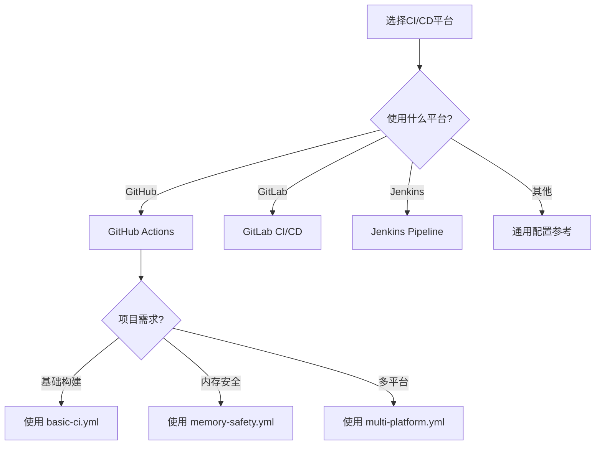

# CI/CD 模板集合

> 本目录提供针对C语言项目的持续集成/持续部署(CI/CD)模板，涵盖GitHub Actions、GitLab CI和Jenkins等多种主流CI/CD平台。

---

## 📋 目录结构

```
05_CI_CD_Templates/
├── README.md                     # 本文件：模板总览与使用指南
├── basic-ci.yml                  # 基础CI模板
├── memory-safety.yml             # 内存安全检测模板
└── multi-platform.yml            # 多平台构建模板
```

---


---

## 📑 目录

- [CI/CD 模板集合](#cicd-模板集合)
  - [📋 目录结构](#-目录结构)
  - [📑 目录](#-目录)
  - [🚀 快速开始](#-快速开始)
    - [选择适合你的模板](#选择适合你的模板)
  - [🔧 GitHub Actions 模板](#-github-actions-模板)
    - [1. 基础CI模板](#1-基础ci模板)
    - [2. 高级矩阵构建模板](#2-高级矩阵构建模板)
    - [3. 静态分析与安全扫描](#3-静态分析与安全扫描)
  - [🦊 GitLab CI 模板](#-gitlab-ci-模板)
    - [1. 完整CI/CD Pipeline](#1-完整cicd-pipeline)
    - [2. Docker构建模板](#2-docker构建模板)
  - [🔨 Jenkins Pipeline 模板](#-jenkins-pipeline-模板)
    - [1. 声明式Pipeline](#1-声明式pipeline)
    - [2. 脚本式Pipeline](#2-脚本式pipeline)
  - [📊 CI/CD 最佳实践](#-cicd-最佳实践)
    - [构建优化策略](#构建优化策略)
  - [🔗 相关资源](#-相关资源)


---

## 🚀 快速开始

### 选择适合你的模板



---

## 🔧 GitHub Actions 模板

### 1. 基础CI模板

```yaml
# .github/workflows/c-ci.yml
name: C/C++ CI

on:
  push:
    branches: [ main, develop ]
  pull_request:
    branches: [ main ]

jobs:
  build:
    runs-on: ubuntu-latest

    steps:
    - uses: actions/checkout@v4

    - name: Install dependencies
      run: |
        sudo apt-get update
        sudo apt-get install -y build-essential cmake valgrind

    - name: Configure CMake
      run: cmake -B build -DCMAKE_BUILD_TYPE=Release

    - name: Build
      run: cmake --build build --config Release

    - name: Test
      working-directory: build
      run: ctest -C Release --output-on-failure

    - name: Memory Check
      run: |
        valgrind --leak-check=full --error-exitcode=1 \
          ./build/my_program
```

### 2. 高级矩阵构建模板

```yaml
# .github/workflows/advanced-matrix.yml
name: Advanced Matrix Build

on: [push, pull_request]

jobs:
  build:
    strategy:
      fail-fast: false
      matrix:
        os: [ubuntu-latest, macos-latest, windows-latest]
        compiler: [gcc, clang]
        build_type: [Debug, Release]
        include:
          - os: ubuntu-latest
            compiler: gcc
            cc: gcc
            cxx: g++
          - os: ubuntu-latest
            compiler: clang
            cc: clang
            cxx: clang++
          - os: macos-latest
            compiler: clang
            cc: clang
            cxx: clang++
        exclude:
          - os: macos-latest
            compiler: gcc
          - os: windows-latest
            compiler: clang

    runs-on: ${{ matrix.os }}

    env:
      CC: ${{ matrix.cc }}
      CXX: ${{ matrix.cxx }}

    steps:
    - uses: actions/checkout@v4

    - name: Setup Windows
      if: runner.os == 'Windows'
      uses: microsoft/setup-msbuild@v2

    - name: Configure
      run: cmake -B build -DCMAKE_BUILD_TYPE=${{ matrix.build_type }}

    - name: Build
      run: cmake --build build --config ${{ matrix.build_type }}

    - name: Test
      run: ctest --test-dir build -C ${{ matrix.build_type }} --verbose
```

### 3. 静态分析与安全扫描

```yaml
# .github/workflows/static-analysis.yml
name: Static Analysis & Security

on:
  push:
    branches: [main]
  pull_request:
    branches: [main]
  schedule:
    - cron: '0 0 * * 0'  # 每周日运行

jobs:
  static-analysis:
    runs-on: ubuntu-latest

    steps:
    - uses: actions/checkout@v4

    - name: Install tools
      run: |
        sudo apt-get update
        sudo apt-get install -y cppcheck clang-tidy clang-format
        pip install cpplint

    - name: Cppcheck
      run: |
        cppcheck --enable=all --error-exitcode=1 \
          --suppress=missingIncludeSystem \
          -I include src/

    - name: Clang-Tidy
      run: |
        find src -name '*.c' -o -name '*.h' | \
          xargs clang-tidy -p build -- \
          -Iinclude -std=c11

    - name: Format Check
      run: |
        find src -name '*.c' -o -name '*.h' | \
          xargs clang-format --dry-run --Werror

    - name: Cpplint
      run: cpplint --recursive src/

  security-scan:
    runs-on: ubuntu-latest

    steps:
    - uses: actions/checkout@v4

    - name: Initialize CodeQL
      uses: github/codeql-action/init@v3
      with:
        languages: cpp

    - name: Autobuild
      uses: github/codeql-action/autobuild@v3

    - name: Perform CodeQL Analysis
      uses: github/codeql-action/analyze@v3
```

---

## 🦊 GitLab CI 模板

### 1. 完整CI/CD Pipeline

```yaml
# .gitlab-ci.yml
stages:
  - build
  - test
  - analyze
  - deploy

variables:
  CMAKE_BUILD_TYPE: Release
  CC: gcc
  CXX: g++

# 缓存配置
cache:
  key: ${CI_COMMIT_REF_SLUG}
  paths:
    - build/CMakeCache.txt
    - build/CMakeFiles/

# 构建阶段
build:linux:
  stage: build
  image: gcc:latest
  script:
    - apt-get update && apt-get install -y cmake
    - cmake -B build -DCMAKE_BUILD_TYPE=${CMAKE_BUILD_TYPE}
    - cmake --build build --parallel $(nproc)
  artifacts:
    paths:
      - build/
    expire_in: 1 hour

build:windows:
  stage: build
  tags:
    - windows
  script:
    - cmake -B build -G "Visual Studio 17 2022" -A x64
    - cmake --build build --config ${CMAKE_BUILD_TYPE}
  artifacts:
    paths:
      - build/

# 测试阶段
test:unit:
  stage: test
  image: gcc:latest
  dependencies:
    - build:linux
  script:
    - cd build && ctest --output-on-failure --verbose
  coverage: '/Total Coverage: \d+\.\d+%/'

# 内存检测
test:valgrind:
  stage: test
  image: registry.gitlab.com/cwka/cicd-valgrind-docker
  dependencies:
    - build:linux
  script:
    - valgrind --leak-check=full --show-leak-kinds=all \\
        --track-origins=yes --verbose \\
        --error-exitcode=1 ./build/test_runner
  allow_failure: true

# 分析阶段
analyze:cppcheck:
  stage: analyze
  image: pipelinecomponents/cppcheck:latest
  script:
    - cppcheck --enable=all --xml --xml-version=2 \\
        --suppress=missingIncludeSystem src/ 2> cppcheck.xml
  artifacts:
    reports:
      codequality: cppcheck.xml
    paths:
      - cppcheck.xml

analyze:sonarqube:
  stage: analyze
  image: sonarsource/sonar-scanner-cli
  script:
    - sonar-scanner \\
        -Dsonar.projectKey=${CI_PROJECT_NAME} \\
        -Dsonar.sources=src \\
        -Dsonar.cfamily.build-wrapper-output=build
  only:
    - merge_requests
    - main
```

### 2. Docker构建模板

```yaml
# Docker集成构建
.docker_template: &docker_definition
  image: docker:latest
  services:
    - docker:dind
  before_script:
    - docker login -u $CI_REGISTRY_USER -p $CI_REGISTRY_PASSWORD $CI_REGISTRY

docker-build:
  <<: *docker_definition
  stage: deploy
  script:
    - docker build -t $CI_REGISTRY_IMAGE:$CI_COMMIT_SHA .
    - docker push $CI_REGISTRY_IMAGE:$CI_COMMIT_SHA
    - |
      if [ "$CI_COMMIT_BRANCH" == "main" ]; then
        docker tag $CI_REGISTRY_IMAGE:$CI_COMMIT_SHA $CI_REGISTRY_IMAGE:latest
        docker push $CI_REGISTRY_IMAGE:latest
      fi
```

---

## 🔨 Jenkins Pipeline 模板

### 1. 声明式Pipeline

```groovy
// Jenkinsfile
pipeline {
    agent any

    environment {
        CC = 'gcc'
        CXX = 'g++'
        BUILD_TYPE = 'Release'
    }

    options {
        buildDiscarder(logRotator(numToKeepStr: '10'))
        timestamps()
        timeout(time: 30, unit: 'MINUTES')
    }

    stages {
        stage('Checkout') {
            steps {
                checkout scm
            }
        }

        stage('Build') {
            parallel {
                stage('Linux Build') {
                    agent { label 'linux' }
                    steps {
                        sh '''
                            cmake -B build -DCMAKE_BUILD_TYPE=${BUILD_TYPE}
                            cmake --build build --parallel $(nproc)
                        '''
                    }
                }
                stage('Windows Build') {
                    agent { label 'windows' }
                    steps {
                        bat '''
                            cmake -B build -G "Visual Studio 16 2019" -A x64
                            cmake --build build --config %BUILD_TYPE%
                        '''
                    }
                }
            }
        }

        stage('Test') {
            steps {
                sh 'cd build && ctest --output-on-failure'
            }
            post {
                always {
                    xunit testTimeMargin: '3000',
                        thresholdMode: 1,
                        thresholds: [failed(), skipped()],
                        tools: [CTest(pattern: 'build/Testing/**/*.xml')]
                }
            }
        }

        stage('Static Analysis') {
            steps {
                sh '''
                    cppcheck --enable=all --xml --xml-version=2 \\
                        src/ 2> cppcheck-report.xml || true
                '''
                recordIssues(
                    tools: [cppCheck(pattern: 'cppcheck-report.xml')]
                )
            }
        }

        stage('Coverage') {
            steps {
                sh '''
                    cmake -B build-cov -DCMAKE_BUILD_TYPE=Debug -DENABLE_COVERAGE=ON
                    cmake --build build-cov
                    cd build-cov && ctest
                    gcovr -r .. --html --html-details -o coverage.html
                '''
                publishHTML([
                    allowMissing: false,
                    alwaysLinkToLastBuild: true,
                    keepAll: true,
                    reportDir: 'build-cov',
                    reportFiles: 'coverage.html',
                    reportName: 'Coverage Report'
                ])
            }
        }
    }

    post {
        always {
            cleanWs()
        }
        failure {
            mail to: 'team@example.com',
                 subject: "Build Failed: ${env.JOB_NAME} #${env.BUILD_NUMBER}"
        }
    }
}
```

### 2. 脚本式Pipeline

```groovy
// Jenkinsfile (Scripted)
node('linux') {
    try {
        stage('Preparation') {
            git 'https://github.com/yourrepo/c-project.git'
        }

        stage('Build') {
            def builds = [:]

            builds['Debug'] = {
                node('linux') {
                    sh 'cmake -B build-debug -DCMAKE_BUILD_TYPE=Debug'
                    sh 'cmake --build build-debug'
                }
            }

            builds['Release'] = {
                node('linux') {
                    sh 'cmake -B build-release -DCMAKE_BUILD_TYPE=Release'
                    sh 'cmake --build build-release'
                }
            }

            parallel builds
        }

        stage('Quality Gate') {
            withSonarQubeEnv('SonarQube') {
                sh 'sonar-scanner'
            }
            timeout(time: 1, unit: 'HOURS') {
                waitForQualityGate abortPipeline: true
            }
        }

    } catch (e) {
        currentBuild.result = 'FAILURE'
        throw e
    } finally {
        notifyBuild(currentBuild.result)
    }
}

def notifyBuild(String buildStatus = 'STARTED') {
    buildStatus = buildStatus ?: 'SUCCESS'
    def color = buildStatus == 'SUCCESS' ? 'good' : 'danger'
    slackSend(color: color, message: "${buildStatus}: ${env.JOB_NAME} #${env.BUILD_NUMBER}")
}
```

---

## 📊 CI/CD 最佳实践

### 构建优化策略

```
┌─────────────────────────────────────────────────────────────┐
│                    CI/CD 优化策略                           │
├─────────────────────────────────────────────────────────────┤
│                                                             │
│  1. 缓存优化                                                 │
│     • 缓存依赖库和工具链                                      │
│     • 使用 ccache 加速C编译                                  │
│     • 增量构建避免重复编译                                    │
│                                                             │
│  2. 并行化                                                   │
│     • 矩阵构建多平台/多编译器                                 │
│     • 并行运行独立测试                                        │
│     • 分布式构建大型项目                                      │
│                                                             │
│  3. 阶段优化                                                 │
│     • 快速失败：静态分析先于完整构建                          │
│     • 按需执行：仅变更相关测试                                 │
│     • 异步分析：非阻塞式质量检查                               │
│                                                             │
│  4. 安全集成                                                 │
│     • SAST静态分析                                          │
│     • 依赖漏洞扫描                                           │
│     • 密钥扫描防止泄漏                                        │
│                                                             │
└─────────────────────────────────────────────────────────────┘
```

---

## 🔗 相关资源

- [返回上级目录](../README.md)
- [并发并行](../../07_Concurrency_Parallelism/README.md) - 构建优化相关
- [GitHub Actions文档](https://docs.github.com/en/actions)
- [GitLab CI文档](https://docs.gitlab.com/ee/ci/)
- [Jenkins文档](https://www.jenkins.io/doc/)

---

> 💡 **提示**：选择CI/CD平台时，考虑团队熟悉度、项目规模和基础设施。GitHub Actions适合开源项目，GitLab CI适合私有仓库，Jenkins适合自托管大型企业环境。
