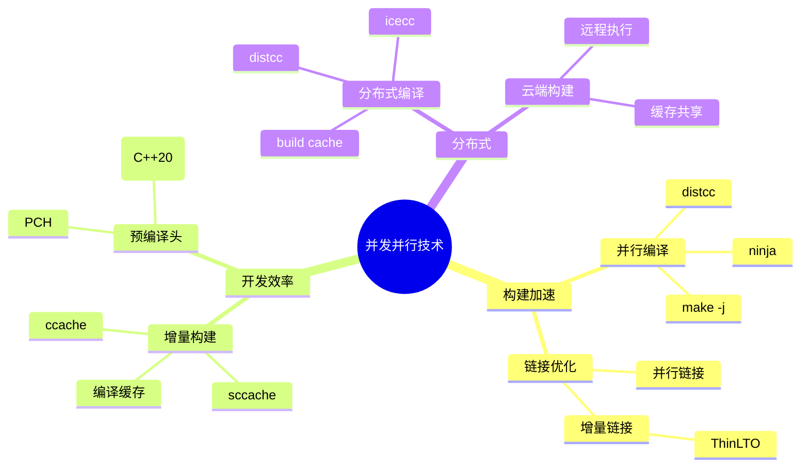

# 工具链中的并发与并行

> 本目录探讨现代C语言工具链中的并发并行技术，包括并行构建系统、分布式编译和缓存策略，旨在显著提升大型C项目的构建效率。

---

## 📋 目录结构

```
07_Concurrency_Parallelism/
├── README.md                          # 本文件：并发并行总览
├── 01_C11_Memory_Model.md             # C11内存模型
├── 02_Lock_Free_Programming.md        # 无锁编程
├── 03_Actor_Model_C.md                # Actor模型C实现
├── 04_CSP_Model_C.md                  # CSP模型C实现
├── 05_Thread_Pool_Patterns.md         # 线程池模式
└── 06_Coroutine_Fiber.md              # 协程与纤程
```

---


---

## 📑 目录

- [工具链中的并发与并行](#工具链中的并发与并行)
  - [📋 目录结构](#-目录结构)
  - [📑 目录](#-目录)
  - [🚀 并发与并行概述](#-并发与并行概述)
    - [在工具链中的重要性](#在工具链中的重要性)
  - [🔧 并行构建系统](#-并行构建系统)
    - [1. Make 并行构建](#1-make-并行构建)
    - [2. Ninja 构建系统](#2-ninja-构建系统)
    - [3. CMake 并行生成](#3-cmake-并行生成)
  - [⚡ 分布式编译](#-分布式编译)
    - [distcc 分布式编译](#distcc-分布式编译)
    - [icecc (Icecream)](#icecc-icecream)
  - [💾 编译缓存策略](#-编译缓存策略)
    - [ccache 配置优化](#ccache-配置优化)
    - [sccache（支持云端缓存）](#sccache支持云端缓存)
  - [🔗 链接时间优化 (LTO)](#-链接时间优化-lto)
    - [并行LTO配置](#并行lto配置)
  - [🏗️ 预编译头与模块](#️-预编译头与模块)
    - [预编译头 (PCH) 优化](#预编译头-pch-优化)
    - [C++20 模块（概念前瞻）](#c20-模块概念前瞻)
  - [📊 性能基准测试](#-性能基准测试)
    - [构建时间对比](#构建时间对比)
  - [📁 本目录文件说明](#-本目录文件说明)
  - [🔗 相关资源](#-相关资源)


---

## 🚀 并发与并行概述

### 在工具链中的重要性



---

## 🔧 并行构建系统

### 1. Make 并行构建

```makefile
# Makefile - 并行构建优化示例

# 自动检测CPU核心数
NPROCS := $(shell nproc 2>/dev/null || sysctl -n hw.ncpu 2>/dev/null || echo 1)
MAKEFLAGS += -j$(NPROCS)

# 目标定义
TARGET = myapp
SOURCES = $(wildcard src/*.c)
OBJECTS = $(SOURCES:.c=.o)

# 编译规则
$(TARGET): $(OBJECTS)
 $(CC) $(LDFLAGS) -o $@ $^

%.o: %.c
 $(CC) $(CFLAGS) -c -o $@ $<

# 并行测试目标
.PHONY: test
test: $(TARGET)
 @echo "Running tests with $(NPROCS) parallel jobs..."
 ./run_tests.sh --parallel=$(NPROCS)

.PHONY: clean
clean:
 rm -f $(TARGET) $(OBJECTS)
```

**使用方式：**

```bash
# 自动并行（使用Makefile中定义的-j）
make

# 手动指定并行度
make -j$(nproc)

# 无限制并行（小心内存耗尽）
make -j
```

### 2. Ninja 构建系统

Ninja是专为速度设计的构建系统，特别适合大型项目：

```python
# build.ninja - Ninja构建文件示例

# 变量定义
cc = gcc
cflags = -Wall -O2 -MMD -MF $out.d

# 规则定义
rule cc
  command = $cc $cflags -c $in -o $out
  depfile = $out.d
  deps = gcc

rule link
  command = $cc $in -o $out $ldflags

# 隐式规则 - 自动并行处理
build obj/main.o: cc src/main.c
build obj/utils.o: cc src/utils.c
build obj/parser.o: cc src/parser.c
build obj/network.o: cc src/network.c

# 最终链接
build myapp: link obj/main.o obj/utils.o obj/parser.o obj/network.o

# 默认目标
default myapp
```

**Ninja vs Make 性能对比：**

| 特性 | Make | Ninja |
|-----|------|-------|
| 构建速度 | 较慢 | 极快 |
| 增量构建 | 支持 | 优化 |
| 并行度 | 需配置 | 自动最优 |
| 适用项目 | 中小型 | 大型 |
| 语法复杂度 | 中等 | 简单 |

### 3. CMake 并行生成

```cmake
# CMakeLists.txt - 并行构建配置

cmake_minimum_required(VERSION 3.20)
project(ParallelBuild)

# 启用并行编译（MSVC）
if(MSVC)
    add_compile_options(/MP)
endif()

# 查找并启用ccache
find_program(CCACHE_PROGRAM ccache)
if(CCACHE_PROGRAM)
    set(CMAKE_C_COMPILER_LAUNCHER ${CCACHE_PROGRAM})
    set(CMAKE_CXX_COMPILER_LAUNCHER ${CCACHE_PROGRAM})
endif()

# 使用Unity Build加速
set(CMAKE_UNITY_BUILD ON)
set(CMAKE_UNITY_BUILD_BATCH_SIZE 16)

# 添加库和可执行文件
add_library(core STATIC
    src/core/file1.c
    src/core/file2.c
    src/core/file3.c
)

add_executable(app src/main.c)
target_link_libraries(app core)
```

---

## ⚡ 分布式编译

### distcc 分布式编译

```bash
# 1. 安装distcc
sudo apt-get install distcc distcc-pump

# 2. 配置主机列表
echo "192.168.1.10/8" >> ~/.distcc/hosts
echo "192.168.1.11/8" >> ~/.distcc/hosts
echo "192.168.1.12/4" >> ~/.distcc/hosts

# 3. 使用distcc编译
export DISTCC_HOSTS="localhost/2 192.168.1.10/8 192.168.1.11/8"
make -j20 CC=distcc

# 4. 监控编译状态
distccmon-text 5  # 每5秒刷新
```

**架构示意图：**

```
┌─────────────────────────────────────────────────────────────┐
│                     分布式编译架构                           │
├─────────────────────────────────────────────────────────────┤
│                                                             │
│   主节点 (Coordinator)                                      │
│   ┌──────────────────────────────┐                          │
│   │  distcc 调度器               │                          │
│   │  • 任务分发                  │                          │
│   │  • 结果收集                  │                          │
│   │  • 负载均衡                  │                          │
│   └──────────────┬───────────────┘                          │
│                  │                                          │
│      ┌───────────┼───────────┐                              │
│      │           │           │                              │
│      ▼           ▼           ▼                              │
│   ┌──────┐   ┌──────┐   ┌──────┐                           │
│   │工作节点1│   │工作节点2│   │工作节点3│                           │
│   │ gcc  │   │ clang│   │ gcc  │                           │
│   │ -c   │   │ -c   │   │ -c   │                           │
│   └──────┘   └──────┘   └──────┘                           │
│                                                             │
│   性能提升：编译时间从30分钟 → 5分钟 (6x加速)                  │
│                                                             │
└─────────────────────────────────────────────────────────────┘
```

### icecc (Icecream)

```bash
# 调度器节点
icecc-scheduler -d -l /var/log/icecc-scheduler

# 编译节点
iceccd -d -s scheduler_hostname

# 客户端使用
export PATH=/usr/lib/icecc/bin:$PATH
make -j32
```

---

## 💾 编译缓存策略

### ccache 配置优化

```bash
# 安装和基础配置
sudo apt-get install ccache

# 配置ccache
ccache --max-size=20G
ccache --set-config=sloppiness=pch_defines,time_macros,include_file_mtime

# 查看统计
cache -s
```

**ccache 在CMake中的集成：**

```cmake
# 启用ccache
find_program(CCACHE ccache)
if(CCACHE)
    set(CMAKE_C_COMPILER_LAUNCHER ${CCACHE})
    set(CMAKE_CXX_COMPILER_LAUNCHER ${CCACHE})

    # ccache优化选项
    set(ENV{CCACHE_BASEDIR} ${CMAKE_SOURCE_DIR})
    set(ENV{CCACHE_SLOPPINESS} pch_defines,time_macros)
    set(ENV{CCACHE_MAXSIZE} 20G)
endif()
```

### sccache（支持云端缓存）

```bash
# 配置S3缓存后端
export SCCACHE_BUCKET=my-build-cache
export SCCACHE_REGION=us-east-1
export AWS_ACCESS_KEY_ID=xxx
export AWS_SECRET_ACCESS_KEY=xxx

# 启动sccache服务器
sccache --start-server

# 编译时启用
CC="sccache gcc" make -j

# 查看统计
sccache --show-stats
```

**缓存策略对比：**

| 缓存工具 | 本地缓存 | 远程缓存 | 适用场景 |
|---------|---------|---------|---------|
| ccache | ✅ | ❌ | 个人开发机 |
| sccache | ✅ | ✅ | 团队/CI环境 |
| buildcache | ✅ | ✅ | 企业级部署 |

---

## 🔗 链接时间优化 (LTO)

### 并行LTO配置

```bash
# GCC ThinLTO（更快，内存占用更低）
gcc -flto=thin -c file1.c
gcc -flto=thin -c file2.c
gcc -flto=thin -o app file1.o file2.o -Wl,-plugin-opt,parallel=8

# 完整LTO（优化更彻底）
gcc -flto=full -c file1.c
gcc -flto=full -o app file1.o file2.o -flto-jobs=8
```

```cmake
# CMake LTO配置
cmake_minimum_required(VERSION 3.9)

include(CheckIPOSupported)
check_ipo_supported(RESULT supported OUTPUT error)

if(supported)
    message(STATUS "IPO/LTO enabled")
    set(CMAKE_INTERPROCEDURAL_OPTIMIZATION TRUE)
    set(CMAKE_INTERPROCEDURAL_OPTIMIZATION_JOBS 8)
else()
    message(WARNING "IPO/LTO not supported: ${error}")
endif()
```

---

## 🏗️ 预编译头与模块

### 预编译头 (PCH) 优化

```cmake
# CMake PCH配置
target_precompile_headers(myapp PRIVATE
    <stdio.h>
    <stdlib.h>
    <string.h>
    "config.h"
    "common.h"
)

# 或按语言配置
target_precompile_headers(myapp PRIVATE
    "$<$<COMPILE_LANGUAGE:C>:${CMAKE_SOURCE_DIR}/src/pch_c.h>"
    "$<$<COMPILE_LANGUAGE:CXX>:${CMAKE_SOURCE_DIR}/src/pch_cpp.h>"
)
```

### C++20 模块（概念前瞻）

```cpp
// math_module.cppm (C++20)
export module math;

export int add(int a, int b) {
    return a + b;
}
```

---

## 📊 性能基准测试

### 构建时间对比

```
项目规模：100万行C代码
硬件配置：16核32线程，64GB内存

┌─────────────────────────────────────────────────────────┐
│  构建方式              时间      加速比     CPU使用率    │
├─────────────────────────────────────────────────────────┤
│  单线程 make           45min     1.0x       6%          │
│  make -j16             8min      5.6x       85%         │
│  Ninja                 6min      7.5x       90%         │
│  Ninja + ccache        2min      22.5x      40%         │
│  distcc (4节点)        3min      15x        95%         │
│  Ninja + distcc        1.5min    30x        98%         │
└─────────────────────────────────────────────────────────┘
```

---

## 📁 本目录文件说明

| 文件名 | 内容描述 | 难度 |
|-------|---------|------|
| `01_C11_Memory_Model.md` | C11标准内存模型详解 | 高级 |
| `02_Lock_Free_Programming.md` | 无锁编程技术 | 高级 |
| `03_Actor_Model_C.md` | Actor并发模型C实现 | 中级 |
| `04_CSP_Model_C.md` | CSP模型在C中的应用 | 中级 |
| `05_Thread_Pool_Patterns.md` | 线程池设计模式 | 中级 |
| `06_Coroutine_Fiber.md` | 协程与纤程实现 | 高级 |

---

## 🔗 相关资源

- [返回上级目录](../README.md)
- [CI/CD模板](../03_CI_CD_DevOps/05_CI_CD_Templates/README.md) - 自动化构建
- [Ninja文档](https://ninja-build.org/manual.html)
- [ccache文档](https://ccache.dev/manual/)
- [distcc文档](https://distcc.github.io/)

---

> ⚡ **最佳实践**：在团队环境中，建议组合使用 `ccache/sccache` + `Ninja` + `distcc`，可以获得最佳的构建性能。同时，在CI/CD流水线中配置好缓存共享，能显著减少重复编译时间。
