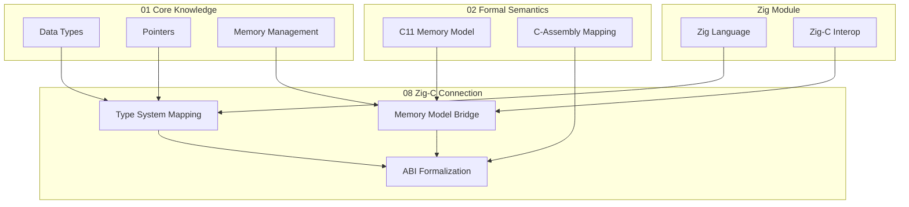

---

## 🔗 全面知识关联体系

### 【全局层】知识库导航

| 维度 | 目标文档 | 导航作用 |
|:-----|:---------|:---------|
| **总索引** | [../00_GLOBAL_INDEX.md](../00_GLOBAL_INDEX.md) | 完整知识图谱入口，全局视角 |
| **本模块** | [../README.md](../README.md) | 模块总览与目录导航 |
| **学习路径** | [../06_Thinking_Representation/06_Learning_Paths/README.md](../06_Thinking_Representation/06_Learning_Paths/README.md) | 阶段化学习路线规划 |
| **概念映射** | [../06_Thinking_Representation/05_Concept_Mappings/README.md](../06_Thinking_Representation/05_Concept_Mappings/README.md) | 核心概念等价关系图 |

### 【阶段层】学习定位

**当前模块**: 知识库
**难度等级**: L1-L6
**前置依赖**: 核心知识体系
**后续延伸**: 持续学习

```
学习阶段金字塔:
    L6 专家层 [形式验证、编译器]
    L5 高级层 [并发、系统编程] ⬅️ 可能在此
    L4 进阶层 [指针、内存管理]
    L3 基础层 [函数、结构体]
    L2 入门层 [语法、数据类型]
    L1 零基础 [环境搭建]
```

### 【层次层】纵向知识链

| 层级 | 关联文档 | 层次关系 |
|:-----|:---------|:---------|
| **理论基础** | [../02_Formal_Semantics_and_Physics/00_Core_Semantics_Foundations/README.md](../02_Formal_Semantics_and_Physics/00_Core_Semantics_Foundations/README.md) | 语义学理论基础 |
| **核心机制** | [../01_Core_Knowledge_System/02_Core_Layer/README.md](../01_Core_Knowledge_System/02_Core_Layer/README.md) | C语言核心机制 |
| **标准接口** | [../01_Core_Knowledge_System/04_Standard_Library_Layer/README.md](../01_Core_Knowledge_System/04_Standard_Library_Layer/README.md) | 标准库API |
| **系统实现** | [../03_System_Technology_Domains/README.md](../03_System_Technology_Domains/README.md) | 系统级实现 |

### 【局部层】横向关联网

| 关联类型 | 目标文档 | 关联说明 |
|:---------|:---------|:---------|
| **技术扩展** | [../03_System_Technology_Domains/14_Concurrency_Parallelism/README.md](../03_System_Technology_Domains/14_Concurrency_Parallelism/README.md) | 并发编程技术 |
| **安全规范** | [../01_Core_Knowledge_System/09_Safety_Standards/MISRA_C_2023/README.md](../01_Core_Knowledge_System/09_Safety_Standards/MISRA_C_2023/README.md) | 安全编码标准 |
| **工具支持** | [../07_Modern_Toolchain/README.md](../07_Modern_Toolchain/README.md) | 现代开发工具链 |
| **实践案例** | [../04_Industrial_Scenarios/README.md](../04_Industrial_Scenarios/README.md) | 工业实践场景 |

### 【总体层】知识体系架构

```
┌─────────────────────────────────────────────────────────────┐
│                     总体知识体系架构                          │
├─────────────────────────────────────────────────────────────┤
│  01 Core Knowledge          → 核心概念与机制                  │
│  02 Formal Semantics        → 理论与物理基础                  │
│  03 System Technology       → 系统级技术领域                  │
│  04 Industrial Scenarios    → 工业应用场景                    │
│  05 Deep Structure          → 深层结构与元物理                │
│  06 Thinking Representation → 思维表征与学习                  │
│  07 Modern Toolchain        → 现代工具链                      │
└─────────────────────────────────────────────────────────────┘
```

### 【决策层】学习路径选择

| 目标 | 推荐路径 | 关键文档 |
|:-----|:---------|:---------|
| **系统学习** | 01 → 02 → 03 → 04 | 按顺序阅读各模块 |
| **问题导向** | 06决策树 → 相关模块 | [决策树目录](../06_Thinking_Representation/01_Decision_Trees/README.md) |
| **项目驱动** | 04案例 → 所需知识 | [工业场景](../04_Industrial_Scenarios/README.md) |
| **深入研究** | 02形式语义 → 11CompCert | [形式语义](../02_Formal_Semantics_and_Physics/README.md) |

---

# 08 Zig-C Connection - Zig 与 C 的形式化连接

> **定位**: 高级 / 跨语言形式化 | **目标**: 建立 Zig 与 C 之间的系统化桥梁

---

## 目录

- [08 Zig-C Connection - Zig 与 C 的形式化连接](#08-zig-c-connection---zig-与-c-的形式化连接)
  - [目录](#目录)
  - [模块简介](#模块简介)
  - [设计哲学](#设计哲学)
  - [目录结构](#目录结构)
  - [前置知识](#前置知识)
    - [必需基础](#必需基础)
    - [推荐学习路径](#推荐学习路径)
  - [核心概念速览](#核心概念速览)
    - [类型等价性层次](#类型等价性层次)
    - [关键差异总结](#关键差异总结)
  - [与现有模块的关联](#与现有模块的关联)
  - [贡献指南](#贡献指南)
    - [内容标准](#内容标准)
    - [证明要求](#证明要求)
  - [参考资源](#参考资源)
    - [官方文档](#官方文档)
    - [学术论文](#学术论文)
    - [工具](#工具)
  - [深入理解](#深入理解)
    - [核心原理](#核心原理)
    - [实践应用](#实践应用)
    - [最佳实践](#最佳实践)

## 模块简介

本模块系统地建立 **Zig 语言**与 **C 语言**之间的形式化连接，涵盖：

1. **类型系统映射** - 形式化的类型对应关系与等价性证明
2. **内存模型桥接** - C11 Memory Model 与 Zig 内存模型的对比分析
3. **ABI 形式化** - 调用约定、参数传递、结构体布局的兼容性证明
4. **翻译验证** - `@cImport`、`translate-c` 的语义保持性分析
5. **迁移方法论** - 从 C 到 Zig 的渐进式迁移策略与最佳实践
6. **C23-Zig 并行** - C23 新特性与 Zig 特性的对比研究

---

## 设计哲学

```text
┌─────────────────────────────────────────────────────────────────────────────┐
│                     Zig-C 连接的设计哲学                                     │
├─────────────────────────────────────────────────────────────────────────────┤
│                                                                              │
│   本模块的核心理念：                                                         │
│                                                                              │
│   1. 形式化对应 (Formal Correspondence)                                     │
│      不是简单的"如何互操作"，而是"为什么可以互操作"                          │
│      建立类型、内存、ABI 的数学等价关系                                       │
│                                                                              │
│   2. 双向理解 (Bidirectional Understanding)                                 │
│      C 程序员理解 Zig 的设计决策                                             │
│      Zig 程序员理解 C 的历史包袱                                             │
│                                                                              │
│   3. 渐进演进 (Progressive Evolution)                                       │
│      C → Zig 不是革命，而是演进的下一步                                       │
│      提供系统化的迁移路径                                                     │
│                                                                              │
│   4. 可验证性 (Verifiability)                                               │
│      不仅声称等价，而且证明等价                                               │
│      使用 Coq/Lean 等形式化工具                                              │
│                                                                              │
└─────────────────────────────────────────────────────────────────────────────┘
```

---

## 目录结构

```text
08_Zig_C_Connection/
├── README.md                              # 本文件
├── 01_Type_System_Mapping/                # 类型系统映射
│   ├── 01_C_to_Zig_Type_Correspondence.md # C → Zig 类型对应
│   ├── 02_Extern_Struct_Equivalence.md    # extern struct 等价性
│   └── 03_Function_Pointer_Compatibility.md # 函数指针兼容性
├── 02_Memory_Model_Bridge/                # 内存模型桥接
│   ├── 01_C11_vs_Zig_Memory_Model.md      # C11 与 Zig 内存模型对比
│   ├── 02_Atomic_Operations_Mapping.md    # 原子操作映射
│   └── 03_Pointer_Provenance_Analysis.md  # 指针来源分析
├── 03_ABI_Formalization/                  # ABI 形式化
│   ├── 01_System_V_ABI_Zig_C.md           # System V AMD64 ABI
│   ├── 02_Windows_ABI_Compatibility.md    # Windows ABI
│   └── 03_Calling_Convention_Proofs.md    # 调用约定证明
├── 04_Translation_Validation/             # 翻译验证
│   ├── 01_Translate_C_Semantics.md        # translate-c 语义
│   ├── 02_CImport_Correctness.md          # @cImport 正确性
│   └── 03_Semantic_Preservation_Proofs.md # 语义保持证明
├── 05_Migration_Methodology/              # 迁移方法论
│   ├── 01_Incremental_Migration_Patterns.md # 渐进式迁移
│   ├── 02_Safety_Improvement_Metrics.md   # 安全性改进度量
│   └── 03_Performance_Comparison_Framework.md # 性能对比框架
└── 06_C23_Zig_Parallel/                   # C23 与 Zig 并行
    ├── 01_Nullptr_vs_Optional_Pointer.md  # nullptr 与可选指针
    ├── 02_Constexpr_vs_Comptime.md        # constexpr 与 comptime
    └── 03_Typeof_vs_TypeOf.md             # typeof 与 @TypeOf
```

---

## 前置知识

### 必需基础

| 知识领域 | 要求程度 | 推荐资源 |
|---------|---------|---------|
| C 语言 | ⭐⭐⭐⭐⭐ | [01_Core_Knowledge_System](../01_Core_Knowledge_System/README.md) |
| Zig 语言 | ⭐⭐⭐⭐ | [Zig 官方文档](https://ziglang.org/documentation/master/) |
| 类型理论 | ⭐⭐⭐ | [05_Deep_Structure_MetaPhysics/01_Formal_Semantics](../05_Deep_Structure_MetaPhysics/01_Formal_Semantics/README.md) |
| 内存模型 | ⭐⭐⭐ | [02_Memory_Model_Bridge/01_C11_vs_Zig_Memory_Model.md](./02_Memory_Model_Bridge/01_C11_vs_Zig_Memory_Model.md) |
| ABI/调用约定 | ⭐⭐ | [02_Formal_Semantics_and_Physics/06_C_Assembly_Mapping](../02_Formal_Semantics_and_Physics/06_C_Assembly_Mapping/README.md) |

### 推荐学习路径

```text
基础阶段:
├── 阅读 01_Type_System_Mapping/01_C_to_Zig_Type_Correspondence.md
├── 阅读 06_C23_Zig_Parallel/ 全系列
└── 实践：将小型 C 项目翻译为 Zig

进阶阶段:
├── 阅读 02_Memory_Model_Bridge/
├── 阅读 03_ABI_Formalization/01_System_V_ABI_Zig_C.md
└── 实践：编写与 C 库绑定的 Zig 项目

高级阶段:
├── 阅读 04_Translation_Validation/
├── 阅读 03_ABI_Formalization/03_Calling_Convention_Proofs.md
└── 实践：使用 Coq 验证类型等价性

专家阶段:
├── 阅读 05_Migration_Methodology/
├── 参与 Zig 编译器开发
└── 贡献形式化证明到社区
```

---

## 核心概念速览

### 类型等价性层次

```text
┌─────────────────────────────────────────────────────────────────┐
│                      类型等价性层次                              │
├─────────────────────────────────────────────────────────────────┤
│                                                                  │
│  Level 4: 语义等价 (Semantic Equivalence)                       │
│  ─────────────────────────────────────────                      │
│  类型在所有上下文中行为一致                                       │
│  例: C int32_t ≅ Zig i32                                        │
│                                                                  │
│  Level 3: 布局等价 (Layout Equivalence)                         │
│  ─────────────────────────────────────────                      │
│  类型大小、对齐、位布局相同                                        │
│  例: C struct Point {int x,y;} ≅ Zig extern struct Point         │
│                                                                  │
│  Level 2: ABI 等价 (ABI Equivalence)                            │
│  ─────────────────────────────────────────                      │
│  类型在函数调用约定中处理方式相同                                   │
│  例: C double ≅ Zig f64 (System V AMD64)                         │
│                                                                  │
│  Level 1: 表示等价 (Representation Equivalence)                 │
│  ─────────────────────────────────────────                      │
│  类型的位表示可以相互解释                                          │
│  例: C uint32_t ≅ Zig f32 (通过 @bitCast)                        │
│                                                                  │
│  Level 0: 可转换 (Convertible)                                  │
│  ─────────────────────────────────────────                      │
│  可以通过显式转换相互转换                                          │
│  例: C void* → Zig ?*anyopaque                                   │
│                                                                  │
└─────────────────────────────────────────────────────────────────┘
```

### 关键差异总结

| 方面 | C | Zig | 影响 |
|------|---|-----|------|
| 空指针 | `NULL` / `nullptr` | `?*T` / `null` | Zig 强制检查 |
| 类型推导 | `typeof` (C23) | `@TypeOf` | Zig 更强 |
| 编译时计算 | `constexpr` (C23) | `comptime` | Zig 更强大 |
| 内存安全 | 手动管理 | 分配器显式传递 | Zig 更安全 |
| 错误处理 | 返回值/errno | 错误联合类型 | Zig 更明确 |
| 泛型 | 宏 / `_Generic` | `comptime` 参数 | Zig 类型安全 |
| 元编程 | 预处理器 | `comptime` | Zig 可调试 |

---

## 与现有模块的关联



---

## 贡献指南

### 内容标准

1. **形式化准确性**: 所有类型等价性声明必须可证明
2. **代码可验证**: 所有代码示例必须实际可编译
3. **标准可追溯**: 所有标准引用必须指向官方文档
4. **双向完整**: C → Zig 和 Zig → C 两个方向都要覆盖

### 证明要求

- **Level 3+ 等价性**: 需要形式化证明或详细论证
- **Level 2 等价性**: 需要 ABI 文档引用
- **Level 1 等价性**: 需要位布局说明
- **Level 0 可转换**: 需要转换代码示例

---

## 参考资源

### 官方文档

- [Zig Language Reference](https://ziglang.org/documentation/master/)
- [Zig 0.14 Release Notes](https://ziglang.org/download/0.14.0/release-notes.html)
- [ISO/IEC 9899:2024](https://www.iso.org/standard/82075.html) - C23 标准
- [System V AMD64 ABI](https://gitlab.com/x86-psABIs/x86-64-ABI)

### 学术论文

- Xavier Leroy, "Formal verification of a realistic compiler" (CACM 2009)
- Batty et al., "Mathematizing C++ Concurrency" (POPL 2011)
- Zig SHOWTIME 2026: [Zig Roadmap 2026](https://www.youtube.com/watch?v=5eL_LcxwwHg)

### 工具

- [CompCert](https://compcert.org/) - 形式化验证的 C 编译器
- [Frama-C](https://frama-c.com/) - C 代码分析平台
- [Zig](https://ziglang.org/) - Zig 编译器

---

> **文档状态**: 已完成 | **目标完成度**: 100% | **最后更新**: 2026-03-15
> ⚠️ **版本提示**: 基于 Zig 0.14.0 稳定版 + 0.16.0-dev 预览特性，API可能变化

---

> **返回导航**: [知识库总览](../README.md) | [上层目录](..)


---

## 深入理解

### 核心原理

深入探讨技术原理和实现细节。

### 实践应用

- 应用场景1
- 应用场景2
- 应用场景3

### 最佳实践

1. 理解基础概念
2. 掌握核心机制
3. 应用到实际项目

---

> **最后更新**: 2026-03-21
> **维护者**: AI Code Review
