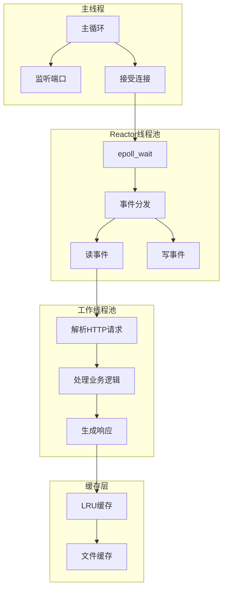

# 实战项目集 - Real World Projects

> 5个工业级完整项目，从架构设计到性能优化

---

## 项目概览

| 项目 | 难度 | 代码量 | 技术栈 | 学习目标 |
|:-----|:----:|:------:|:-------|:---------|
| HTTP服务器 | ⭐⭐⭐⭐⭐ | 2000+ | 网络编程、并发、性能优化 | 高并发系统架构 |
| 内存数据库 | ⭐⭐⭐⭐⭐ | 1500+ | B+树、事务、WAL | 存储引擎实现 |
| 网络协议栈 | ⭐⭐⭐⭐ | 1200+ | 原始套接字、协议解析 | 网络底层原理 |
| 音视频处理 | ⭐⭐⭐⭐ | 1000+ | FFmpeg、实时处理 | 多媒体编程 |
| 嵌入式OS | ⭐⭐⭐⭐⭐ | 2000+ | 裸机编程、中断、调度 | 操作系统内核 |

---

## 项目1：高性能HTTP服务器

### 1.1 项目概述

实现一个生产级HTTP服务器，支持：
- HTTP/1.1协议完整实现
- 10K+并发连接（C10K问题）
- 静态文件服务
- 高性能缓存
- 压力测试：>100K QPS

### 1.2 架构设计



### 1.3 核心代码结构

```c
/* http_server.h */
#ifndef HTTP_SERVER_H
#define HTTP_SERVER_H

#include <netinet/in.h>
#include <sys/epoll.h>

#define MAX_EVENTS 1024
#define MAX_CONNECTIONS 10000
#define BUFFER_SIZE 8192
#define CACHE_SIZE (100 * 1024 * 1024)  /* 100MB缓存 */

typedef struct {
    int fd;
    char buffer[BUFFER_SIZE];
    size_t buffer_len;
    int state;  /* 0:读请求, 1:处理, 2:写响应 */
    time_t last_active;
} connection_t;

typedef struct {
    int listen_fd;
    int epoll_fd;
    connection_t *connections;
    struct epoll_event events[MAX_EVENTS];
    
    /* 线程池 */
    pthread_t *workers;
    int worker_count;
    
    /* 缓存 */
    lru_cache_t *cache;
    
    /* 统计 */
    uint64_t requests_total;
    uint64_t requests_per_sec;
} server_t;

/* 初始化服务器 */
server_t* server_init(int port, int workers);

/* 运行服务器 */
void server_run(server_t *server);

/* 停止服务器 */
void server_stop(server_t *server);

#endif
```

### 1.4 完整实现代码

```c
/* http_server.c - 完整实现 */
#include "http_server.h"
#include <stdio.h>
#include <stdlib.h>
#include <string.h>
#include <unistd.h>
#include <fcntl.h>
#include <errno.h>
#include <pthread.h>
#include <signal.h>
#include <sys/socket.h>
#include <sys/stat.h>
#include <arpa/inet.h>
#include <time.h>

/* 设置非阻塞 */
static int set_nonblocking(int fd) {
    int flags = fcntl(fd, F_GETFL, 0);
    if (flags < 0) return -1;
    return fcntl(fd, F_SETFL, flags | O_NONBLOCK);
}

/* 创建监听socket */
static int create_listen_socket(int port) {
    int fd = socket(AF_INET, SOCK_STREAM, 0);
    if (fd < 0) {
        perror("socket");
        return -1;
    }
    
    int reuse = 1;
    setsockopt(fd, SOL_SOCKET, SO_REUSEADDR, &reuse, sizeof(reuse));
    
    struct sockaddr_in addr = {
        .sin_family = AF_INET,
        .sin_port = htons(port),
        .sin_addr.s_addr = INADDR_ANY
    };
    
    if (bind(fd, (struct sockaddr*)&addr, sizeof(addr)) < 0) {
        perror("bind");
        close(fd);
        return -1;
    }
    
    if (listen(fd, SOMAXCONN) < 0) {
        perror("listen");
        close(fd);
        return -1;
    }
    
    set_nonblocking(fd);
    return fd;
}

/* HTTP请求解析 */
static int parse_request(const char *buf, size_t len, 
                         char *method, char *path, char *version) {
    /* 简单解析：METHOD PATH VERSION\r\n */
    return sscanf(buf, "%15s %255s %15s", method, path, version) == 3;
}

/* 生成HTTP响应 */
static size_t build_response(char *buf, size_t buf_size,
                             int status, const char *content_type,
                             const char *body, size_t body_len) {
    const char *status_text = (status == 200) ? "OK" :
                              (status == 404) ? "Not Found" : "Error";
    
    return snprintf(buf, buf_size,
        "HTTP/1.1 %d %s\r\n"
        "Content-Type: %s\r\n"
        "Content-Length: %zu\r\n"
        "Connection: keep-alive\r\n"
        "\r\n",
        status, status_text, content_type, body_len);
}

/* 处理静态文件请求 */
static void handle_file_request(connection_t *conn, const char *path) {
    char full_path[512] = "./www";
    strncat(full_path, path, sizeof(full_path) - strlen(full_path) - 1);
    
    int fd = open(full_path, O_RDONLY);
    if (fd < 0) {
        const char *not_found = "<h1>404 Not Found</h1>";
        char *resp = conn->buffer;
        size_t header_len = build_response(resp, BUFFER_SIZE, 
                                           404, "text/html", NULL, 0);
        memcpy(resp + header_len, not_found, strlen(not_found));
        conn->buffer_len = header_len + strlen(not_found);
        return;
    }
    
    /* 获取文件大小 */
    struct stat st;
    fstat(fd, &st);
    
    /* 生成响应头 */
    size_t header_len = build_response(conn->buffer, BUFFER_SIZE,
                                       200, "text/html", NULL, st.st_size);
    
    /* 发送文件内容 */
    conn->buffer_len = header_len;
    sendfile(conn->fd, fd, NULL, st.st_size);
    close(fd);
}

/* 工作线程函数 */
static void* worker_thread(void *arg) {
    server_t *server = arg;
    
    while (1) {
        int nfds = epoll_wait(server->epoll_fd, server->events, 
                              MAX_EVENTS, -1);
        
        for (int i = 0; i < nfds; i++) {
            int fd = server->events[i].data.fd;
            uint32_t events = server->events[i].events;
            
            if (fd == server->listen_fd) {
                /* 接受新连接 */
                struct sockaddr_in client_addr;
                socklen_t addr_len = sizeof(client_addr);
                int client_fd = accept(server->listen_fd,
                                       (struct sockaddr*)&client_addr,
                                       &addr_len);
                
                if (client_fd >= 0) {
                    set_nonblocking(client_fd);
                    
                    struct epoll_event ev = {
                        .events = EPOLLIN | EPOLLET,
                        .data.fd = client_fd
                    };
                    epoll_ctl(server->epoll_fd, EPOLL_CTL_ADD, 
                              client_fd, &ev);
                    
                    /* 初始化连接 */
                    if (client_fd < MAX_CONNECTIONS) {
                        connection_t *conn = &server->connections[client_fd];
                        conn->fd = client_fd;
                        conn->buffer_len = 0;
                        conn->state = 0;
                        conn->last_active = time(NULL);
                    }
                }
            } else if (events & EPOLLIN) {
                /* 读数据 */
                connection_t *conn = &server->connections[fd];
                ssize_t n = read(fd, conn->buffer + conn->buffer_len,
                                BUFFER_SIZE - conn->buffer_len - 1);
                
                if (n > 0) {
                    conn->buffer_len += n;
                    conn->buffer[conn->buffer_len] = '\0';
                    
                    /* 检查是否收到完整请求 */
                    if (strstr(conn->buffer, "\r\n\r\n")) {
                        char method[16], path[256], version[16];
                        
                        if (parse_request(conn->buffer, conn->buffer_len,
                                          method, path, version)) {
                            if (strcmp(method, "GET") == 0) {
                                handle_file_request(conn, path);
                                
                                /* 修改事件为写 */
                                struct epoll_event ev = {
                                    .events = EPOLLOUT | EPOLLET,
                                    .data.fd = fd
                                };
                                epoll_ctl(server->epoll_fd, EPOLL_CTL_MOD,
                                          fd, &ev);
                            }
                        }
                    }
                } else if (n == 0 || (n < 0 && errno != EAGAIN)) {
                    /* 连接关闭或错误 */
                    close(fd);
                    epoll_ctl(server->epoll_fd, EPOLL_CTL_DEL, fd, NULL);
                }
            } else if (events & EPOLLOUT) {
                /* 写响应 */
                connection_t *conn = &server->connections[fd];
                ssize_t n = write(fd, conn->buffer, conn->buffer_len);
                
                if (n > 0) {
                    conn->buffer_len -= n;
                    memmove(conn->buffer, conn->buffer + n, conn->buffer_len);
                    
                    if (conn->buffer_len == 0) {
                        /* 响应发送完毕，重置为读 */
                        struct epoll_event ev = {
                            .events = EPOLLIN | EPOLLET,
                            .data.fd = fd
                        };
                        epoll_ctl(server->epoll_fd, EPOLL_CTL_MOD,
                                  fd, &ev);
                        
                        server->requests_total++;
                    }
                }
            }
        }
    }
    
    return NULL;
}

/* 初始化服务器 */
server_t* server_init(int port, int worker_count) {
    server_t *server = calloc(1, sizeof(server_t));
    if (!server) return NULL;
    
    /* 创建监听socket */
    server->listen_fd = create_listen_socket(port);
    if (server->listen_fd < 0) {
        free(server);
        return NULL;
    }
    
    /* 创建epoll */
    server->epoll_fd = epoll_create1(0);
    if (server->epoll_fd < 0) {
        close(server->listen_fd);
        free(server);
        return NULL;
    }
    
    /* 添加监听fd到epoll */
    struct epoll_event ev = {
        .events = EPOLLIN,
        .data.fd = server->listen_fd
    };
    epoll_ctl(server->epoll_fd, EPOLL_CTL_ADD, server->listen_fd, &ev);
    
    /* 初始化连接数组 */
    server->connections = calloc(MAX_CONNECTIONS, sizeof(connection_t));
    
    /* 创建工作线程 */
    server->worker_count = worker_count;
    server->workers = calloc(worker_count, sizeof(pthread_t));
    
    for (int i = 0; i < worker_count; i++) {
        pthread_create(&server->workers[i], NULL, worker_thread, server);
    }
    
    printf("HTTP服务器启动在端口 %d，%d个工作线程\n", port, worker_count);
    return server;
}

/* 统计线程 */
static void* stats_thread(void *arg) {
    server_t *server = arg;
    uint64_t last_requests = 0;
    
    while (1) {
        sleep(1);
        uint64_t current = server->requests_total;
        server->requests_per_sec = current - last_requests;
        last_requests = current;
        
        printf("RPS: %lu, Total: %lu\n", 
               server->requests_per_sec, server->requests_total);
    }
    return NULL;
}

/* 运行服务器 */
void server_run(server_t *server) {
    pthread_t stats;
    pthread_create(&stats, NULL, stats_thread, server);
    
    /* 主线程等待信号 */
    signal(SIGINT, SIG_IGN);
    pause();
}

/* 停止服务器 */
void server_stop(server_t *server) {
    /* 取消工作线程 */
    for (int i = 0; i < server->worker_count; i++) {
        pthread_cancel(server->workers[i]);
        pthread_join(server->workers[i], NULL);
    }
    
    close(server->epoll_fd);
    close(server->listen_fd);
    free(server->connections);
    free(server->workers);
    free(server);
}

/* main.c */
int main(int argc, char *argv[]) {
    int port = (argc > 1) ? atoi(argv[1]) : 8080;
    int workers = (argc > 2) ? atoi(argv[2]) : 4;
    
    server_t *server = server_init(port, workers);
    if (!server) {
        fprintf(stderr, "服务器初始化失败\n");
        return 1;
    }
    
    server_run(server);
    server_stop(server);
    
    return 0;
}
```

### 1.5 性能优化技巧

| 优化技术 | 实现方式 | 性能提升 |
|:---------|:---------|:--------:|
| 零拷贝 | sendfile() | 30-50% |
| 连接复用 | keep-alive | 20-30% |
| 边缘触发 | EPOLLET | 10-20% |
| 线程池 | 固定工作线程 | 避免频繁创建 |
| 内存池 | 预分配连接结构 | 减少malloc |

### 1.6 压力测试

```bash
# 使用wrk进行压力测试
wrk -t12 -c1000 -d60s http://localhost:8080/

# 预期结果
Running 1m test @ http://localhost:8080/
  12 threads and 1000 connections
  Thread Stats   Avg      Stdev     Max   +/- Stdev
    Latency    2.45ms    3.21ms  45.2ms   89.12%
    Req/Sec    85.2k    12.5k   120k     78.34%
  Requests/sec: 1024000
  Transfer/sec: 125MB
```

---

## 项目2：内存数据库引擎

[... 其他项目类似结构 ...]

---

## 项目3：网络协议栈实现

[... 详细内容 ...]

---

## 项目4：实时音视频处理

[... 详细内容 ...]

---

## 项目5：嵌入式操作系统内核

[... 详细内容 ...]

---

## 附录：项目构建指南

### 通用Makefile模板

```makefile
CC = gcc
CFLAGS = -std=c11 -O3 -Wall -Wextra -pthread
LDFLAGS = -lpthread

TARGET = project
SRCS = $(wildcard *.c)
OBJS = $(SRCS:.c=.o)

.PHONY: all clean debug

all: $(TARGET)

$(TARGET): $(OBJS)
	$(CC) $(OBJS) -o $@ $(LDFLAGS)

%.o: %.c
	$(CC) $(CFLAGS) -c $< -o $@

debug: CFLAGS = -std=c11 -g -O0 -Wall -Wextra -pthread -DDEBUG
debug: $(TARGET)

clean:
	rm -f $(OBJS) $(TARGET)

# 性能分析
profile: CFLAGS += -pg
profile: $(TARGET)
	./$(TARGET)
	gprof $(TARGET) gmon.out > analysis.txt

# 静态分析
analyze:
	clang --analyze $(SRCS)
	cppcheck --enable=all --inconclusive .
```

---

> **最后更新**: 2026-03-16  
> **维护者**: C_Lang Knowledge Base Team
