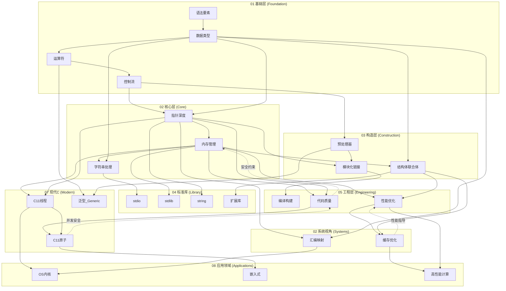
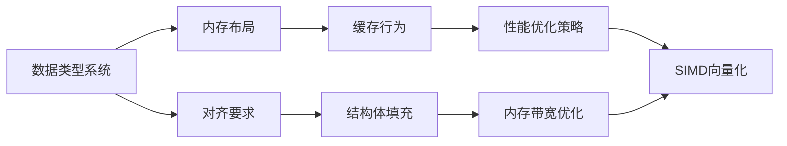
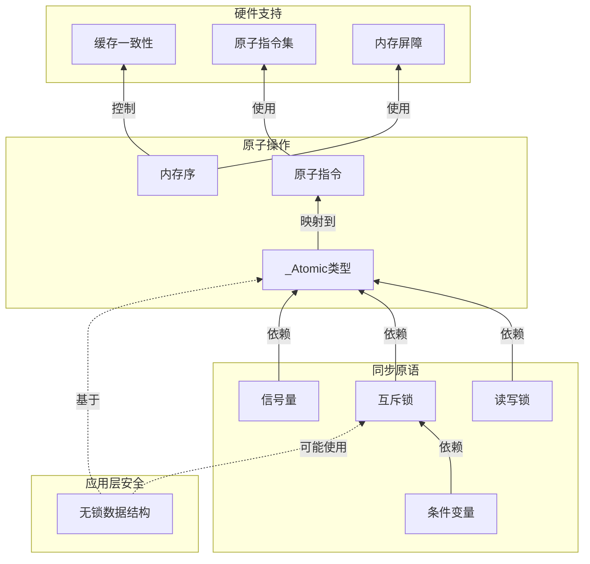
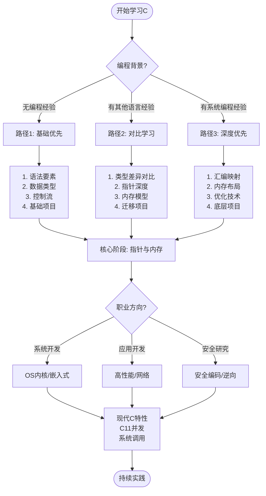

---

## 🔗 全面知识关联体系

### 【全局层】知识库导航

| 维度 | 目标文档 | 导航作用 |
|:-----|:---------|:---------|
| **总索引** | [./00_GLOBAL_INDEX.md](./00_GLOBAL_INDEX.md) | 完整知识图谱入口，全局视角 |
| **本模块** | [./readme.md](./readme.md) | 模块总览与目录导航 |
| **学习路径** | [./06_Thinking_Representation/06_Learning_Paths/readme.md](./06_Thinking_Representation/06_Learning_Paths/readme.md) | 阶段化学习路线规划 |
| **概念映射** | [./06_Thinking_Representation/05_Concept_Mappings/readme.md](./06_Thinking_Representation/05_Concept_Mappings/readme.md) | 核心概念等价关系图 |

### 【阶段层】学习定位

**当前模块**: 知识库
**难度等级**: L1-L6
**前置依赖**: 核心知识体系
**后续延伸**: 持续学习

```
学习阶段金字塔:
    L6 专家层 [形式验证、编译器]
    L5 高级层 [并发、系统编程] ⬅️ 可能在此
    L4 进阶层 [指针、内存管理]
    L3 基础层 [函数、结构体]
    L2 入门层 [语法、数据类型]
    L1 零基础 [环境搭建]
```

### 【层次层】纵向知识链

| 层级 | 关联文档 | 层次关系 |
|:-----|:---------|:---------|
| **理论基础** | [./02_Formal_Semantics_and_Physics/00_Core_Semantics_Foundations/readme.md](./02_Formal_Semantics_and_Physics/00_Core_Semantics_Foundations/readme.md) | 语义学理论基础 |
| **核心机制** | [./01_Core_Knowledge_System/02_Core_Layer/readme.md](./01_Core_Knowledge_System/02_Core_Layer/readme.md) | C语言核心机制 |
| **标准接口** | [./01_Core_Knowledge_System/04_Standard_Library_Layer/readme.md](./01_Core_Knowledge_System/04_Standard_Library_Layer/readme.md) | 标准库API |
| **系统实现** | [./03_System_Technology_Domains/readme.md](./03_System_Technology_Domains/readme.md) | 系统级实现 |

### 【局部层】横向关联网

| 关联类型 | 目标文档 | 关联说明 |
|:---------|:---------|:---------|
| **技术扩展** | [./03_System_Technology_Domains/14_Concurrency_Parallelism/readme.md](./03_System_Technology_Domains/14_Concurrency_Parallelism/readme.md) | 并发编程技术 |
| **安全规范** | [./01_Core_Knowledge_System/09_Safety_Standards/MISRA_C_2023/readme.md](./01_Core_Knowledge_System/09_Safety_Standards/MISRA_C_2023/readme.md) | 安全编码标准 |
| **工具支持** | [./07_Modern_Toolchain/readme.md](./07_Modern_Toolchain/readme.md) | 现代开发工具链 |
| **实践案例** | [./04_Industrial_Scenarios/readme.md](./04_Industrial_Scenarios/readme.md) | 工业实践场景 |

### 【总体层】知识体系架构

```
┌─────────────────────────────────────────────────────────────┐
│                     总体知识体系架构                          │
├─────────────────────────────────────────────────────────────┤
│  01 Core Knowledge          → 核心概念与机制                  │
│  02 Formal Semantics        → 理论与物理基础                  │
│  03 System Technology       → 系统级技术领域                  │
│  04 Industrial Scenarios    → 工业应用场景                    │
│  05 Deep Structure          → 深层结构与元物理                │
│  06 Thinking Representation → 思维表征与学习                  │
│  07 Modern Toolchain        → 现代工具链                      │
└─────────────────────────────────────────────────────────────┘
```

### 【决策层】学习路径选择

| 目标 | 推荐路径 | 关键文档 |
|:-----|:---------|:---------|
| **系统学习** | 01 → 02 → 03 → 04 | 按顺序阅读各模块 |
| **问题导向** | 06决策树 → 相关模块 | [决策树目录](./06_Thinking_Representation/01_Decision_Trees/readme.md) |
| **项目驱动** | 04案例 → 所需知识 | [工业场景](./04_Industrial_Scenarios/readme.md) |
| **深入研究** | 02形式语义 → 11CompCert | [形式语义](./02_Formal_Semantics_and_Physics/readme.md) |

---

# C语言知识体系关联图谱

---

## 🔗 知识关联网络

### 1. 全局导航

| 层级 | 文档 | 作用 |
|:-----|:-----|:-----|
| 总索引 | [./00_GLOBAL_INDEX.md](./00_GLOBAL_INDEX.md) | 完整知识图谱入口 |
| 本模块 | [./readme.md](./readme.md) | 模块总览与导航 |
| 学习路径 | [./06_Thinking_Representation/06_Learning_Paths/readme.md](./06_Thinking_Representation/06_Learning_Paths/readme.md) | 推荐学习路线 |

### 2. 前置知识依赖

| 文档 | 关系 | 掌握要求 |
|:-----|:-----|:---------|
| [./01_Core_Knowledge_System/01_Basic_Layer/01_Syntax_Elements.md](./01_Core_Knowledge_System/01_Basic_Layer/01_Syntax_Elements.md) | 语言基础 | 必须掌握 |
| [./01_Core_Knowledge_System/02_Core_Layer/01_Pointer_Depth.md](./01_Core_Knowledge_System/02_Core_Layer/01_Pointer_Depth.md) | 核心机制 | 必须掌握 |
| [./01_Core_Knowledge_System/02_Core_Layer/02_Memory_Management.md](./01_Core_Knowledge_System/02_Core_Layer/02_Memory_Management.md) | 内存基础 | 必须掌握 |

### 3. 同层横向关联

| 文档 | 关系 | 互补内容 |
|:-----|:-----|:---------|
| [./03_System_Technology_Domains/14_Concurrency_Parallelism/readme.md](./03_System_Technology_Domains/14_Concurrency_Parallelism/readme.md) | 技术扩展 | 并发编程技术 |
| [./02_Formal_Semantics_and_Physics/readme.md](./02_Formal_Semantics_and_Physics/readme.md) | 理论支撑 | 形式化方法 |
| [./04_Industrial_Scenarios/readme.md](./04_Industrial_Scenarios/readme.md) | 实践应用 | 工业实践案例 |

### 4. 深层理论关联

| 文档 | 关系 | 理论深度 |
|:-----|:-----|:---------|
| [./02_Formal_Semantics_and_Physics/00_Core_Semantics_Foundations/readme.md](./02_Formal_Semantics_and_Physics/00_Core_Semantics_Foundations/readme.md) | 语义基础 | 操作语义、类型理论 |
| [./06_Thinking_Representation/05_Concept_Mappings/readme.md](./06_Thinking_Representation/05_Concept_Mappings/readme.md) | 概念映射 | 知识关联网络 |

### 5. 后续进阶延伸

| 文档 | 关系 | 进阶方向 |
|:-----|:-----|:---------|
| [./03_System_Technology_Domains/readme.md](./03_System_Technology_Domains/readme.md) | 系统技术 | 系统级开发 |
| [./01_Core_Knowledge_System/09_Safety_Standards/readme.md](./01_Core_Knowledge_System/09_Safety_Standards/readme.md) | 安全标准 | 安全编码规范 |
| [./07_Modern_Toolchain/readme.md](./07_Modern_Toolchain/readme.md) | 工具链 | 现代开发工具 |

### 6. 阶段学习定位

```
当前位置: 根据文档主题确定学习阶段
├─ 入门阶段: 基础语法、数据类型
├─ 基础阶段: 控制流程、函数
├─ 进阶阶段: 指针、内存管理 ⬅️ 可能在此
├─ 高级阶段: 并发、系统编程
└─ 专家阶段: 形式验证、编译器
```

### 7. 局部索引

本文件所属模块的详细内容：

- 参见本模块 [readme.md](./readme.md)
- 相关子目录文档


> **文档定位**: 全局知识关联与依赖关系映射
> **用途**: 展示主题间的联系、依赖、演进路径
> **更新**: 2025-03-09

---

## 一、知识关联总图



---

## 二、知识依赖关系矩阵

### 2.1 横向依赖矩阵（前置知识）

| 主题 | 直接依赖 | 间接依赖 | 并发学习 |
|:-----|:---------|:---------|:---------|
| **指针深度** | 数据类型、运算符 | 语法要素 | 控制流 |
| **内存管理** | 指针深度、数据类型 | 运算符、语法 | 结构体 |
| **字符串处理** | 指针深度、内存管理 | 数据类型 | 标准库I/O |
| **预处理器** | 控制流 | 语法要素 | 模块化 |
| **模块化链接** | 预处理器、指针深度 | 内存管理 | 编译构建 |
| **C11线程** | 内存管理、指针深度 | 数据类型 | 操作系统 |
| **性能优化** | 内存管理、缓存 | 指针深度 | 编译器 |

### 2.2 纵向深化路径

```
Level 1: 语法基础
    ↓ 应用
Level 2: 类型与运算
    ↓ 抽象
Level 3: 指针与内存
    ↓ 组织
Level 4: 结构与设计
    ↓ 协作
Level 5: 并发与系统
    ↓ 优化
Level 6: 性能与工程
```

---

## 三、主题间论证联系

### 3.1 指针 ↔ 内存管理 双向论证

```
指针深度 ──────────────────────► 内存管理
    │                                 ▲
    │ 论证：                          │
    │ 1. 指针是内存地址的抽象表示     │
    │ 2. 理解指针才能理解堆栈区别     │
    │ 3. 指针运算涉及内存对齐         │
    │                                 │
    ▼                                 │
为什么需要malloc/free？              │
- 指针可以指向栈（自动变量）         │
- 指针可以指向堆（动态分配）         │
- 区分生命周期需要理解内存布局 ──────┘
```

### 3.2 数据类型 → 性能优化 因果链



### 3.3 预处理器 ↔ 泛型编程 演进关系

| 阶段 | 技术 | 局限 | 演进 |
|:-----|:-----|:-----|:-----|
| C89 | 宏泛型 | 类型不安全、调试困难 | 需要更好方案 |
| C99 | tgmath.h | 仅限数学函数 | 通用化需求 |
| C11 | _Generic | 类型安全、可调试 | 现代泛型 |
| C23 | typeof + auto | 推导更智能 | 进一步简化 |

---

## 四、多维概念对比网络

### 4.1 内存管理策略对比网络

```
                    栈分配
                   /       \
                 /          \
              快速           自动释放
              /                \
            /                   \
    大小固定                    生命周期限制
        |                           |
        |                           |
    小对象 ◄─────────────────────► 大对象
        |                           |
        |                           |
    函数局部                    动态需求
        |                           |
        ▼                           ▼
    栈溢出风险                  堆分配
                                    |
                                    |
                    ┌───────────────┼───────────────┐
                    |               |               |
                   malloc         内存池          自定义
                    |               |               |
                 通用性强        性能优化        特殊需求
                    |               |               |
                 碎片问题        预分配策略      嵌入式
                    |               |               |
                    └───────────────┴───────────────┘
                                    |
                                    ▼
                              内存管理综合策略
```

### 4.2 并发安全层次依赖图



---

## 五、学习路径决策图



---

## 六、主题覆盖矩阵

### 6.1 应用场景 × 知识主题 覆盖矩阵

| 应用场景 | 指针 | 内存 | 并发 | 网络 | 安全 | 优化 |
|:---------|:----:|:----:|:----:|:----:|:----:|:----:|
| **OS内核** | ⭐⭐⭐ | ⭐⭐⭐ | ⭐⭐⭐ | ⭐⭐ | ⭐⭐⭐ | ⭐⭐ |
| **嵌入式** | ⭐⭐⭐ | ⭐⭐⭐ | ⭐⭐ | ⭐ | ⭐⭐⭐ | ⭐⭐⭐ |
| **高频交易** | ⭐⭐ | ⭐⭐ | ⭐⭐⭐ | ⭐⭐⭐ | ⭐⭐ | ⭐⭐⭐ |
| **数据库** | ⭐⭐⭐ | ⭐⭐⭐ | ⭐⭐⭐ | ⭐ | ⭐⭐ | ⭐⭐⭐ |
| **游戏引擎** | ⭐⭐⭐ | ⭐⭐⭐ | ⭐⭐ | ⭐ | ⭐ | ⭐⭐⭐ |
| **安全工具** | ⭐⭐⭐ | ⭐⭐⭐ | ⭐ | ⭐ | ⭐⭐⭐ | ⭐ |

### 6.2 标准版本 × 特性 演进矩阵

| 特性类别 | C89 | C99 | C11 | C17 | C23 |
|:---------|:---:|:---:|:---:|:---:|:---:|
| **基础语法** | ✅ | ✅ | ✅ | ✅ | ✅ |
| **标准库** | 基础 | VLA/复数 | 线程/原子 | 修复 | 现代特性 |
| **类型安全** | ❌ | ❌ | _Generic | ❌ | nullptr/typeof |
| **并发支持** | ❌ | ❌ | 内置 | ❌ | 优化 |
| **泛型编程** | 宏 | tgmath | _Generic | ❌ | typeof/auto |
| **属性系统** | ❌ | ❌ | [[ ]] | ❌ | [ ] |

---

## 七、知识盲区检查清单

### 7.1 常见学习断层

- [ ] **指针与数组关系不清** → 需要加强指针深度文档学习
- [ ] **sizeof与strlen混淆** → 查看字符串处理安全章节
- [ ] **宏副作用问题** → 预处理器最佳实践
- [ ] **整数溢出忽视** → 数据类型系统+UB文档
- [ ] **并发数据竞争** → C11内存模型+原子操作
- [ ] **缓存不友好代码** → 缓存友好编程+性能优化

### 7.2 知识联系验证

```
验证问题：为什么理解对齐后需要学习结构体填充？
答案路径：
对齐要求 → 编译器填充 → 内存布局 → 缓存行利用 → 性能影响

验证问题：为什么C11线程需要原子操作配合？
答案路径：
线程共享内存 → 数据竞争风险 → 原子操作保证 → 内存序控制
```

---

> **使用说明**: 本文档展示知识体系的整体关联，建议在学习具体主题时返回此处查看上下文联系。


---

## 深入理解

### 核心原理

深入探讨技术原理和实现细节。

### 实践应用

- 应用场景1
- 应用场景2
- 应用场景3

### 最佳实践

1. 理解基础概念
2. 掌握核心机制
3. 应用到实际项目

---

> **最后更新**: 2026-03-21
> **维护者**: AI Code Review
