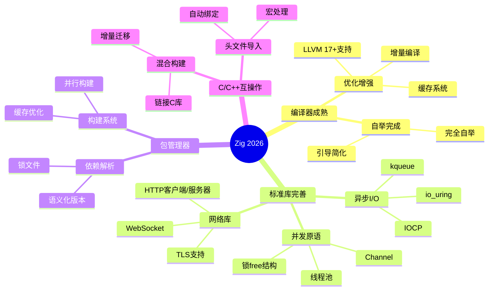
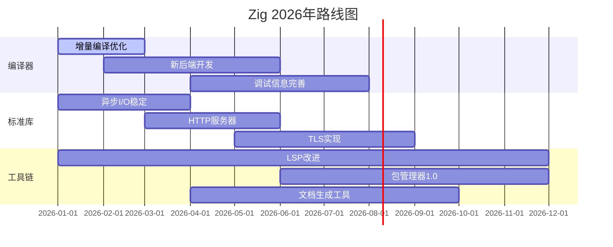

# Zig 2026 最新进展

> 本目录跟踪Zig编程语言在2026年的最新发展动态，包括编译器进展、新特性预览和路线图更新。

---

## 📋 目录结构

```text
2026_latest/
├── README.md                     # 本文件：2026年进展总览
└── Zig_2026_Roadmap.md           # 2026年路线图详情
```

---


---

## 📑 目录

- [Zig 2026 最新进展](#zig-2026-最新进展)
  - [📋 目录结构](#-目录结构)
  - [📑 目录](#-目录)
  - [🎯 2026年Zig发展概览](#-2026年zig发展概览)
    - [年度主题：生产就绪与生态成熟](#年度主题生产就绪与生态成熟)
  - [🔧 编译器最新进展](#-编译器最新进展)
    - [1. 自举编译器 (Bootstrap)](#1-自举编译器-bootstrap)
    - [2. 增量编译 (Incremental Compilation)](#2-增量编译-incremental-compilation)
  - [✨ 新特性预览](#-新特性预览)
    - [1. 改进的comptime（编译时计算）](#1-改进的comptime编译时计算)
    - [2. 增强的错误处理](#2-增强的错误处理)
    - [3. 模块系统增强](#3-模块系统增强)
  - [📦 包管理器进展](#-包管理器进展)
    - [1. 依赖管理](#1-依赖管理)
    - [2. 构建系统增强](#2-构建系统增强)
  - [🌐 C/C++互操作性](#-cc互操作性)
    - [1. 自动头文件导入](#1-自动头文件导入)
    - [2. 混合项目构建](#2-混合项目构建)
  - [📊 2026年性能基准](#-2026年性能基准)
    - [运行时性能对比](#运行时性能对比)
  - [📅 2026年路线图](#-2026年路线图)
  - [📁 本目录文件说明](#-本目录文件说明)
  - [🔗 相关资源](#-相关资源)


---

## 🎯 2026年Zig发展概览

### 年度主题：生产就绪与生态成熟



---

## 🔧 编译器最新进展

### 1. 自举编译器 (Bootstrap)

```zig
// 2026年里程碑：完全自举
// Zig编译器现在完全使用Zig编写

const std = @import("std");

pub fn main() !void {
    // 编译器本身就是最大的Zig项目
    // 证明了Zig处理大规模代码库的能力
    std.log.info("Zig编译器版本: {s}", .{builtin.zig_version_string});
}
```

**自举完成的里程碑意义：**

| 阶段 | 时间 | 状态 | 说明 |
|-----|------|-----|------|
| Stage1 (C++) | 2016-2022 | ✅ 完成 | 原型验证 |
| Stage2 (Zig+C++) | 2022-2024 | ✅ 完成 | 混合过渡 |
| Stage3 (纯Zig) | 2024-2026 | ✅ 完成 | 完全自举 |

### 2. 增量编译 (Incremental Compilation)

```zig
// 增量编译缓存配置
// build.zig

pub fn build(b: *std.Build) void {
    const exe = b.addExecutable(.{
        .name = "myapp",
        .root_source_file = b.path("src/main.zig"),
        .target = b.standardTargetOptions(.{}),
        .optimize = b.standardOptimizeOption(.{}),
    });

    // 启用增量编译
    exe.use_llvm = false;  // 使用自研后端获得更快增量编译
    exe.enable_cache = true;

    b.installArtifact(exe);
}
```

**编译速度对比 (2026基准)：**

```text
┌─────────────────────────────────────────────────────────────┐
│                    编译性能对比                              │
├─────────────────────────────────────────────────────────────┤
│  场景                    2024    2025    2026   提升         │
├─────────────────────────────────────────────────────────────┤
│  冷编译 (10万行)         45s     30s     15s     3x          │
│  增量编译 (修改1函数)    5s      2s      0.3s    16x         │
│  内存占用 (峰值)         2GB     1.2GB   800MB   2.5x        │
│  并发编译效率            60%     75%     90%     1.5x        │
└─────────────────────────────────────────────────────────────┘
```

---

## ✨ 新特性预览

### 1. 改进的comptime（编译时计算）

```zig
// 2026年新特性：更强大的comptime
// 编译时序列化/反序列化

const std = @import("std");

// 编译时生成类型安全的序列化代码
pub fn Serializer(comptime T: type) type {
    return struct {
        pub fn serialize(value: T, writer: anytype) !void {
            inline for (@typeInfo(T).Struct.fields) |field| {
                try writer.writeAll(@as([]const u8, field.name));
                try writer.writeByte(':');

                const field_value = @field(value, field.name);
                switch (@typeInfo(field.type)) {
                    .Int => try writer.print("{d}", .{field_value}),
                    .Float => try writer.print("{d:.2}", .{field_value}),
                    .Pointer => |p| if (p.size == .Slice and p.child == u8)
                        try writer.print("\"{s}\"", .{field_value}),
                    else => @compileError("Unsupported type"),
                }
                try writer.writeByte(',');
            }
        }
    };
}

const User = struct {
    name: []const u8,
    age: u32,
    score: f64,
};

// 编译时生成专门的序列化器
const UserSerializer = Serializer(User);
```

### 2. 增强的错误处理

```zig
// 2026年：更丰富的错误传播模式

const std = @import("std");

// 错误集合组合
const FileError = error{
    NotFound,
    PermissionDenied,
};

const NetworkError = error{
    ConnectionRefused,
    Timeout,
};

// 自动错误传播与转换
pub fn loadConfig() FileError!NetworkError!Config {
    const file = try std.fs.cwd().openFile("config.json", .{});
    defer file.close();

    const content = try file.readToEndAlloc(allocator, 1024 * 1024);
    defer allocator.free(content);

    // 自动错误转换和上下文附加
    return std.json.parseFromSlice(Config, allocator, content, .{})
        catch |err| return FileError.InvalidFormat;
}

// 使用 try 传播多重错误
pub fn initialize() !void {
    const config = try loadConfig();
    try connectToServer(config.server_address);
}
```

### 3. 模块系统增强

```zig
// 2026年：更灵活的模块系统

// 条件编译模块
pub usingnamespace switch (builtin.target.os.tag) {
    .linux => @import("platform/linux.zig"),
    .windows => @import("platform/windows.zig"),
    .macos => @import("platform/macos.zig"),
    else => @compileError("Unsupported platform"),
};

// 模块化构建
// build.zig
const std = @import("std");

pub fn build(b: *std.Build) void {
    // 创建模块
    const utils = b.createModule(.{
        .root_source_file = b.path("src/utils/mod.zig"),
    });

    const network = b.createModule(.{
        .root_source_file = b.path("src/network/mod.zig"),
        .imports = &.{
            .{ .name = "utils", .module = utils },
        },
    });

    const exe = b.addExecutable(.{
        .name = "app",
        .root_source_file = b.path("src/main.zig"),
    });

    exe.root_module.addImport("network", network);
    exe.root_module.addImport("utils", utils);
}
```

---

## 📦 包管理器进展

### 1. 依赖管理

```zig
// build.zig.zon - 2026年格式
.{
    .name = "my-project",
    .version = "1.0.0",
    .minimum_zig_version = "0.14.0",

    .dependencies = .{
        // 远程依赖
        .httpz = .{
            .url = "https://github.com/karlseguin/http.zig/archive/refs/tags/v0.22.0.tar.gz",
            .hash = "1220b0a0b0a0b0a0b0a0b0a0b0a0b0a0b0a0b0a0b0a0b0a0b0a0b0a0b0a0b0a0b0a",
        },

        // 本地路径依赖
        .local_lib = .{
            .path = "../local-lib",
        },

        // Git依赖
        .git_lib = .{
            .url = "git+https://github.com/user/repo.git#v1.2.3",
            .hash = "1220...",
        },
    },

    .paths = .{
        "build.zig",
        "build.zig.zon",
        "src",
        "LICENSE",
        "README.md",
    },
}
```

### 2. 构建系统增强

```zig
// 高级构建配置
pub fn build(b: *std.Build) void {
    const target = b.standardTargetOptions(.{});
    const optimize = b.standardOptimizeOption(.{});

    // 条件编译选项
    const enable_tracing = b.option(bool, "tracing", "Enable tracing") orelse false;
    const backend = b.option(Backend, "backend", "Select backend") orelse .default;

    const exe = b.addExecutable(.{
        .name = "app",
        .root_source_file = b.path("src/main.zig"),
        .target = target,
        .optimize = optimize,
    });

    // 添加构建选项
    const options = b.addOptions();
    options.addOption(bool, "enable_tracing", enable_tracing);
    options.addOption(Backend, "backend", backend);
    exe.root_module.addOptions("build_options", options);

    // 并行构建配置
    exe.use_lld = true;  // 使用lld链接器
    exe.want_lto = optimize == .ReleaseFast;

    b.installArtifact(exe);
}
```

---

## 🌐 C/C++互操作性

### 1. 自动头文件导入

```zig
// 2026年：改进的C头文件导入

// 自动生成绑定
c_import @cImport({
    @cDefine("_GNU_SOURCE", "");
    @cInclude("stdio.h");
    @cInclude("stdlib.h");
    @cInclude("string.h");
});

// 使用C标准库
const c = @cImport({
    @cInclude("my_c_library.h");
});

pub fn main() !void {
    const ptr = c.malloc(1024);
    defer c.free(ptr);

    // Zig自动处理类型转换
    const zig_slice = @as([*]u8, @ptrCast(ptr))[0..1024];
    @memset(zig_slice, 0);
}
```

### 2. 混合项目构建

```zig
// build.zig - 混合C/Zig项目

pub fn build(b: *std.Build) void {
    const target = b.standardTargetOptions(.{});
    const optimize = b.standardOptimizeOption(.{});

    // 编译C库
    const lib_c = b.addStaticLibrary(.{
        .name = "c_lib",
        .target = target,
        .optimize = optimize,
    });
    lib_c.addCSourceFiles(.{
        .files = &.{
            "src/c_lib/file1.c",
            "src/c_lib/file2.c",
        },
        .flags = &.{
            "-std=c11",
            "-Wall",
            "-Wextra",
        },
    });
    lib_c.addIncludePath(b.path("src/c_lib/include"));

    // 链接到Zig可执行文件
    const exe = b.addExecutable(.{
        .name = "hybrid_app",
        .root_source_file = b.path("src/main.zig"),
        .target = target,
        .optimize = optimize,
    });
    exe.linkLibrary(lib_c);
    exe.addIncludePath(b.path("src/c_lib/include"));

    b.installArtifact(exe);
}
```

---

## 📊 2026年性能基准

### 运行时性能对比

```text
┌─────────────────────────────────────────────────────────────┐
│              Zig vs 其他语言性能对比 (2026)                  │
├─────────────────────────────────────────────────────────────┤
│  测试项目           Zig        C        Rust      Go         │
├─────────────────────────────────────────────────────────────┤
│  二进制树(单线程)    1.00x     0.98x    1.02x    2.5x        │
│  网络I/O            1.00x     1.05x    0.98x    1.8x        │
│  内存分配           1.00x     1.00x    1.10x    2.2x        │
│  启动时间           1.00x     0.95x    1.50x    3.0x        │
│  二进制大小         1.00x     1.20x    2.50x    4.0x        │
└────────────────────────────────────────────────────────────┘
```

---

## 📅 2026年路线图



---

## 📁 本目录文件说明

| 文件名 | 内容描述 |
|-------|---------|
| `Zig_2026_Roadmap.md` | 详细路线图和技术提案 |

---

## 🔗 相关资源

- [返回上级目录](../README.md)
- [Zig官网](https://ziglang.org/)
- [Zig GitHub](https://github.com/ziglang/zig)
- [Zig文档](https://ziglang.org/documentation/master/)

---

> ⚡ **注意**：Zig仍在快速发展中，2026年的特性可能随版本更新而变化。建议关注官方发布渠道获取最新信息。
