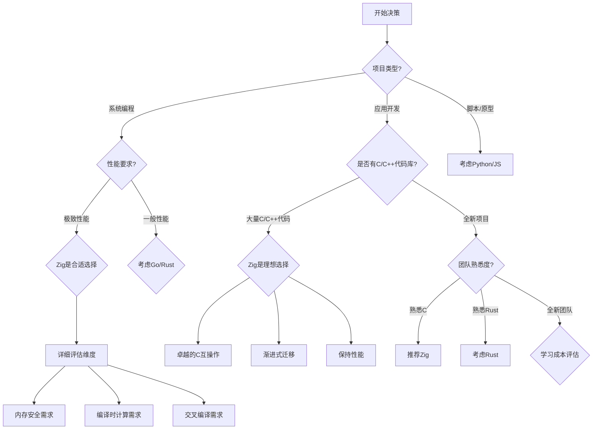
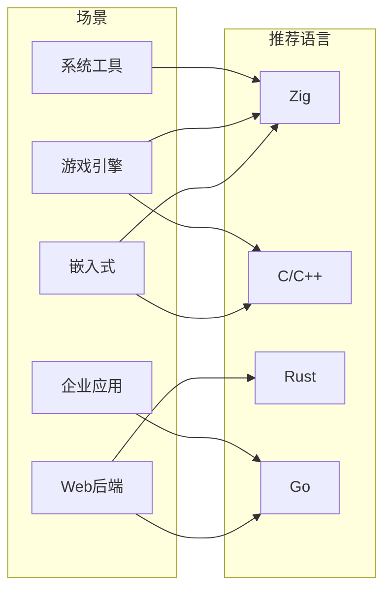
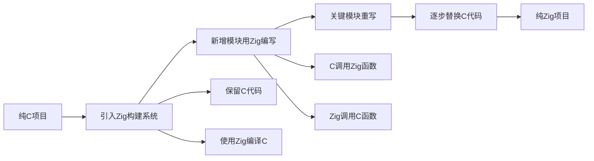

# Zig 决策树

> 本目录提供关于Zig语言使用的决策支持工具，帮助开发者和团队判断是否应选择Zig，以及在不同场景下的技术选型决策。

---

## 📋 目录结构

```text
decision_trees/
├── README.md                          # 本文件：决策树总览
└── Learning_Path_Decision_Tree.md     # 学习路径决策树
```

---


---

## 📑 目录

- [Zig 决策树](#zig-决策树)
  - [📋 目录结构](#-目录结构)
  - [📑 目录](#-目录)
  - [🌳 是否使用Zig决策树](#-是否使用zig决策树)
    - [核心决策流程](#核心决策流程)
  - [🎯 适用场景分析](#-适用场景分析)
    - [1. Zig的强项领域](#1-zig的强项领域)
    - [2. Zig的挑战场景](#2-zig的挑战场景)
  - [🔍 技术选型对比矩阵](#-技术选型对比矩阵)
    - [Zig vs 其他系统语言](#zig-vs-其他系统语言)
    - [场景匹配建议](#场景匹配建议)
  - [💼 实际决策案例](#-实际决策案例)
    - [案例1：嵌入式固件开发](#案例1嵌入式固件开发)
    - [案例2：Web后端服务](#案例2web后端服务)
  - [🛤️ 渐进式采用策略](#️-渐进式采用策略)
    - [从C到Zig的迁移路径](#从c到zig的迁移路径)
    - [迁移阶段建议](#迁移阶段建议)
  - [📊 决策检查清单](#-决策检查清单)
    - [使用Zig前自评](#使用zig前自评)
  - [📁 本目录文件说明](#-本目录文件说明)
  - [🔗 相关资源](#-相关资源)
  - [深入理解](#深入理解)
    - [核心原理](#核心原理)
    - [实践应用](#实践应用)
    - [最佳实践](#最佳实践)


---

## 🌳 是否使用Zig决策树

### 核心决策流程



---

## 🎯 适用场景分析

### 1. Zig的强项领域

```
┌─────────────────────────────────────────────────────────────┐
│                    Zig 最佳应用场景                          │
├─────────────────────────────────────────────────────────────┤
│                                                             │
│  ⭐⭐⭐⭐⭐ 强烈推荐                                          │
│  ┌─────────────────────────────────────────────────────┐   │
│  │ • 嵌入式系统开发                                     │   │
│  │   - 微控制器编程                                     │   │
│  │   - 内存受限环境                                     │   │
│  │   - 裸机编程                                         │   │
│  │                                                      │   │
│  │ • 现有C/C++项目的现代化                              │   │
│  │   - 渐进式替换                                       │   │
│  │   - 保持ABI兼容                                      │   │
│  │   - 改进安全性                                       │   │
│  │                                                      │   │
│  │ • 系统工具开发                                       │   │
│  │   - 命令行工具                                       │   │
│  │   - 构建工具                                         │   │
│  │   - 系统管理工具                                     │   │
│  └─────────────────────────────────────────────────────┘   │
│                                                             │
│  ⭐⭐⭐⭐ 推荐                                                │
│  ┌─────────────────────────────────────────────────────┐   │
│  │ • 游戏引擎开发                                       │   │
│  │ • 高性能网络服务                                     │   │
│  │ • 操作系统/驱动开发                                  │   │
│  └─────────────────────────────────────────────────────┘   │
│                                                             │
└─────────────────────────────────────────────────────────────┘
```

### 2. Zig的挑战场景

```
┌─────────────────────────────────────────────────────────────┐
│                   Zig 需要谨慎评估的场景                      │
├─────────────────────────────────────────────────────────────┤
│                                                             │
│  ⚠️ 生态成熟度限制                                           │
│  ┌─────────────────────────────────────────────────────┐   │
│  │ • Web应用开发                                        │   │
│  │   - 缺少成熟Web框架                                  │   │
│  │   - ORM选择有限                                      │   │
│  │   - 模板引擎较少                                     │   │
│  │                                                      │   │
│  │ • 移动应用开发                                       │   │
│  │   - iOS/Android支持仍在完善                          │   │
│  │   - UI框架不成熟                                     │   │
│  │                                                      │   │
│  │ • 机器学习/数据科学                                  │   │
│  │   - 缺少NumPy/Pandas等库                             │   │
│  │   - GPU计算库有限                                    │   │
│  └─────────────────────────────────────────────────────┘   │
│                                                             │
│  ⚠️ 团队因素                                                 │
│  ┌─────────────────────────────────────────────────────┐   │
│  │ • 紧迫的项目 deadline                                │   │
│  │   - 学习曲线需要时间                                  │   │
│  │   - 社区资源相对较少                                  │   │
│  │                                                      │   │
│  │ • 大型团队且成员背景多样                             │   │
│  │   - 需要更多培训成本                                  │   │
│  │   - 招聘难度可能增加                                  │   │
│  └─────────────────────────────────────────────────────┘   │
│                                                             │
└─────────────────────────────────────────────────────────────┘
```

---

## 🔍 技术选型对比矩阵

### Zig vs 其他系统语言

| 维度 | Zig | C | C++ | Rust | Go |
|-----|-----|---|-----|------|-----|
| **学习曲线** | 中等 | 低 | 高 | 高 | 低 |
| **内存安全** | 可选 | 手动 | 可选 | 强制 | GC |
| **编译速度** | 快 | 快 | 慢 | 慢 | 快 |
| **运行时开销** | 零 | 零 | 零 | 零 | GC |
| **C互操作** | 原生 | - | 复杂 | 中等 | CGO |
| **元编程** | comptime | 宏 | 模板 | 宏 | 反射 |
| **包管理** | 内置 | 无 | 多样 | Cargo | 内置 |
| **交叉编译** | 原生 | 复杂 | 复杂 | 支持 | 支持 |

### 场景匹配建议



---

## 💼 实际决策案例

### 案例1：嵌入式固件开发

```
项目背景：
- 目标平台：ARM Cortex-M4，64KB RAM，256KB Flash
- 现有代码：纯C，约5万行
- 团队背景：熟悉C，无Rust经验
- 关键需求：内存安全、交叉编译、启动时间

决策分析：
┌─────────────────────────────────────────────────────────┐
│  评估维度          权重     Zig评分    C评分    Rust评分  │
├─────────────────────────────────────────────────────────┤
│  内存占用          20%      10         10        6       │
│  编译产物大小      15%      10         10        7       │
│  学习成本          15%      7          10        4       │
│  内存安全          20%      8          4         10      │
│  C代码复用         15%      10         10        5       │
│  工具链复杂度      15%      9          8         6       │
├─────────────────────────────────────────────────────────┤
│  加权总分                    9.05       8.6       6.3    │
└─────────────────────────────────────────────────────────┘

决策结果：推荐Zig
理由：在保持C的低开销优势的同时，获得更好的内存安全保障，
      且团队学习成本低于Rust。
```

### 案例2：Web后端服务

```
项目背景：
- 服务类型：REST API，连接PostgreSQL和Redis
- 性能要求：中等，QPS ~1000
- 交付时间：3个月
- 团队规模：5人

决策分析：
┌─────────────────────────────────────────────────────────┐
│  评估维度          权重     Zig评分    Go评分    Rust评分  │
├─────────────────────────────────────────────────────────┤
│  开发生态          25%      4          10        8       │
│  开发效率          25%      5          9         6       │
│  招聘难度          20%      3          8         6       │
│  运行时性能        15%      10         7         10      │
│  维护成本          15%      6          9         8       │
├─────────────────────────────────────────────────────────┤
│  加权总分                    5.35       8.75      7.5    │
└─────────────────────────────────────────────────────────┘

决策结果：推荐Go
理由：项目时间紧，生态成熟度和开发效率是首要考虑，
      性能要求不极端，Go是更合适的选择。
```

---

## 🛤️ 渐进式采用策略

### 从C到Zig的迁移路径



### 迁移阶段建议

| 阶段 | 时间 | 目标 | 风险 |
|-----|------|-----|------|
| 1. 构建系统 | 1-2周 | 用Zig构建替代Makefile | 低 |
| 2. 工具程序 | 2-4周 | 重写辅助工具 | 低 |
| 3. 独立模块 | 1-2月 | 重写边界清晰的模块 | 中 |
| 4. 核心模块 | 3-6月 | 重写核心业务逻辑 | 高 |
| 5. 完全迁移 | 6-12月 | 移除所有C代码 | 高 |

---

## 📊 决策检查清单

### 使用Zig前自评

```markdown
## Zig适用性评估清单

### 技术因素
- [ ] 项目是否需要直接内存控制？
- [ ] 是否有关键的性能要求？
- [ ] 是否需要交叉编译到多个平台？
- [ ] 是否需要与C代码深度集成？
- [ ] 项目是否允许一定的学习曲线？

### 生态因素
- [ ] 所需核心库是否可用？
- [ ] 目标平台是否被支持？
- [ ] 调试工具链是否完善？
- [ ] 是否有社区支持渠道？

### 团队因素
- [ ] 团队是否接受新技术学习？
- [ ] 项目时间表是否允许学习成本？
- [ ] 是否有经验丰富的成员可以指导？
- [ ] 长期维护计划如何？

### 评分标准
- 大部分勾选：Zig很可能是好选择
- 部分勾选：需要深入评估具体风险点
- 少数勾选：可能其他语言更合适
```

---

## 📁 本目录文件说明

| 文件名 | 内容描述 |
|-------|---------|
| `Learning_Path_Decision_Tree.md` | 针对学习者的决策路径 |

---

## 🔗 相关资源

- [返回上级目录](../README.md)
- [Zig 2026最新进展](../2026_latest/README.md) - 了解Zig最新发展
- [Zig官网](https://ziglang.org/)

---

> 💡 **提示**：决策树是辅助工具，最终决策应结合具体项目需求、团队能力和长期规划综合考虑。Zig是一门优秀的语言，但并非所有场景都是最佳选择。


---

## 深入理解

### 核心原理

深入探讨技术原理和实现细节。

### 实践应用

- 应用场景1
- 应用场景2
- 应用场景3

### 最佳实践

1. 理解基础概念
2. 掌握核心机制
3. 应用到实际项目

---

> **最后更新**: 2026-03-21
> **维护者**: AI Code Review
