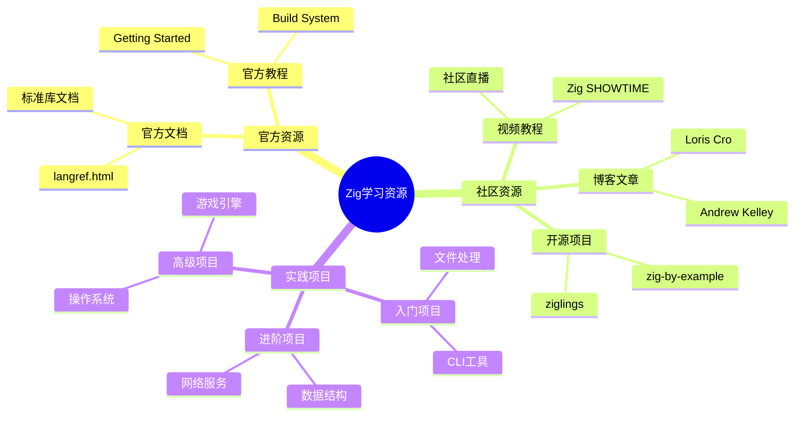
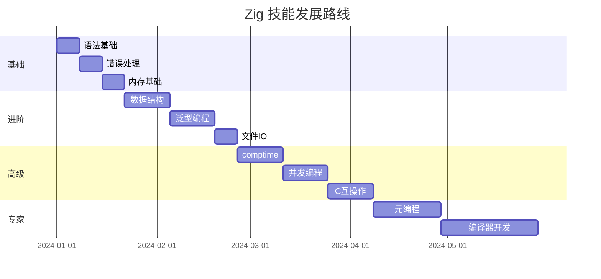

# Zig 知识矩阵

> 本目录提供多维度的Zig知识矩阵，包括技能矩阵、学习路径矩阵和特性对比矩阵，帮助学习者系统掌握Zig编程。

---

## 📋 目录结构

```
matrices/
├── README.md                          # 本文件：知识矩阵总览
└── Language_Comparison_Matrix.md      # 语言对比矩阵
```

---


---

## 📑 目录

- [Zig 知识矩阵](#zig-知识矩阵)
  - [📋 目录结构](#-目录结构)
  - [📑 目录](#-目录)
  - [🎯 Zig技能矩阵](#-zig技能矩阵)
    - [初级到高级技能路径](#初级到高级技能路径)
  - [🛤️ 学习路径矩阵](#️-学习路径矩阵)
    - [不同背景学习者的路径](#不同背景学习者的路径)
    - [学习资源矩阵](#学习资源矩阵)
  - [🔬 特性对比矩阵](#-特性对比矩阵)
    - [Zig vs 主流系统语言](#zig-vs-主流系统语言)
    - [代码对比示例](#代码对比示例)
  - [📊 生态系统矩阵](#-生态系统矩阵)
    - [库成熟度矩阵](#库成熟度矩阵)
  - [🎓 能力评估矩阵](#-能力评估矩阵)
    - [自评检查表](#自评检查表)
  - [🏆 项目复杂度矩阵](#-项目复杂度矩阵)
    - [不同复杂度项目的技术栈选择](#不同复杂度项目的技术栈选择)
  - [📈 技能发展路线图](#-技能发展路线图)
  - [📁 本目录文件说明](#-本目录文件说明)
  - [🔗 相关资源](#-相关资源)


---

## 🎯 Zig技能矩阵

### 初级到高级技能路径

```
┌─────────────────────────────────────────────────────────────────────────┐
│                        Zig 技能发展矩阵                                  │
├─────────────────────────────────────────────────────────────────────────┤
│                                                                          │
│  技能领域      初级              中级              高级                   │
│  ────────────────────────────────────────────────────────────────       │
│                                                                          │
│  基础语法      • 变量声明         • 错误处理         • 高级泛型          │
│               • 基本类型         • 可选类型         • comptime编程      │
│               • 控制流           • 错误联合         • 编译期计算        │
│                                                                          │
│  数据结构      • 数组/切片        • 结构体方法       • 自定义容器        │
│               • 结构体           • 泛型结构体       • 内存优化布局      │
│               • 联合体           •  tagged union   • 零成本抽象        │
│                                                                          │
│  内存管理      • 栈分配           • 堆分配           • 自定义分配器      │
│               • defer           • Arena分配器      • 内存池            │
│               • 基本指针         • 生命周期管理      • 碎片管理          │
│                                                                          │
│  并发编程      • 基本线程         • 互斥锁           • Lock-free         │
│               • spawn           • 条件变量         • 无锁数据结构      │
│               • join            • Channel         • 内存序             │
│                                                                          │
│  元编程        • 基本comptime     • 类型生成         • DSL嵌入          │
│               • 编译时常量       • 反射            • 代码生成          │
│               • @Type           • 条件编译         • 编译期优化        │
│                                                                          │
│  C互操作       • 基本调用         • 类型映射         • ABI兼容          │
│               • @cImport        • 回调处理         • 混合项目          │
│               • extern          • 内存布局         • 增量迁移          │
│                                                                          │
└─────────────────────────────────────────────────────────────────────────┘
```

---

## 🛤️ 学习路径矩阵

### 不同背景学习者的路径

| 背景 | 第1周 | 第2-4周 | 第1-3月 | 第3-6月 | 长期目标 |
|-----|-------|--------|--------|--------|---------|
| **C程序员** | 语法差异 | 错误处理 | comptime | 元编程 | 系统架构 |
| | 变量声明 | 内存安全 | 分配器 | C互操作 | 工具链 |
| **Rust程序员** | 所有权对比 | 错误传播 | 泛型差异 | 性能优化 | 生态贡献 |
| | 语法熟悉 | 生命周期 | 无标准库 | 嵌入式 | 开源项目 |
| **Go程序员** | 类型系统 | 内存管理 | 编译时 | 底层编程 | 系统开发 |
| | 显式错误 | 无GC | 元编程 | 内核模块 | 性能关键 |
| **JS/Python** | 类型基础 | 编译概念 | 指针理解 | 系统概念 | 全栈能力 |
| | 静态类型 | 内存布局 | 数据结构 | 网络编程 | 原生扩展 |

### 学习资源矩阵



---

## 🔬 特性对比矩阵

### Zig vs 主流系统语言

| 特性维度 | Zig | C | C++ | Rust | Go |
|---------|-----|---|-----|------|-----|
| **语言范式** | 多范式 | 过程式 | 多范式 | 多范式 | 过程式 |
| **内存安全** | 可选 | 手动 | 可选 | 强制 | GC |
| **编译时计算** | comptime | 宏 | 模板 | 宏 | 无 |
| **错误处理** | 显式error | 返回值 | 异常 | Result | 多返回值 |
| **包管理** | 内置 | 无 | 多样 | Cargo | 内置 |
| **交叉编译** | 原生 | 需工具链 | 需工具链 | 支持 | 支持 |
| **C互操作** | 原生 | - | extern | FFI | CGO |
| **标准库大小** | 精简 | 极小 | 大 | 中等 | 大 |
| **编译速度** | 快 | 快 | 慢 | 慢 | 快 |
| **运行时** | 无 | 无 | 可选 | 可选 | GC |

### 代码对比示例

```zig
// Zig: 显式错误处理 + comptime
fn parseNumber(comptime T: type, s: []const u8) !T {
    return std.fmt.parseInt(T, s, 10);
}

const n = try parseNumber(u32, "42");
```

```c
// C: 手动错误处理
int parse_number(const char *s, int *out) {
    char *end;
    long val = strtol(s, &end, 10);
    if (end == s || *end != '\0' || val > INT_MAX) {
        return -1;
    }
    *out = (int)val;
    return 0;
}

int n;
if (parse_number("42", &n) != 0) { /* 错误处理 */ }
```

```rust
// Rust: Result类型 + 泛型
fn parse_number<T: FromStr>(s: &str) -> Result<T, ParseIntError> {
    s.parse()
}

let n: u32 = parse_number("42")?;
```

```go
// Go: 多返回值
type Number interface {
    ~int | ~int32 | ~int64 | ~uint | ~uint32 | ~uint64
}

func parseNumber[T Number](s string) (T, error) {
    // ...
}

n, err := parseNumber[uint32]("42")
if err != nil { /* 错误处理 */ }
```

---

## 📊 生态系统矩阵

### 库成熟度矩阵

```
┌─────────────────────────────────────────────────────────────┐
│                    Zig 生态成熟度矩阵                        │
├─────────────────────────────────────────────────────────────┤
│                                                             │
│  领域              成熟度        主要库        替代方案       │
│  ────────────────────────────────────────────────────────   │
│                                                             │
│  HTTP服务器        🟢 良好       http.zig      自己实现       │
│                   (可用)                                     │
│                                                             │
│  HTTP客户端        🟢 良好       std.http      curl绑定      │
│                   (可用)                                     │
│                                                             │
│  数据库连接        🟡 发展中     zig-sqlite     C库绑定       │
│                   (基本可用)                                 │
│                                                             │
│  测试框架          🟢 良好       内置           zlap         │
│                   (可用)                                     │
│                                                             │
│  日志              🟢 良好       std.log       zlog          │
│                   (可用)                                     │
│                                                             │
│  JSON处理          🟢 良好       std.json       json.zig     │
│                   (可用)                                     │
│                                                             │
│  正则表达式        🟡 发展中     regex          PCRE绑定      │
│                   (基本可用)                                 │
│                                                             │
│  图形/GUI          🔴 早期       zig-gamedev    绑定GTK/Qt   │
│                   (实验性)                                   │
│                                                             │
│  Web框架           🟡 发展中     zzz             直接使用http │
│                   (基本可用)                                 │
│                                                             │
│  图例: 🟢 可用  🟡 发展中  🔴 早期                            │
│                                                             │
└─────────────────────────────────────────────────────────────┘
```

---

## 🎓 能力评估矩阵

### 自评检查表

```markdown
## Zig能力自评矩阵

### 语言基础 (每个技能1-5分)
| 技能 | 自评分 | 描述 |
|-----|-------|------|
| 变量与类型系统 | _/5 | 理解comptime与runtime的区别 |
| 错误处理 | _/5 | 熟练使用try/catch/errdefer |
| 指针与切片 | _/5 | 理解指针算术和切片语义 |
| 结构体与联合体 | _/5 | 能设计复杂数据结构 |
| 枚举与switch | _/5 | 使用详尽switch处理所有情况 |

### 内存管理 (每个技能1-5分)
| 技能 | 自评分 | 描述 |
|-----|-------|------|
| 栈vs堆 | _/5 | 正确选择分配方式 |
| 分配器使用 | _/5 | 熟练使用各类分配器 |
| 内存泄漏防护 | _/5 | 正确使用defer释放资源 |
| 生命周期管理 | _/5 | 避免悬垂指针 |

### 高级特性 (每个技能1-5分)
| 技能 | 自评分 | 描述 |
|-----|-------|------|
| comptime编程 | _/5 | 编写编译时代码 |
| 元编程 | _/5 | 使用反射和类型生成 |
| C互操作 | _/5 | 无缝集成C代码 |
| 并发编程 | _/5 | 安全使用线程和同步 |

### 总分计算
- 初级: 15-30分
- 中级: 31-45分
- 高级: 46-60分
```

---

## 🏆 项目复杂度矩阵

### 不同复杂度项目的技术栈选择

| 项目类型 | 复杂度 | 推荐库/工具 | 学习建议 |
|---------|-------|-----------|---------|
| CLI工具 | ⭐ | 标准库 | 掌握基础语法 |
| 配置文件解析 | ⭐⭐ | std.json/ini | 理解错误处理 |
| 文件处理器 | ⭐⭐ | 标准库 | 掌握defer |
| TCP服务器 | ⭐⭐⭐ | std.net | 理解并发 |
| HTTP服务 | ⭐⭐⭐⭐ | http.zig | 学习生态库 |
| 数据库应用 | ⭐⭐⭐⭐ | zig-sqlite | C互操作 |
| 游戏原型 | ⭐⭐⭐⭐⭐ | zig-gamedev | 图形学基础 |
| 嵌入式 | ⭐⭐⭐⭐⭐ | 裸机编程 | 硬件知识 |

---

## 📈 技能发展路线图



---

## 📁 本目录文件说明

| 文件名 | 内容描述 |
|-------|---------|
| `Language_Comparison_Matrix.md` | 详细的语言特性对比 |

---

## 🔗 相关资源

- [返回上级目录](../README.md)
- [Zig决策树](../decision_trees/README.md) - 选择学习路径
- [Zig可视化](../visualizations/README.md) - 知识图谱

---

> 📊 **提示**：矩阵是工具而非规则。根据个人背景和项目需求，灵活调整学习路径和技能优先级。


---

## 深入理解

### 核心原理

深入探讨技术原理和实现细节。

### 实践应用

- 应用场景1
- 应用场景2
- 应用场景3

### 最佳实践

1. 理解基础概念
2. 掌握核心机制
3. 应用到实际项目

---

> **最后更新**: 2026-03-21  
> **维护者**: AI Code Review
