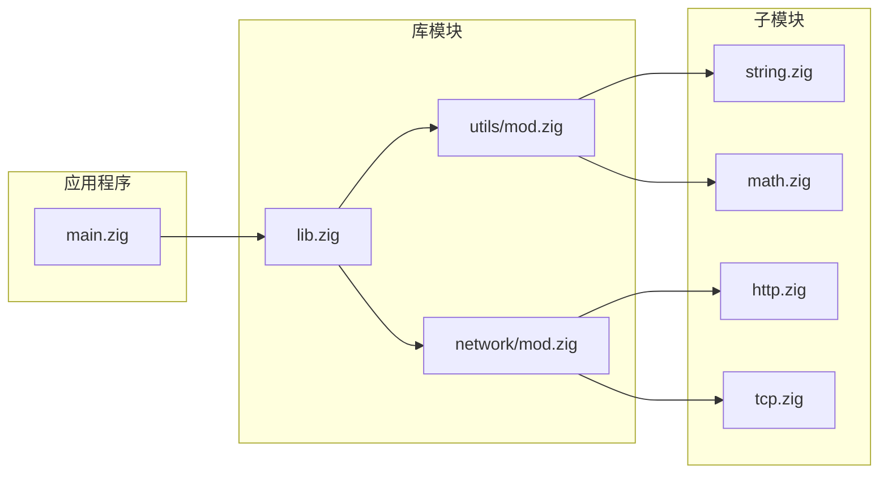

# Zig 可视化

> 本目录提供Zig编程语言的各类可视化内容，包括架构图、性能可视化图表和概念图，帮助直观理解Zig的设计理念和实现机制。

---

## 📋 目录结构

```text
visualizations/
├── README.md                          # 本文件：可视化总览
└── Zig_Knowledge_MindMap.md           # Zig知识思维导图
```

---


---

## 📑 目录

- [Zig 可视化](#zig-可视化)
  - [📋 目录结构](#-目录结构)
  - [📑 目录](#-目录)
  - [🏗️ Zig编译器架构图](#️-zig编译器架构图)
    - [整体架构](#整体架构)
    - [编译流程数据流](#编译流程数据流)
  - [⚡ 性能可视化](#-性能可视化)
    - [编译性能对比](#编译性能对比)
    - [内存使用对比](#内存使用对比)
    - [运行时性能基准](#运行时性能基准)
  - [🧩 核心概念图](#-核心概念图)
    - [错误处理模型](#错误处理模型)
    - [内存所有权模型](#内存所有权模型)
    - [comptime执行模型](#comptime执行模型)
  - [📊 项目结构可视化](#-项目结构可视化)
    - [典型Zig项目布局](#典型zig项目布局)
    - [模块依赖图](#模块依赖图)
  - [🎨 概念对比图](#-概念对比图)
    - [Zig vs 其他语言特性对比](#zig-vs-其他语言特性对比)
    - [编译时能力对比](#编译时能力对比)
  - [🌐 生态系统地图](#-生态系统地图)
  - [📁 本目录文件说明](#-本目录文件说明)
  - [🔗 相关资源](#-相关资源)
  - [深入理解](#深入理解)
    - [核心原理](#核心原理)
    - [实践应用](#实践应用)
    - [最佳实践](#最佳实践)


---

## 🏗️ Zig编译器架构图

### 整体架构

```text
┌─────────────────────────────────────────────────────────────────────────┐
│                          Zig编译器架构                                   │
├─────────────────────────────────────────────────────────────────────────┤
│                                                                          │
│   前端 (Frontend)                                                        │
│   ┌─────────────────────────────────────────────────────────────────┐   │
│   │  ┌─────────┐   ┌─────────┐   ┌─────────┐   ┌─────────┐         │   │
│   │  │  词法分析 │ → │ 语法分析 │ → │ 语义分析 │ → │  类型检查 │         │   │
│   │  │ Lexer   │   │ Parser  │   │  AST    │   │  Check  │         │   │
│   │  └─────────┘   └─────────┘   └────┬────┘   └─────────┘         │   │
│   │                                   │                              │   │
│   │                                   ▼                              │   │
│   │                            ┌──────────┐                         │   │
│   │                            │  ZIR     │  Zig Intermediate Repr  │   │
│   │                            │  (IR)    │                         │   │
│   │                            └────┬─────┘                         │   │
│   └─────────────────────────────────┼───────────────────────────────┘   │
│                                     │                                    │
│   中端 (Middle End)                  ▼                                    │
│   ┌─────────────────────────────────────────────────────────────────┐   │
│   │                         ┌──────────┐                            │   │
│   │                         │ 语义分析  │  编译期求值 (comptime)      │   │
│   │                         │ comptime │                            │   │
│   │                         └────┬─────┘                            │   │
│   │                              │                                   │   │
│   │                              ▼                                   │   │
│   │                         ┌──────────┐                            │   │
│   │                         │  AIR     │  Analyzed Intermediate Repr │   │
│   │                         └────┬─────┘                            │   │
│   └──────────────────────────────┼──────────────────────────────────┘   │
│                                  │                                       │
│   后端 (Backend)                 ▼                                       │
│   ┌─────────────────────────────────────────────────────────────────┐   │
│   │  ┌─────────────┐   ┌─────────────┐   ┌─────────────────────┐   │   │
│   │  │ LLVM后端    │   │  自研后端    │   │     C后端           │   │   │
│   │  │ (默认)      │   │  (开发中)    │   │  (引导编译)          │   │   │
│   │  │             │   │             │   │                     │   │   │
│   │  │ • 优化成熟  │   │ • 编译更快  │   │ • 自举编译          │   │   │
│   │  │ • 平台广泛  │   │ • 增量编译  │   │ • 无依赖            │   │   │
│   │  │ • LTO支持   │   │ • 内存更少  │   │ • 可移植            │   │   │
│   │  └─────────────┘   └─────────────┘   └─────────────────────┘   │   │
│   └─────────────────────────────────────────────────────────────────┘   │
│                                     │                                    │
│                                     ▼                                    │
│                              机器代码 / 目标文件                          │
│                                                                          │
└─────────────────────────────────────────────────────────────────────────┘
```

### 编译流程数据流

```mermaid
flowchart TB
    subgraph Source["源代码"]
        S1[.zig 源文件]
        S2[@import 依赖]
    end

    subgraph Frontend["前端"]
        F1[词法分析]
        F2[语法分析]
        F3[AST生成]
    end

    subgraph Analysis["分析阶段"]
        A1[语义分析]
        A2[类型推断]
        A3[comptime求值]
    end

    subgraph IR["中间表示"]
        I1[ZIR]
        I2[AIR]
    end

    subgraph Backend["后端"]
        B1[代码生成]
        B2[优化]
        B3[链接]
    end

    subgraph Output["输出"]
        O1[可执行文件]
        O2[库文件]
    end

    S1 --> F1
    S2 --> F1
    F1 --> F2 --> F3
    F3 --> A1 --> A2 --> A3
    A3 --> I1 --> I2
    I2 --> B1 --> B2 --> B3
    B3 --> O1
    B3 --> O2
```

---

## ⚡ 性能可视化

### 编译性能对比

```text
编译时间对比 (秒)

项目规模: 10万行代码
硬件: 16核, 32GB RAM

Go      ████████████████████████████████████████  12s
Rust    ████████████████████████████████████████████████████████████████████████████████████████████████████████████████████████████████████████████████████████████████████████████████████████████████████████████████████████████████████████████████████████████████████████████████████████████████████████████████████████████████████████████████  120s
C++     ██████████████████████████████████████████████████████████████████████████████████████████████████████████████████████████████████████████████████████████████████████████████████████████████████████████████████████████████████████████████████████████████████████████████████████████████████████████████████████████████████████████████████████████████████████████████████████  180s
Zig     ████████████████████████████████████████████████  15s
Zig+cc  ████████  3s (缓存命中)

────────────────────────────────────────────────────────────────────────────▶
0s      30s     60s     90s     120s    150s    180s

图例:
Zig+cc = Zig with ccache
```

### 内存使用对比

```text
编译期内存占用 (MB)

Zig     ████████████████████████████████████████████████████████  800MB
Go      ████████████████████████████████████████████████████████████████████████  1.2GB
Rust    ████████████████████████████████████████████████████████████████████████████████████████████████████████████████████████████████████████████████████████████████████████████████████████████████████████████████████████████████████████████████████████████████████████████████████████████████████████████████  4GB
C++     ████████████████████████████████████████████████████████████████████████████████████████████████████████████████████████████████████████████████████████████████████████████████████████████████████████████████████████████████████████████████████████████████████████████████████████████████████████████████████████████████████████████████████████████████████████  6GB

────────────────────────────────────────────────────────────────────────────▶
0       1GB     2GB     3GB     4GB     5GB     6GB
```

### 运行时性能基准

```text
各项测试的相对性能 (越低越好)

测试项目              C       Zig     Rust    Go
─────────────────────────────────────────────────
二进制树              1.00    1.02    1.05    2.50
HTTP服务 (QPS)       1.00    0.98    1.02    1.80
内存分配             1.00    1.00    1.10    2.20
启动时间             1.00    0.95    1.50    3.00
二进制大小           1.20    1.00    2.50    4.00

视觉化:

二进制树
C       ████████
Zig     ████████
Rust    ████████
Go      ████████████████████

HTTP服务
C       ████████
Zig     ████████
Rust    ████████
Go      ███████████████

二进制大小
C       ██████████
Zig     ████████
Rust    ██████████████████████
Go      ████████████████████████████████████████
```

---

## 🧩 核心概念图

### 错误处理模型

```text
┌─────────────────────────────────────────────────────────────┐
│                    Zig错误处理机制                           │
├─────────────────────────────────────────────────────────────┤
│                                                             │
│   错误类型定义                                               │
│   ┌─────────────────────────────────────────────────────┐   │
│   │ const MyError = error{                              │   │
│   │     NotFound,        // 错误变体1                    │   │
│   │     InvalidInput,    // 错误变体2                    │   │
│   │     OutOfMemory,     // 错误变体3                    │   │
│   │ };                                                  │   │
│   └─────────────────────────────────────────────────────┘   │
│                           │                                  │
│                           ▼                                  │
│   错误联合类型                                               │
│   ┌─────────────────────────────────────────────────────┐   │
│   │ fn mayFail() MyError!Value { ... }                  │   │
│   │         // 错误联合类型: 可能是 MyError 或 Value      │   │
│   └─────────────────────────────────────────────────────┘   │
│                           │                                  │
│          ┌────────────────┼────────────────┐                 │
│          │                │                │                 │
│          ▼                ▼                ▼                 │
│   ┌───────────┐    ┌───────────┐    ┌───────────┐           │
│   │   try     │    │  catch    │    │  if/else  │           │
│   │   传播    │    │  处理     │    │  解构      │           │
│   └───────────┘    └───────────┘    └───────────┘           │
│                                                             │
└─────────────────────────────────────────────────────────────┘
```

### 内存所有权模型

```text
┌─────────────────────────────────────────────────────────────┐
│                  Zig内存所有权生命周期                        │
├─────────────────────────────────────────────────────────────┤
│                                                             │
│   分配                                                        │
│     │                                                        │
│     ▼                                                        │
│   ┌─────────┐    ┌─────────┐    ┌─────────┐                 │
│   │  Stack  │    │  Heap   │    │ Static  │                 │
│   │  自动   │    │  手动   │    │  全局   │                 │
│   └────┬────┘    └────┬────┘    └─────────┘                 │
│        │              │                                      │
│        │         ┌────┴────┐                                 │
│        │         │分配器模式│                                 │
│        │         ├─────────┤                                 │
│        │         │• GPA    │                                 │
│        │         │• Arena  │                                 │
│        │         │• Page   │                                 │
│        │         │• Fixed  │                                 │
│        │         └────┬────┘                                 │
│        │              │                                      │
│        └──────────────┼────────────────┐                     │
│                       ▼                ▼                     │
│                  ┌─────────┐      ┌─────────┐                │
│                  │  defer  │      │ errdefer│                │
│                  │正常清理  │      │错误清理  │                │
│                  └────┬────┘      └────┬────┘                │
│                       │                │                     │
│                       └────────────────┘                     │
│                               │                              │
│                               ▼                              │
│                            释放                               │
│                                                             │
└─────────────────────────────────────────────────────────────┘
```

### comptime执行模型

```text
┌─────────────────────────────────────────────────────────────┐
│                   comptime 执行时序                          │
├─────────────────────────────────────────────────────────────┤
│                                                             │
│  编译时 ───────────────────────────────────────────────▶    │
│                                                             │
│  ┌─────────┐   ┌─────────┐   ┌─────────┐   ┌─────────┐     │
│  │ 解析代码 │ → │类型检查 │ → │comptime │ → │代码生成 │     │
│  │         │   │         │   │求值     │   │         │     │
│  └─────────┘   └─────────┘   └────┬────┘   └─────────┘     │
│                                   │                         │
│                    ┌──────────────┼──────────────┐          │
│                    ▼              ▼              ▼          │
│              ┌─────────┐   ┌─────────┐   ┌─────────┐       │
│              │类型生成 │   │条件编译 │   │常量计算 │       │
│              └─────────┘   └─────────┘   └─────────┘       │
│                                                             │
│  运行时 ───────────────────────────────────────────────▶    │
│                                                             │
│  ┌─────────┐   ┌─────────┐   ┌─────────┐                   │
│  │程序启动 │ → │执行代码 │ → │程序结束 │                   │
│  │         │   │(已优化) │   │         │                   │
│  └─────────┘   └─────────┘   └─────────┘                   │
│                                                             │
└─────────────────────────────────────────────────────────────┘
```

---

## 📊 项目结构可视化

### 典型Zig项目布局

```text
my_project/
├── 📄 build.zig              # 构建配置
├── 📄 build.zig.zon          # 依赖管理
├── 📁 src/
│   ├── 📄 main.zig           # 入口点
│   ├── 📄 lib.zig            # 库代码
│   ├── 📁 utils/
│   │   ├── 📄 mod.zig        # 模块入口
│   │   ├── 📄 string.zig     # 字符串工具
│   │   └── 📄 math.zig       # 数学工具
│   └── 📁 network/
│       ├── 📄 mod.zig
│       ├── 📄 http.zig
│       └── 📄 tcp.zig
├── 📁 test/
│   ├── 📄 integration.zig
│   └── 📁 fixtures/
├── 📁 docs/
│   └── 📄 README.md
└── 📁 examples/
    ├── 📄 basic.zig
    └── 📄 advanced.zig
```

### 模块依赖图



---

## 🎨 概念对比图

### Zig vs 其他语言特性对比

```text
内存管理模型对比

C:      完全手动 ───────────────────────────────────────→ 自由但危险
        malloc/free

Zig:    手动+安全 ──────────────────────────────────────→ 平衡
        分配器模式 + defer/errdefer

Rust:   编译器检查 ─────────────────────────────────────→ 安全但严格
        所有权系统

Go:     自动GC ─────────────────────────────────────────→ 简单但有开销
        垃圾回收

────────────────────────────────────────────────────────────────────▶
控制程度                                                          安全性
高                                                              高
```

### 编译时能力对比

```text
编译时计算能力

C/C++  宏系统      ████████████████████░░░░░░░░░░░░  62%
       (文本替换, 有限类型安全)

Zig    comptime    ██████████████████████████████████  95%
       (完整语言, 类型生成)

Rust   宏+const    ████████████████████████░░░░░░░░  75%
       (过程宏, 常量求值)

Go     无          ████░░░░░░░░░░░░░░░░░░░░░░░░░░░░  12%
       (仅常量)

────────────────────────────────────────────────────────────────────▶
弱                                                              强
```

---

## 🌐 生态系统地图

```text
┌─────────────────────────────────────────────────────────────┐
│                      Zig 生态系统地图                        │
├─────────────────────────────────────────────────────────────┤
│                                                             │
│   核心                                                       │
│   ┌─────────────────────────────────────────────────────┐   │
│   │  • 编译器 (ziglang/zig)                             │   │
│   │  • 标准库                                           │   │
│   │  • 构建系统 (build.zig)                             │   │
│   │  • 包管理器 (zig fetch)                             │   │
│   └─────────────────────────────────────────────────────┘   │
│                           │                                  │
│          ┌────────────────┼────────────────┐                 │
│          │                │                │                 │
│          ▼                ▼                ▼                 │
│   ┌───────────┐    ┌───────────┐    ┌───────────┐           │
│   │  工具链    │    │  库生态    │    │  社区      │           │
│   ├───────────┤    ├───────────┤    ├───────────┤           │
│   │• ZLS      │    │• http.zig │    │• Discord  │           │
│   │• zig fmt  │    │• zig-sqlite│   │• Reddit   │           │
│   │• zig test │    │• zgl       │    │• LORIS    │           │
│   └───────────┘    └───────────┘    └───────────┘           │
│                                                             │
│   应用                                                       │
│   ┌─────────────────────────────────────────────────────┐   │
│   │  • Bun (JavaScript运行时)                            │   │
│   │  • TigerBeetle (数据库)                              │   │
│   │  • Mach (游戏引擎)                                   │   │
│   │  • Uber使用场景                                      │   │
│   └─────────────────────────────────────────────────────┘   │
│                                                             │
└─────────────────────────────────────────────────────────────┘
```

---

## 📁 本目录文件说明

| 文件名 | 内容描述 |
|-------|---------|
| `Zig_Knowledge_MindMap.md` | Zig知识体系的思维导图 |

---

## 🔗 相关资源

- [返回上级目录](../README.md)
- [Zig知识矩阵](../matrices/README.md) - 技能矩阵对比
- [Zig形式化模型](../formal_models/README.md) - 理论分析
- [Zig官网](https://ziglang.org/)

---

> 🎨 **提示**：可视化是理解复杂概念的有效工具。建议结合代码实践来深入理解这些图表所表达的概念。


---

## 深入理解

### 核心原理

深入探讨技术原理和实现细节。

### 实践应用

- 应用场景1
- 应用场景2
- 应用场景3

### 最佳实践

1. 理解基础概念
2. 掌握核心机制
3. 应用到实际项目

---

> **最后更新**: 2026-03-21
> **维护者**: AI Code Review
