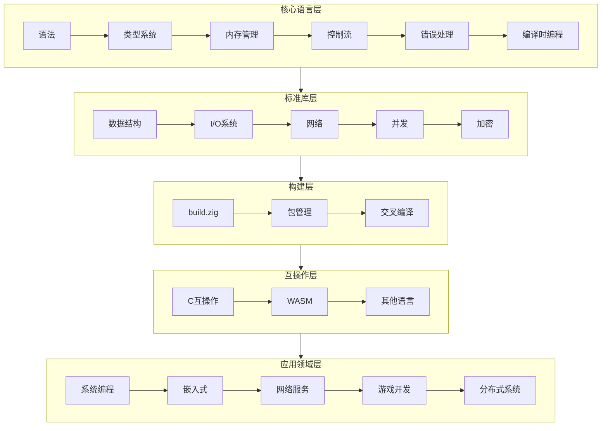
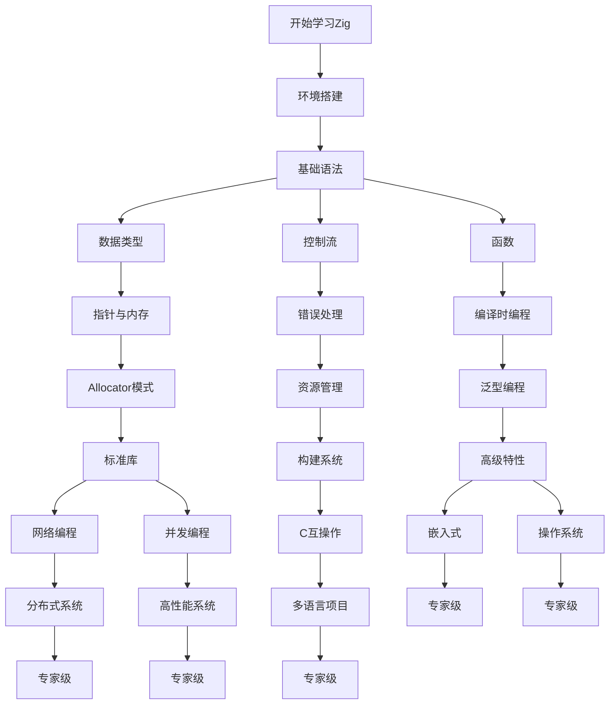

# Zig 知识体系全景思维导图

```mermaid
mindmap
  root((Zig Programming Language))
    Core Language
      Data Types
        Primitive Types
          Integers i8-i256 u8-u256 usize isize
          Floats f16 f32 f64 f80 f128
          bool void noreturn
          comptime_int comptime_float
        Composite Types
          Arrays [N]T [N:S]T [_]T
          Structs struct packed extern
          Unions union enum
          Enums enum
          Optional ?T
          Error Union E!T
        Pointer Types
          Single Item *T *const T *volatile T
          Many Item [*]T
          Slice []T []const T
          C Pointer [*c]T
          Function *fn()
      Memory Management
        Stack Allocation
          Function locals
          Static arrays
          Inline variables
        Heap Allocation
          Allocator interface
          GeneralPurposeAllocator
          PageAllocator
          FixedBufferAllocator
          ArenaAllocator
          Custom allocators
        Memory Safety
          No hidden allocations
          Explicit lifetimes
          defer errdefer
          Compile-time bounds checking
      Control Flow
        Conditionals
          if if-else if-else-if
          switch exhaustive non-exhaustive
          if as expression
        Loops
          while while-continue while-break
          for range iteration
          inline loop unrolling
        Control Transfer
          break labeled
          continue labeled
          return
          unreachable
      Functions
        Declaration fn name() T
        Calling conventions
          C Noreturn Inline Async
          Interrupt Signal stdcall
        Parameters
          Pass by value
          Pass by pointer
          comptime parameters
        Return Values
          Single value
          Error unions
          Tuples anonymous structs
      Metaprogramming
        comptime keyword
          comptime variables
          comptime blocks
          comptime functions
        Type Information
          @typeInfo @Type
          @typeName @hasDecl
          @hasField @field
        Code Generation
          @compileLog @compileError
          @src @import
          @embedFile
      Error Handling
        Error Sets
          Explicit error types
          Error merging ||
          Anyerror
        Error Unions
          E!T syntax
          try keyword
          catch blocks
          if-else unwrap
        Resource Cleanup
          defer LIFO
          errdefer on error
          errdefer blocks
    Standard Library
      Data Structures
        Linear
          ArrayList
          SinglyLinkedList
          DoublyLinkedList
          TailQueue
          SegmentedList
        Maps
          HashMap
          BufMap
          StringHashMap
        Trees
          PriorityQueue
        Buffers
          CircularBuffer
          FixedBufferStream
      Memory
        Allocators
          page_allocator
          heap_allocator
          c_allocator
          GeneralPurposeAllocator
          FixedBufferAllocator
          ThreadSafeAllocator
          LoggingAllocator
        Utilities
          Allocator interface
          MemoryPool
          stackFallback
      I/O
        Streams
          Reader Writer SeekableStream
          BufferedReader BufferedWriter
          FixedBufferStream
        Files
          File open read write seek
          Dir make open iterate
          Path join resolve normalize
        Formatted I/O
          std.fmt.format
          std.debug.print
          Format specifiers
      Concurrency
        Threading
          Thread spawn join
          Mutex Condition
          Semaphore RwLock
          Barrier Event
        Atomic Operations
          Atomic ordering
          atomic_store atomic_load
          atomic_rmw atomic_cmpxchg
        Async/Await
          Suspend Resume
          Async frames
          Event loops
      Networking
        TCP/UDP
          TcpServer TcpStream
          UdpSocket
          Server general
        HTTP
          Client requests
          Headers cookies
          TLS/SSL support
        Addressing
          IPv4 IPv6
          Socket addresses
          DNS resolution
      Crypto
        Hash Functions
          SHA256 SHA512
          Blake2 Blake3
          MD5 SHA1
        MAC
          HMAC
        AEAD
          AES-GCM
          ChaCha20-Poly1305
        Random
          Cryptographically secure RNG
          OsRandom
          Xoshiro256
    Build System
      build.zig
        Build struct
        Standard options
        Dependencies
        Compile steps
      Build Steps
        addExecutable
        addLibrary
        addTest
        addInstallArtifact
        addRunArtifact
      Configuration
        Target selection
        Optimization modes
        C/C++ integration
        Custom build logic
      Package Management
        build.zig.zon
        Dependencies hash
        System integration
    Interoperability
      C Integration
        @cImport @cInclude
        translate-c
        Linking C libraries
        C types mapping
      Export to C
        export keyword
        extern struct
        C calling convention
      Other Languages
        WebAssembly
        JavaScript host
        Python bindings
    Application Domains
      System Programming
        OS kernels
        Device drivers
        Bootloaders
        File systems
      Embedded Systems
        Bare metal
        Microcontrollers
        MMIO register access
        Interrupt handling
        RTOS integration
      WebAssembly
        Browser applications
        WASI runtime
        JS interoperability
        Module exports
      Game Development
        Game loops
        ECS architecture
        Graphics bindings
        Asset management
      Networking
        Protocol implementation
        Server applications
        Client libraries
        High-performance I/O
      Distributed Systems
        Consensus algorithms
        RPC frameworks
        Message passing
        Cluster coordination
      Machine Learning
        Tensor operations
        Neural networks
        Inference engines
        SIMD optimization
    Development Tools
      Compiler
        zig build
        zig run
        zig test
        zig fmt
        zig translate-c
      Debugging
        Stack traces
        Debug info
        GDB/LLDB support
        Logging
      Analysis
        LSP support
        ZLS
        Static analysis
        Fuzzing
    Advanced Topics
      Assembly
        Inline assembly
        asm volatile
        Register constraints
        Output operands
      SIMD
        Vector types
          @Vector(N, T)
          SIMD operations
        Auto-vectorization
        Platform intrinsics
      Unsafe Code
          @ptrCast
          @alignCast
          @intToPtr @ptrToInt
          @bitCast
      Compiler Internals
        AIR
        LLVM backend
        C backend
        Self-hosted compiler
```

---

## 知识图谱连接



---

## 学习依赖图



---

## 概念层次结构

```text
Zig 编程知识体系
├── 基础层 (Foundation)
│   ├── 语法元素
│   │   ├── 关键字与标识符
│   │   ├── 字面量与常量
│   │   └── 运算符与表达式
│   ├── 类型系统基础
│   │   ├── 标量类型
│   │   ├── 复合类型
│   │   └── 类型转换
│   └── 基本控制流
│       ├── 条件语句
│       ├── 循环结构
│       └── 跳转语句
│
├── 核心层 (Core)
│   ├── 内存管理
│   │   ├── 栈内存语义
│   │   ├── 堆内存管理
│   │   ├── 指针系统
│   │   └── 生命周期
│   ├── 错误处理机制
│   │   ├── 错误集定义
│   │   ├── 错误联合类型
│   │   ├── 传播与捕获
│   │   └── 资源清理
│   └── 编译时编程
│       ├── comptime 语义
│       ├── 类型元编程
│       ├── 代码生成
│       └── 泛型实现
│
├── 工程层 (Engineering)
│   ├── 构建系统
│   │   ├── build.zig 结构
│   │   ├── 目标配置
│   │   ├── 依赖管理
│   │   └── 自定义构建逻辑
│   ├── 测试与调试
│   │   ├── 单元测试
│   │   ├── 集成测试
│   │   ├── 调试技术
│   │   └── 性能分析
│   └── 互操作性
│       ├── C 语言集成
│       ├── 导出 C 接口
│       └── 跨语言绑定
│
├── 应用层 (Application)
│   ├── 系统编程
│   │   ├── 操作系统开发
│   │   ├── 驱动程序
│   │   └── 底层工具
│   ├── 嵌入式开发
│   │   ├── 裸机编程
│   │   ├── MCU 开发
│   │   └── RTOS 集成
│   ├── 网络编程
│   │   ├── 协议实现
│   │   ├── 服务器开发
│   │   └── 客户端应用
│   └── 特殊领域
│       ├── WebAssembly
│       ├── 游戏开发
│       ├── 分布式系统
│       └── 机器学习
│
└── 理论层 (Theory)
    ├── 形式语义
    │   ├── 操作语义
    │   ├── 类型理论
    │   └── 内存模型
    ├── 编译原理
    │   ├── 编译器架构
    │   ├── 中间表示
    │   └── 代码生成
    └── 程序分析
        ├── 静态分析
        ├── 形式化验证
        └── 安全证明
```

---

> **文档类型**: 思维导图可视化
> **用途**: 全局知识导航
> **更新**: 2026-03-12


---

## 深入理解

### 核心原理

深入探讨技术原理和实现细节。

### 实践应用

- 应用场景1
- 应用场景2
- 应用场景3

### 最佳实践

1. 理解基础概念
2. 掌握核心机制
3. 应用到实际项目

---

> **最后更新**: 2026-03-21
> **维护者**: AI Code Review
