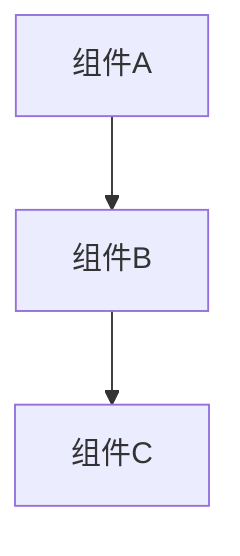

# 文档模板库

> 本目录提供标准化的技术文档模板、代码注释模板和API文档模板，帮助团队建立一致、专业的文档规范。

---

## 📋 目录结构

```text
templates/
├── README.md                     # 本文件：模板总览
├── kb-article-template.md        # 知识库文章模板
└── [其他专业模板]                 # 各类文档模板
```

---


---

## 📑 目录

- [文档模板库](#文档模板库)
  - [📋 目录结构](#-目录结构)
  - [📑 目录](#-目录)
  - [🎯 模板设计理念](#-模板设计理念)
    - [为什么需要标准化模板](#为什么需要标准化模板)
  - [📝 技术文档模板](#-技术文档模板)
    - [1. 设计文档模板 (Design Doc)](#1-设计文档模板-design-doc)
    - [3.2 接口设计](#32-接口设计)
    - [3.3 数据模型](#33-数据模型)
    - [3.4 算法设计](#34-算法设计)
  - [4. 实现计划](#4-实现计划)
    - [4.1 里程碑](#41-里程碑)
    - [4.2 风险评估](#42-风险评估)
  - [5. 测试策略](#5-测试策略)
    - [5.1 测试范围](#51-测试范围)
    - [5.2 测试方法](#52-测试方法)
  - [6. 附录](#6-附录)
    - [6.1 参考资料](#61-参考资料)
    - [6.2 术语表](#62-术语表)
  - [解决方案](#解决方案)
    - [方案一：\[推荐方案\]](#方案一推荐方案)
    - [方案二：\[备选方案\]](#方案二备选方案)
  - [预防措施](#预防措施)
  - [相关案例](#相关案例)
    - [2. 函数注释模板（Doxygen风格）](#2-函数注释模板doxygen风格)
    - [3. 结构体注释模板](#3-结构体注释模板)
    - [4. 宏定义注释模板](#4-宏定义注释模板)
  - [📚 API文档模板](#-api文档模板)
    - [1. 模块API文档](#1-模块api文档)
    - [Hello World](#hello-world)
  - [核心概念](#核心概念)
    - [概念一：\[概念名称\]](#概念一概念名称)
    - [概念二：\[概念名称\]](#概念二概念名称)
  - [API参考](#api参考)
    - [函数](#函数)
      - [function\_name()](#function_name)
    - [数据结构](#数据结构)
      - [struct\_name](#struct_name)
    - [宏定义](#宏定义)
  - [错误处理](#错误处理)
    - [错误码定义](#错误码定义)
  - [性能说明](#性能说明)
    - [时间复杂度](#时间复杂度)
    - [空间复杂度](#空间复杂度)
  - [最佳实践](#最佳实践)
    - [Do](#do)
    - [Don't](#dont)
  - [常见问题 (FAQ)](#常见问题-faq)
  - [更新日志](#更新日志)
    - [v1.0.0 (2024-01-01)](#v100-2024-01-01)
  - [接口列表](#接口列表)
    - [\[接口名称\]](#接口名称)
    - [评审清单](#评审清单)
  - [📁 本目录文件说明](#-本目录文件说明)
  - [🔗 相关资源](#-相关资源)


---

## 🎯 模板设计理念

### 为什么需要标准化模板

```text
┌─────────────────────────────────────────────────────────────┐
│                    标准化模板的价值                          │
├─────────────────────────────────────────────────────────────┤
│                                                             │
│   ┌─────────────┐      ┌─────────────┐      ┌────────────┐ │
│   │   读者视角   │      │   作者视角   │      │  团队视角   │ │
│   ├─────────────┤      ├─────────────┤      ├────────────┤ │
│   │• 快速定位    │      │• 减少思考    │      │• 风格统一   │ │
│   │  所需信息    │      │  文档结构    │      │            │ │
│   │             │      │             │      │• 降低维护   │ │
│   │• 一致的阅读  │      │• 聚焦内容    │      │  成本      │ │
│   │  体验        │      │  而非格式    │      │            │ │
│   │             │      │             │      │• 知识传承   │ │
│   │• 降低理解    │      │• 确保完整性   │      │            │ │
│   │  成本        │      │             │      │            │ │
│   └─────────────┘      └─────────────┘      └────────────┘ │
│                                                             │
└─────────────────────────────────────────────────────────────┘
```

---

## 📝 技术文档模板

### 1. 设计文档模板 (Design Doc)

```markdown
# [项目/功能名称] 设计文档

## 1. 概述

### 1.1 背景
[描述该项目的背景和业务需求]

### 1.2 目标
[明确本设计文档要解决的问题]

### 1.3 范围
[界定本设计的边界，包括包含和不包含的内容]

## 2. 现状分析

### 2.1 当前方案
[描述当前的实现方式]

### 2.2 存在问题
[列出当前方案的问题和限制]

## 3. 设计方案

### 3.1 架构设计
[系统架构图和说明]



### 3.2 接口设计

[关键接口定义]

| 接口 | 输入 | 输出 | 说明 |
|-----|------|-----|------|
| func() | - | - | - |

### 3.3 数据模型

[数据结构设计]

### 3.4 算法设计

[关键算法描述]

## 4. 实现计划

### 4.1 里程碑

- [ ] 阶段一：核心功能
- [ ] 阶段二：边界处理
- [ ] 阶段三：性能优化

### 4.2 风险评估

| 风险 | 影响 | 缓解措施 |
|-----|------|---------|
| - | - | - |

## 5. 测试策略

### 5.1 测试范围

### 5.2 测试方法

## 6. 附录

### 6.1 参考资料

### 6.2 术语表

```

### 2. 故障排查文档模板

```markdown
# [问题标题] 故障排查指南

## 问题现象

### 错误信息
```

[完整的错误日志或报错信息]

```

### 影响范围
- 受影响版本：
- 受影响功能：
- 影响程度：

## 根因分析

### 问题原因
[详细解释问题产生的根本原因]

### 代码定位
```c
// 问题代码位置
file.c:123
void problematic_function() {
    // ...
}
```

## 解决方案

### 方案一：[推荐方案]

**适用场景：**
**操作步骤：**

1. 步骤一
2. 步骤二

**验证方法：**

### 方案二：[备选方案]

...

## 预防措施

- [ ] 代码审查要点
- [ ] 测试用例补充
- [ ] 监控告警配置

## 相关案例

- 案例 #1234
- 案例 #5678

```

---

## 💻 代码注释模板

### 1. 文件头注释模板

```c
/**
 * @file      filename.c
 * @brief     [一句话描述文件功能]
 * @author    [作者]
 * @date      [创建日期]
 * @version   [版本号]
 *
 * @copyright Copyright (c) [年份]
 *
 * @details
 * [详细描述文件功能、设计思路、使用注意事项等]
 *
 * @par 修改日志:
 * <table>
 * <tr><th>Date       <th>Version <th>Author  <th>Description
 * <tr><td>2024-01-01 <td>1.0     <td>张三    <td>初始版本
 * </table>
 */
```

### 2. 函数注释模板（Doxygen风格）

```c
/**
 * @brief  [函数一句话描述]
 * @param  [参数名] [参数描述]
 * @param  [参数名] [参数描述]
 * @return [返回值描述]
 * @retval [具体返回值] [返回值含义]
 * @note   [使用注意事项]
 * @warning [警告信息]
 * @see    [相关函数或文档]
 *
 * @par 示例:
 * @code
 * int result = function_name(arg1, arg2);
 * if (result < 0) {
 *     // 错误处理
 * }
 * @endcode
 */
int function_name(int param1, const char *param2);
```

### 3. 结构体注释模板

```c
/**
 * @struct data_structure
 * @brief  [结构体功能描述]
 *
 * [详细说明结构体的用途和设计考虑]
 *
 * @par 内存布局:
 * @code
 *  0-3:   field1  (4 bytes)
 *  4-7:   field2  (4 bytes)
 *  8-15:  field3  (8 bytes)  // 对齐填充
 * @endcode
 */
struct data_structure {
    int field1;        /**< [字段描述] */
    int field2;        /**< [字段描述] */
    void *field3;      /**< [字段描述] */
};
```

### 4. 宏定义注释模板

```c
/**
 * @def MAX_BUFFER_SIZE
 * @brief 最大缓冲区大小
 *
 * 定义了内部缓冲区的最大字节数。
 * 此值影响内存使用和最大处理能力。
 *
 * @note 修改此值需要重新编译所有依赖模块
 */
#define MAX_BUFFER_SIZE 4096

/**
 * @def SAFE_FREE(ptr)
 * @brief 安全释放内存宏
 * @param ptr 要释放的指针
 *
 * 释放指针指向的内存，并将指针置为NULL，防止悬空指针。
 *
 * @par 使用示例:
 * @code
 * char *buffer = malloc(100);
 * // 使用 buffer
 * SAFE_FREE(buffer);  // buffer 现在是 NULL
 * @endcode
 */
#define SAFE_FREE(ptr) do { \
    free(ptr); \
    (ptr) = NULL; \
} while(0)
```

---

## 📚 API文档模板

### 1. 模块API文档

```markdown
# [模块名称] API文档

## 概述

| 属性 | 值 |
|-----|---|
| 模块名称 | module_name |
| 版本 | 1.0.0 |
| 作者 | [作者] |
| 依赖 | dep1, dep2 |

## 快速开始

### 安装
```bash
# 安装命令
```

### Hello World

```c
#include "module.h"

int main() {
    // 最小使用示例
    return 0;
}
```

## 核心概念

### 概念一：[概念名称]

[概念解释]

```
[概念图示或示例]
```

### 概念二：[概念名称]

...

## API参考

### 函数

#### function_name()

**函数签名：**

```c
return_type function_name(param_type param);
```

**参数：**

| 参数 | 类型 | 描述 | 是否可空 |
|-----|------|------|---------|
| param | type | 描述 | No |

**返回值：**

| 值 | 描述 |
|---|------|
| 0 | 成功 |
| -1 | 参数错误 |
| -2 | 内存不足 |

**示例：**

```c
// 代码示例
```

### 数据结构

#### struct_name

| 字段 | 类型 | 描述 |
|-----|------|------|
| field | type | 描述 |

### 宏定义

| 宏 | 值 | 描述 |
|---|---|------|
| MACRO_NAME | value | 描述 |

## 错误处理

### 错误码定义

| 错误码 | 值 | 描述 | 处理建议 |
|-------|---|------|---------|
| ERR_OK | 0 | 成功 | - |
| ERR_INVALID_PARAM | -1 | 参数无效 | 检查参数范围 |

## 性能说明

### 时间复杂度

| 操作 | 平均 | 最坏 |
|-----|------|------|
| operation | O(1) | O(n) |

### 空间复杂度

[空间使用说明]

## 最佳实践

### Do

- [推荐做法1]
- [推荐做法2]

### Don't

- [避免做法1]
- [避免做法2]

## 常见问题 (FAQ)

**Q: [常见问题]**

A: [解答]

## 更新日志

### v1.0.0 (2024-01-01)

- 初始版本
- 功能列表

```

### 2. RESTful API文档模板

```markdown
# [服务名] RESTful API

## 基础信息

| 项目 | 内容 |
|-----|------|
| Base URL | `https://api.example.com/v1` |
| 认证方式 | Bearer Token |
| Content-Type | application/json |

## 认证

### 获取Token
```http
POST /auth/token
Content-Type: application/json

{
    "username": "user",
    "password": "pass"
}
```

## 接口列表

### [接口名称]

**Endpoint:** `METHOD /path`

**描述:** [接口功能描述]

**请求头:**

| 头 | 必填 | 描述 |
|---|-----|------|
| Authorization | 是 | Bearer {token} |

**请求参数:**

| 参数 | 类型 | 必填 | 描述 |
|-----|------|-----|------|
| param | string | 是 | 参数描述 |

**请求示例:**

```json
{
    "param": "value"
}
```

**成功响应 (200 OK):**

| 字段 | 类型 | 描述 |
|-----|------|------|
| code | int | 状态码 |
| data | object | 响应数据 |

**响应示例:**

```json
{
    "code": 0,
    "data": {
        "id": 1,
        "name": "example"
    }
}
```

**错误响应:**

| 状态码 | 描述 |
|-------|------|
| 400 | 请求参数错误 |
| 401 | 未授权 |
| 500 | 服务器内部错误 |

**错误示例:**

```json
{
    "code": 1001,
    "message": "参数错误：name不能为空"
}
```

```

---

## 🎨 模板使用规范

### 文档命名规范

```

[类型]_[主题]_[日期].[扩展名]

示例：
design_memory_allocator_20240115.md
api_network_module_v2.md
incident_memory_leak_20240110.md

```

### 版本控制规范

```markdown
## 文档版本

| 版本 | 日期 | 作者 | 变更说明 |
|-----|------|-----|---------|
| 1.0 | 2024-01-15 | 张三 | 初始版本 |
| 1.1 | 2024-01-20 | 李四 | 补充性能测试数据 |
| 2.0 | 2024-02-01 | 王五 | 架构重构，不兼容变更 |
```

### 评审清单

```markdown
## 文档评审清单

- [ ] 准确性：技术内容是否正确
- [ ] 完整性：是否覆盖所有必要信息
- [ ] 清晰性：表达是否清晰易懂
- [ ] 一致性：术语、格式是否统一
- [ ] 时效性：信息是否最新
- [ ] 可追溯性：引用是否有出处
```

---

## 📁 本目录文件说明

| 文件名 | 内容描述 | 使用场景 |
|-------|---------|---------|
| `kb-article-template.md` | 知识库文章标准模板 | 技术分享、问题记录 |

---

## 🔗 相关资源

- [返回上级目录](../README.md)
- [Doxygen文档](https://www.doxygen.nl/)
- [Markdown语法指南](https://www.markdownguide.org/)
- [Mermaid图表](https://mermaid.js.org/)

---

> 📝 **提示**：模板是起点而非终点。根据项目实际情况调整模板内容，但保持核心结构的一致性。好的文档应该像代码一样被维护和迭代。
