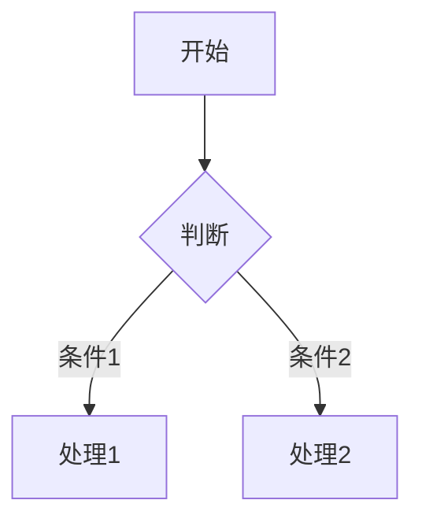
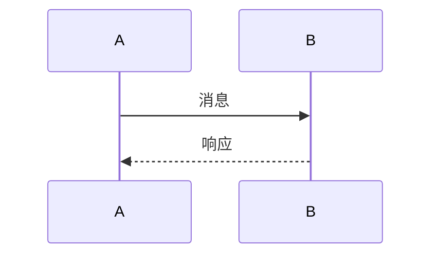

---

## 🔗 全面知识关联体系

### 【全局层】知识库导航

| 维度 | 目标文档 | 导航作用 |
|:-----|:---------|:---------|
| **总索引** | [../00_GLOBAL_INDEX.md](../00_GLOBAL_INDEX.md) | 完整知识图谱入口，全局视角 |
| **本模块** | [../readme.md](../readme.md) | 模块总览与目录导航 |
| **学习路径** | [../06_Thinking_Representation/06_Learning_Paths/readme.md](../06_Thinking_Representation/06_Learning_Paths/readme.md) | 阶段化学习路线规划 |
| **概念映射** | [../06_Thinking_Representation/05_Concept_Mappings/readme.md](../06_Thinking_Representation/05_Concept_Mappings/readme.md) | 核心概念等价关系图 |

### 【阶段层】学习定位

**当前模块**: 知识库
**难度等级**: L1-L6
**前置依赖**: 核心知识体系
**后续延伸**: 持续学习

```
学习阶段金字塔:
    L6 专家层 [形式验证、编译器]
    L5 高级层 [并发、系统编程] ⬅️ 可能在此
    L4 进阶层 [指针、内存管理]
    L3 基础层 [函数、结构体]
    L2 入门层 [语法、数据类型]
    L1 零基础 [环境搭建]
```

### 【层次层】纵向知识链

| 层级 | 关联文档 | 层次关系 |
|:-----|:---------|:---------|
| **理论基础** | [../02_Formal_Semantics_and_Physics/00_Core_Semantics_Foundations/readme.md](../02_Formal_Semantics_and_Physics/00_Core_Semantics_Foundations/readme.md) | 语义学理论基础 |
| **核心机制** | [../01_Core_Knowledge_System/02_Core_Layer/readme.md](../01_Core_Knowledge_System/02_Core_Layer/readme.md) | C语言核心机制 |
| **标准接口** | [../01_Core_Knowledge_System/04_Standard_Library_Layer/readme.md](../01_Core_Knowledge_System/04_Standard_Library_Layer/readme.md) | 标准库API |
| **系统实现** | [../03_System_Technology_Domains/readme.md](../03_System_Technology_Domains/readme.md) | 系统级实现 |

### 【局部层】横向关联网

| 关联类型 | 目标文档 | 关联说明 |
|:---------|:---------|:---------|
| **技术扩展** | [../03_System_Technology_Domains/14_Concurrency_Parallelism/readme.md](../03_System_Technology_Domains/14_Concurrency_Parallelism/readme.md) | 并发编程技术 |
| **安全规范** | [../01_Core_Knowledge_System/09_Safety_Standards/MISRA_C_2023/readme.md](../01_Core_Knowledge_System/09_Safety_Standards/MISRA_C_2023/readme.md) | 安全编码标准 |
| **工具支持** | [../07_Modern_Toolchain/readme.md](../07_Modern_Toolchain/readme.md) | 现代开发工具链 |
| **实践案例** | [../04_Industrial_Scenarios/readme.md](../04_Industrial_Scenarios/readme.md) | 工业实践场景 |

### 【总体层】知识体系架构

```
┌─────────────────────────────────────────────────────────────┐
│                     总体知识体系架构                          │
├─────────────────────────────────────────────────────────────┤
│  01 Core Knowledge          → 核心概念与机制                  │
│  02 Formal Semantics        → 理论与物理基础                  │
│  03 System Technology       → 系统级技术领域                  │
│  04 Industrial Scenarios    → 工业应用场景                    │
│  05 Deep Structure          → 深层结构与元物理                │
│  06 Thinking Representation → 思维表征与学习                  │
│  07 Modern Toolchain        → 现代工具链                      │
└─────────────────────────────────────────────────────────────┘
```

### 【决策层】学习路径选择

| 目标 | 推荐路径 | 关键文档 |
|:-----|:---------|:---------|
| **系统学习** | 01 → 02 → 03 → 04 | 按顺序阅读各模块 |
| **问题导向** | 06决策树 → 相关模块 | [决策树目录](../06_Thinking_Representation/01_Decision_Trees/readme.md) |
| **项目驱动** | 04案例 → 所需知识 | [工业场景](../04_Industrial_Scenarios/readme.md) |
| **深入研究** | 02形式语义 → 11CompCert | [形式语义](../02_Formal_Semantics_and_Physics/readme.md) |

---

# {{标题}}

> **层级定位**: {{章节编号}} {{章节名称}}
> **对应标准**: C89/C99/C11/C17/C23
> **难度级别**: {{L1-L6}}
> **预估学习时间**: {{X}} 小时

---

## 📋 本节概要

| 属性 | 内容 |
|:-----|:-----|
| **核心概念** | {{3-5个关键词}} |
| **前置知识** | {{前置依赖主题}} |
| **后续延伸** | {{后续进阶主题}} |
| **权威来源** | {{K&R ChX / CSAPP ChX / Modern C SecX / C11标准 SecX}} |

---

## 🧠 知识结构思维导图

```mermaid
mindmap
  root(({{主题}}))
    {{子主题1}}
      {{细节1}}
      {{细节2}}
    {{子主题2}}
      {{细节1}}
      {{细节2}}
    {{子主题3}}
      {{细节1}}
      {{细节2}}
```

---

## 📖 核心概念详解

### 1. {{概念1}}

#### 1.1 定义与语义

{{清晰、精确的定义。使用数学符号或形式化描述（如适用）}}

#### 1.2 标准演进

| 标准 | 支持情况 | 关键变化 |
|:-----|:--------:|:---------|
| C89 | {{✅/❌/⚠️}} | {{说明}} |
| C99 | {{✅/❌/⚠️}} | {{说明}} |
| C11 | {{✅/❌/⚠️}} | {{说明}} |
| C17 | {{✅/❌/⚠️}} | {{说明}} |
| C23 | {{✅/❌/⚠️}} | {{说明}} |

#### 1.3 代码示例

**✅ 推荐做法：**

```c
{{正确的、符合最佳实践的代码示例}}
```

**❌ 避免做法：**

```c
{{常见的错误做法，明确标注为UNSAFE}}
```

---

### 2. {{概念2}}

[同上结构...]

---

## 🔄 多维矩阵对比

### 矩阵1: {{对比维度}}

| 特性 | C89 | C99 | C11 | C17 | C23 |
|:-----|:---:|:---:|:---:|:---:|:---:|
| {{特性1}} | {{✅/❌}} | {{✅/❌}} | {{✅/❌}} | {{✅/❌}} | {{✅/❌}} |
| {{特性2}} | {{✅/❌}} | {{✅/❌}} | {{✅/❌}} | {{✅/❌}} | {{✅/❌}} |

### 矩阵2: 平台差异

| 平台 | {{属性1}} | {{属性2}} | {{属性3}} |
|:-----|:---------:|:---------:|:---------:|
| x86-64 (LP64) | {{值}} | {{值}} | {{值}} |
| x86-64 (LLP64/Win) | {{值}} | {{值}} | {{值}} |
| ARM64 | {{值}} | {{值}} | {{值}} |
| RISC-V64 | {{值}} | {{值}} | {{值}} |

---

## 🌳 决策树

```
{{决策场景}}
├── {{条件1}}?
│   ├── 是 → {{结果1}}
│   └── 否 → {{子决策1}}
├── {{条件2}}?
│   ├── 是 → {{结果2}}
│   └── 否 → {{结果3}}
└── {{默认结果}}
```

---

## ⚠️ 常见陷阱与防御

### 陷阱 {{编号}}: {{陷阱名称}}

| 属性 | 内容 |
|:-----|:-----|
| **现象** | {{错误的表现}} |
| **后果** | {{严重程度：崩溃/未定义行为/安全漏洞/性能损失}} |
| **根本原因** | {{技术解释}} |
| **检测方法** | {{静态分析/动态检测工具}} |
| **修复方案** | {{正确代码}} |
| **CERT规则** | {{对应的CERT C规则编号}} |

**示例代码：**

```c
// ❌ 错误代码（UNSAFE）
{{展示错误代码}}

// ✅ 修复后代码（SAFE）
{{展示修复后代码}}
```

---

## 🎯 练习题

### 练习题 {{编号}}: {{题目名称}}

**难度**: {{⭐-⭐⭐⭐⭐⭐}}

{{题目描述}}

<details>
<summary>点击查看答案</summary>

```c
{{参考答案}}
```

**解析**：{{解释}}

</details>

---

## 🔗 权威来源引用

### 主要参考

| 来源 | 章节/页码 | 核心内容 |
|:-----|:----------|:---------|
| **K&R C (2nd)** | Ch {{X}}, Sec {{Y}} | {{具体内容}} |
| **CSAPP (3rd)** | Ch {{X}}, Sec {{Y}} | {{具体内容}} |
| **Modern C** | Level {{X}}, Sec {{Y}} | {{具体内容}} |
| **C11 Standard (ISO/IEC 9899:2011)** | Sec {{X.Y.Z}} | {{具体内容}} |
| **CERT C** | {{RULE-ID}} | {{具体内容}} |

### 延伸阅读

- [{{资源名称}}]({{URL}}) - {{说明}}

---

## 🛠️ 模板使用指南

### 创建新文章步骤

1. **复制模板** - 复制此文件并重命名
2. **填写元数据** - 更新标题、层级定位、难度等
3. **构建结构** - 填充各章节内容
4. **添加代码** - 确保代码可编译运行
5. **验证清单** - 检查质量验收清单

### 内容编写规范

#### 代码示例规范

```c
// ✅ 推荐的代码风格
#include <stdio.h>
#include <stdlib.h>
#include <stdint.h>

// 函数注释说明用途
int32_t add(int32_t a, int32_t b) {
    // 边界检查
    if (b > 0 && a > INT32_MAX - b) {
        return INT32_MAX;  // 溢出处理
    }
    return a + b;
}

int main(void) {
    int32_t result = add(10, 20);
    printf("Result: %d\n", result);
    return 0;
}
```

#### 图表规范

- 使用 Mermaid 语法绘制图表
- 矩阵表格对齐清晰
- ASCII 图用于复杂结构

#### 术语规范

| 术语 | 说明 |
|:-----|:-----|
| UB | 未定义行为 (Undefined Behavior) |
| IB | 实现定义行为 (Implementation-defined Behavior) |
| AT | 未指定行为 (Unspecified Behavior) |

### 文件命名规范

```
{{章节编号}}_{{英文主题}}.md

示例：
- 01_Syntax_Elements.md
- 02_Memory_Management.md
- 03_Concurrency_Patterns.md
```

---

## 📐 扩展内容模板

### 案例研究模板

```markdown
## 📖 案例研究: {{案例名称}}

### 场景描述
{{描述实际应用场景}}

### 问题分析
{{分析问题原因}}

### 解决方案
{{提供代码实现}}

### 效果验证
{{提供测试数据和对比}}
```

### 对比分析模板

```markdown
## 🔄 {{主题}}对比分析

### 方案A vs 方案B

| 维度 | 方案A | 方案B |
|:-----|:------|:------|
| 性能 | {{评价}} | {{评价}} |
| 复杂度 | {{评价}} | {{评价}} |
| 可维护性 | {{评价}} | {{评价}} |
| 适用场景 | {{场景}} | {{场景}} |
```

### 最佳实践模板

```markdown
## 💡 最佳实践: {{主题}}

### 原则
1. {{原则1}}
2. {{原则2}}
3. {{原则3}}

### 代码模板
```c
{{可复用的代码模板}}
```

### 常见反模式

- {{反模式1}}: {{说明}}
- {{反模式2}}: {{说明}}

```

---

## ✅ 质量验收清单

- [ ] 所有代码示例已编译测试通过 (gcc -std=c11 -Wall -Wextra -Werror)
- [ ] 所有代码示例已编译测试通过 (clang -std=c17 -Wall -Wextra -Werror)
- [ ] Mermaid图表语法正确，可渲染
- [ ] 所有C标准引用已核对
- [ ] CERT安全规则引用准确
- [ ] 术语使用符合ISO C标准
- [ ] 包含至少一个完整可运行程序
- [ ] 文件路径和链接正确
- [ ] 中英文标点使用规范
- [ ] 代码块语言标识正确

---

## 📝 Markdown 语法速查

### 常用元素

| 元素 | 语法 | 示例 |
|:-----|:-----|:-----|
| 标题 | `#` - `######` | `# 一级标题` |
| 加粗 | `**text**` | **粗体** |
| 斜体 | `*text*` | *斜体* |
| 代码行 | `` `code` `` | `code` |
| 代码块 | ` ```c ` | 见上文 |
| 链接 | `[text](url)` | [链接](#) |
| 图片 | `` | 图片 |
| 表格 | `\| a \| b \|` | 见上文 |
| 列表 | `-` 或 `1.` | 列表项 |
| 引用 | `> text` | 引用 |

### Mermaid 图表

流程图:


时序图:



---

## 📚 模板变量说明

### 元数据变量

| 变量 | 说明 | 示例 |
|:-----|:-----|:-----|
| {{标题}} | 文章标题 | C语言指针详解 |
| {{章节编号}} | 章节编号 | 01 |
| {{章节名称}} | 章节名称 | 核心概念 |
| {{L1-L6}} | 难度级别 | L3 |
| {{X}} | 学习时间 | 4 |

### 内容变量

| 变量 | 说明 | 示例 |
|:-----|:-----|:-----|
| {{主题}} | 知识主题 | 指针 |
| {{子主题}} | 细分主题 | 指针运算 |
| {{概念}} | 具体概念 | 空指针 |
| {{陷阱名称}} | 常见错误 | 悬挂指针 |

---

## 🎨 样式指南

### 颜色使用

- 🟢 绿色 (✅) - 正确/推荐
- 🔴 红色 (❌) - 错误/避免
- 🟡 黄色 (⚠️) - 警告/注意
- 🔵 蓝色 (📖) - 信息/参考

### 图标约定

| 图标 | 含义 |
|:-----|:-----|
| 📋 | 概要/总结 |
| 🧠 | 思维导图 |
| 📖 | 详细内容 |
| 🔄 | 对比/矩阵 |
| 🌳 | 决策树 |
| ⚠️ | 陷阱/警告 |
| 🎯 | 练习 |
| 🔗 | 链接/引用 |
| ✅ | 检查清单 |

---

> **更新记录**
>
> - {{YYYY-MM-DD}}: 初版创建
> - 2026-03-13: 扩展模板使用指南、扩展内容模板、Markdown速查、变量说明

## 🔗 模板版本控制

### 版本历史

| 版本 | 日期 | 变更内容 |
|:-----|:-----|:---------|
| v1.0 | 2025-03-09 | 初始模板创建 |
| v1.1 | 2026-03-13 | 扩展使用指南、样式指南 |
| v1.2 | 2026-03-13 | 添加版本控制、案例模板 |

### 模板兼容性

- 支持标准: C89/C99/C11/C17/C23
- 渲染引擎: GitHub Flavored Markdown
- 图表支持: Mermaid.js
- 代码高亮: highlight.js

---

## 💡 高级使用技巧

### 条件内容标记

```markdown
<!-- 仅在特定条件下显示的内容 -->
<details>
<summary>高级主题 (可选阅读)</summary>

深入内容...

</details>
```

### 多版本代码对比

```markdown
| C89 | C11 | C23 |
|:----|:----|:----|
| `int i = 0;` | `for (int i = 0; ...)` | `auto i = 0;` |
```

### 可视化数据流程

```markdown
数据输入 → [处理阶段] → 数据输出
                ↓
            [验证阶段] → 错误处理
```

---

> **更新记录**
>
> - {{YYYY-MM-DD}}: 初版创建
> - 2026-03-13: 扩展模板使用指南、扩展内容模板、Markdown速查、变量说明、版本控制
